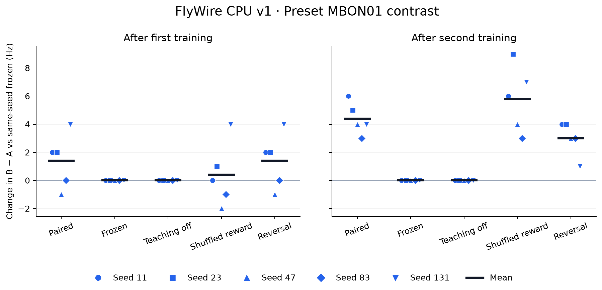
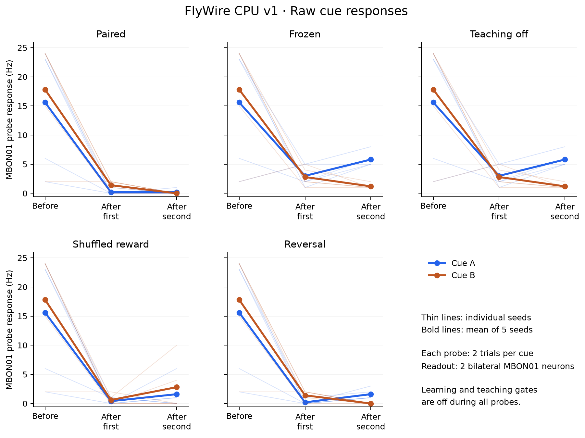

# FlyWire 固定全脑 + 局部 KC→MBON 学习：CPU v1 结果

本报告来自完整的 139,255 神经元、15,091,983 条原始聚合连接：其中 2,560 条双侧 MBON01 输入边可塑，其余固定。25 个预设条件运行完成。

奖励采用外部合成教学信号，γ5/β′2a 合并为一个投影级学习单元。该模型没有实现空间分辨的多巴胺释放、真实果蝇行为或生理拟合。

**结论：CPU 实现、局部可塑性及恢复一致性验收通过；本次冻结协议没有建立稳定可读出的奖励关联或可靠反转证据。** 初次训练存在小幅配对差异，但第二轮后配对条件有 4/5 个 seed 对两种刺激都静默。下文保留全部结果，没有剔除 seed 或追加调参。

本报告的数值表由 `report.py` 从完整产物重新审计生成；结论、图注及末尾研究解释为完成全部实验后撰写。机器可读结果见 [final_report.json](final_report.json)，原始文件、验证范围及复现入口见 [ARTIFACTS.md](ARTIFACTS.md)。

## 预设主要结果

效应为同一 seed 中，学习条件相对冻结条件的 MBON01「B−A」测试放电率差，单位 Hz。它不是分类准确率。

| 条件 | 首次训练后均值 [最小,最大] | 第二训练后均值 [最小,最大] | 最终平均 gain |
| --- | ---: | ---: | ---: |
| paired | 1.4000 [-1.0000, 4.0000] | 4.4000 [3.0000, 6.0000] | 0.901931 |
| frozen | 0.0000 [0.0000, 0.0000] | 0.0000 [0.0000, 0.0000] | 1.000000 |
| teaching_off | 0.0000 [0.0000, 0.0000] | 0.0000 [0.0000, 0.0000] | 1.000000 |
| shuffled_reward | 0.4000 [-2.0000, 4.0000] | 5.8000 [3.0000, 9.0000] | 0.870145 |
| reversal | 1.4000 [-1.0000, 4.0000] | 3.0000 [1.0000, 4.0000] | 0.887301 |

配对条件首次测试相对冻结对照的差值均值为 1.4000 Hz，第二训练后为 4.4000 Hz；反转条件最终差值均值为 3.0000 Hz。上表保留全部 seed 的正、零和负效应。5 个 seed 与每个测试块 4 次刺激限制了统计效力；这些描述性差异不能直接证明可靠关联学习、生物学习机制或真实拓扑优势。

### 原始读出与静默诊断



点形区分五个预设 seed，黑线为均值；[矢量 PDF](preset_effects.pdf)。正的对照差值必须结合下方原始放电率解释。

以下为描述性检查，不替换预设主要指标。A/B 分别是两种刺激的 MBON01 放电率，先在每个 seed 内汇总，再跨 5 个 seed 取均值。若学习后 A、B 同时归零，而冻结条件的 B−A 为负，相对冻结的效应仍可为正；这种情况不能作为刺激特异关联的证据。

| 条件 | 训练前 A/B Hz | 首次训练后 A/B Hz | 第二训练后 A/B Hz | 最终 A、B 均静默的 seed 数 |
| --- | ---: | ---: | ---: | ---: |
| paired | 15.6000 / 17.8000 | 0.2000 / 1.4000 | 0.2000 / 0.0000 | 4/5 |
| frozen | 15.6000 / 17.8000 | 3.0000 / 2.8000 | 5.8000 / 1.2000 | 0/5 |
| teaching_off | 15.6000 / 17.8000 | 3.0000 / 2.8000 | 5.8000 / 1.2000 | 0/5 |
| shuffled_reward | 15.6000 / 17.8000 | 0.4000 / 0.6000 | 1.6000 / 2.8000 | 2/5 |
| reversal | 15.6000 / 17.8000 | 0.2000 / 1.4000 | 1.6000 / 0.0000 | 0/5 |



各面板使用相同纵轴，每个测试块每种刺激仅 2 次试验；[矢量 PDF](raw_cue_responses.pdf)。图表由已审计 JSON 生成，来源散列见 [figure_provenance.json](figure_provenance.json)。

## 全部 seed

| seed | 条件 | 首次效应 Hz | 最终效应 Hz | 变化边数 | 最终平均 gain |
| ---: | --- | ---: | ---: | ---: | ---: |
| 11 | paired | 2.0000 | 6.0000 | 2281 | 0.912271 |
| 11 | frozen | 0.0000 | 0.0000 | 0 | 1.000000 |
| 11 | teaching_off | 0.0000 | 0.0000 | 0 | 1.000000 |
| 11 | shuffled_reward | 0.0000 | 6.0000 | 2307 | 0.865070 |
| 11 | reversal | 2.0000 | 4.0000 | 2287 | 0.878392 |
| 23 | paired | 2.0000 | 5.0000 | 2337 | 0.874030 |
| 23 | frozen | 0.0000 | 0.0000 | 0 | 1.000000 |
| 23 | teaching_off | 0.0000 | 0.0000 | 0 | 1.000000 |
| 23 | shuffled_reward | 1.0000 | 9.0000 | 2338 | 0.882838 |
| 23 | reversal | 2.0000 | 4.0000 | 2327 | 0.886811 |
| 47 | paired | -1.0000 | 4.0000 | 1769 | 0.918460 |
| 47 | frozen | 0.0000 | 0.0000 | 0 | 1.000000 |
| 47 | teaching_off | 0.0000 | 0.0000 | 0 | 1.000000 |
| 47 | shuffled_reward | -2.0000 | 4.0000 | 1733 | 0.905489 |
| 47 | reversal | -1.0000 | 3.0000 | 1771 | 0.896172 |
| 83 | paired | 0.0000 | 3.0000 | 2299 | 0.892315 |
| 83 | frozen | 0.0000 | 0.0000 | 0 | 1.000000 |
| 83 | teaching_off | 0.0000 | 0.0000 | 0 | 1.000000 |
| 83 | shuffled_reward | -1.0000 | 3.0000 | 2295 | 0.862468 |
| 83 | reversal | 0.0000 | 3.0000 | 2294 | 0.876301 |
| 131 | paired | 4.0000 | 4.0000 | 2002 | 0.912580 |
| 131 | frozen | 0.0000 | 0.0000 | 0 | 1.000000 |
| 131 | teaching_off | 0.0000 | 0.0000 | 0 | 1.000000 |
| 131 | shuffled_reward | 4.0000 | 7.0000 | 2341 | 0.834861 |
| 131 | reversal | 4.0000 | 1.0000 | 2001 | 0.898830 |

## 正确性与恢复

独立逐时步参考、Brian2 NumPy/C++ 和 Rust 小回路验证通过；真实诱导子图全数组一致。完整全脑 Rust 1/4 线程与 C++ 对照通过；静态/可塑边分区逆向还原原图。全脑连续/分段、新进程 checkpoint 恢复、原生二进制重复执行均通过。

全脑跨后端数值门覆盖 1.1 生物秒；全脑连续/分段和新进程恢复比较采用 seed 11 的 paired 条件，覆盖完整 19.1 生物秒。比较范围包括所有神经元的最终状态和不应期状态、全部脉冲、全部可塑边的 gain/资格迹，以及 6 个预选神经元的状态轨迹；没有记录所有神经元的逐时步电压。

小回路的中间突触样本和逐段禁学检查覆盖 Brian NumPy 与 Rust reference/AOT；C++ standalone 仅比较最终突触状态及神经轨迹/脉冲。历史 spiking_validation.json 中 C++ 的 learning_off_gain_exact=false 表示未采集中间样本，不是失败结果。

最终审计重新读取 25 组输入和权重数组：所有测试/休息时段学习与教学输入为零，测试前后 gain 逐位相同；冻结与教学关闭条件的 gain 始终为 1。完整输出索引、脉冲计数、有限状态、电导和增益边界检查通过。详细误差见 correctness.json。

同一 seed 的五个条件共用完全相同的非控制输入数组；五个 seed 的背景事件、刺激事件和随机映射均不同，散列记录见 input_identity_audit.json。

## 成本与复现

正式执行使用 Rust CPU 4 线程。每个条件模拟 19.1 生物秒；原生循环耗时范围 70.95–847.32 s，单次端到端范围 119.78–986.82 s。

原生进程峰值 RSS 最大 350.3 MiB，Python 前端峰值最大 1303.4 MiB。原生 RSS 由新建的小型 wait4 supervisor 测量；这些数值不等于并发进程树内存之和。编译、初始化和循环时间在逐阶段报告中分列，未作跨机器加速结论。

完整规则、时程、学习率和有限校准预算见 [PROTOCOL.md](../../PROTOCOL.md)；原始图与注释校验、边身份、输入数组、源码散列、编译制品及 checkpoint 均保存在 [产物索引](ARTIFACTS.md) 所列研究输出目录。主机为 Apple M3、8 CPU、16 GiB；存在其他并发负载，因此墙钟耗时不构成隔离性能基准。

```sh
python brian2-rust/experiments/flywire_learning/study.py --prepared /path/to/learning-prepared --output /path/to/new-study --amplitude 40
python brian2-rust/experiments/flywire_learning/report.py --prepared /path/to/learning-prepared --study /path/to/new-study --output /path/to/new-report
```

结构映射依据：[Li et al., eLife](https://elifesciences.org/articles/62576)。学习动机及与本实现的区别见 [RESEARCH.md](../../RESEARCH.md)。FlyWire v783 数据：[Zenodo](https://zenodo.org/records/10676866)，CC BY 4.0。

## 研究解释与后续问题

初次训练后，配对相对冻结效应均值为 +1.4 Hz，打乱奖励为 +0.4 Hz。作为事后描述性比较，同 seed 的配对减打乱差值依次为 2、1、1、1、0 Hz，均值 +1.0 Hz。这是值得后续检验的小幅早期差异，但不是新增的成功阈值或统计显著性结论。

第二轮后，配对的原始 B−A 仅为 −0.2 Hz，而冻结为 −4.6 Hz；两者相减得到 +4.4 Hz。结合 4/5 seeds 双刺激静默，这一正差值主要体现读出压低后的对照差异，不能解释成更强的刺激区分。打乱奖励同一最终指标为 +5.8 Hz，也不支持持续的配对优势。权重确实变化，并不足以单独证明任务学会。

反转条件的原始 B−A 从首次测试 +1.2 Hz 变为最终 −1.6 Hz，但冻结对照同期也从 −0.2 Hz 漂移至 −4.6 Hz。反转相对冻结最终仍为 +3.0 Hz，且 B 平均读出为 0 Hz。因此原始对比的符号变化不能独立证明可靠反转。

限制包括固定读出的两枚 MBON01、每块每种刺激仅两次测试、19.1 s 模拟时长、合并 γ5/β′2a 的外部教学假设，以及冻结网络本身明显的活动变化。这些结果既不能定位静默的唯一原因，也不能推论 FlyWire 一般不能学习、真实连接组没有价值或生物长时记忆不存在。

后续独立研究应先在禁学条件下建立稳定且可区分的 A/B 读出，检查预热、输入驱动和抑制平衡，再预先冻结新的学习协议。空间分区的教学映射及闭环 DAN 反馈可随后检验。本批参数、种子和结果保持原样；本次研究在负面及有限正面观察均完整记录后结束。
