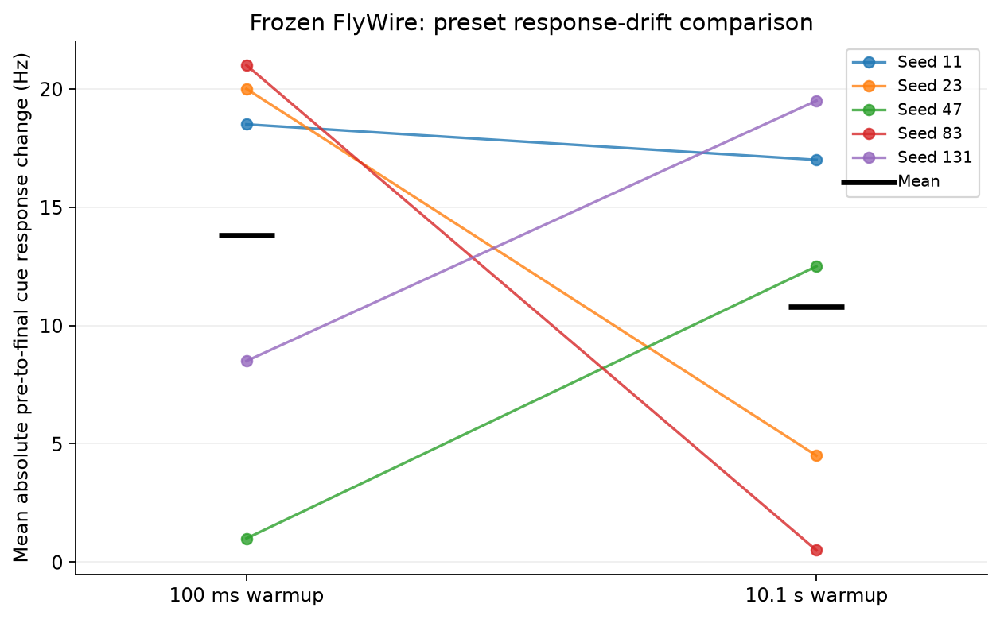
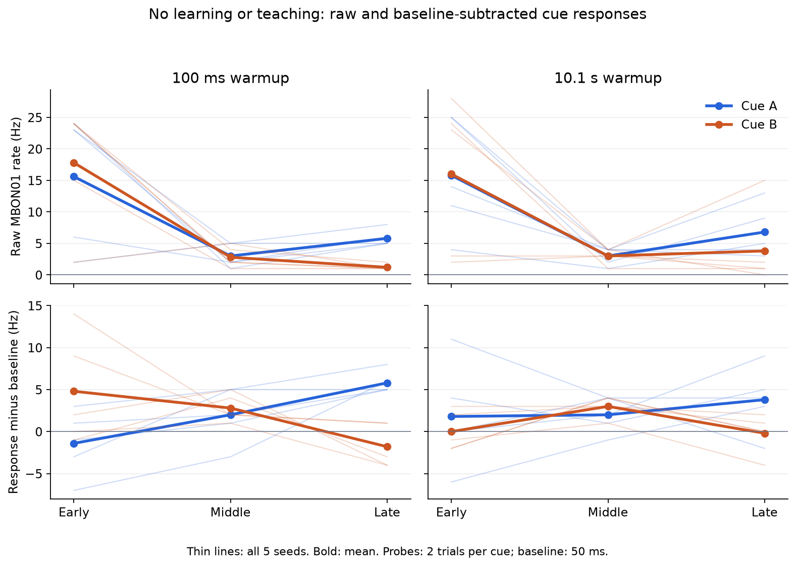

# 冻结网络预热对照：100 ms 与 10.1 s

**结论：延长预热降低了平均首尾响应变化，但没有带来一致的稳定性改善，也没有建立稳定区分 A/B 的证据。** 五个种子中三个改善、两个变差；不能把均值下降解释为问题已经解决。

本轮协议在运行前冻结，见 [WARMUP_PROTOCOL.md](../../WARMUP_PROTOCOL.md)。数值表由独立审计脚本生成，下方研究解释在全部结果完成后撰写。原 [CPU v1 实验](../cpu-v1/RESULTS.md)及[第一轮衰减诊断](../readout-diagnostics-v1/RESULTS.md)均保持原样。

10/10 全脑运行完成；360 次试验读出独立重算通过。两组均无学习、无教学、无奖励，全部 gain 保持 1。

长预热组在原输入前增加 10 s 背景活动；之后的背景和刺激事件逐项匹配。模型、初始状态、刺激顺序和参数保持相同。

## 预设主要指标

每种刺激分别取末次与首次测试放电率差的绝对值，再对 A/B 平均，单位 Hz。越小表示这两个测试时点的响应变化越小；它不衡量分类准确率，也不保证中间过程稳定。

| seed | 100 ms 漂移 | 10.1 s 漂移 | 长减短 |
| ---: | ---: | ---: | ---: |
| 11 | 18.50 | 17.00 | -1.50 |
| 23 | 20.00 | 4.50 | -15.50 |
| 47 | 1.00 | 12.50 | +11.50 |
| 83 | 21.00 | 0.50 | -20.50 |
| 131 | 8.50 | 19.50 | +11.00 |

100 ms：均值 13.80 Hz，范围 [1.00, 21.00] Hz。

10.1 s：均值 10.80 Hz，范围 [0.50, 19.50] Hz。

长减短：均值 -3.00 Hz，范围 [-20.50, 11.50] Hz。



每条线连接同一个种子的两组结果；黑横线为均值，不是置信区间。[矢量 PDF](warmup_drift.pdf)。

## 全部原始测试读出

表内为 A/B Hz，每种刺激每个测试块仅 2 次试验。

| seed | 预热 ms | 早期 A/B | 中期 A/B | 晚期 A/B |
| ---: | ---: | ---: | ---: | ---: |
| 11 | 100 | 23.0/24.0 | 5.0/4.0 | 8.0/2.0 |
| 11 | 10100 | 14.0/23.0 | 4.0/4.0 | 3.0/0.0 |
| 23 | 100 | 23.0/24.0 | 2.0/2.0 | 6.0/1.0 |
| 23 | 10100 | 11.0/3.0 | 4.0/3.0 | 4.0/1.0 |
| 47 | 100 | 6.0/2.0 | 2.0/5.0 | 5.0/1.0 |
| 47 | 10100 | 25.0/28.0 | 4.0/4.0 | 13.0/15.0 |
| 83 | 100 | 24.0/24.0 | 1.0/2.0 | 5.0/1.0 |
| 83 | 10100 | 4.0/2.0 | 1.0/3.0 | 5.0/2.0 |
| 131 | 100 | 2.0/15.0 | 5.0/1.0 | 5.0/1.0 |
| 131 | 10100 | 25.0/24.0 | 2.0/1.0 | 9.0/1.0 |

## 五个种子均值：原始及基线校正读出

基线为刺激前 50 ms；负的校正值表示刺激窗口放电率低于该短基线估计，不是负放电。

| 预热 ms | 测试时点 | 原始 A/B Hz | 校正 A/B Hz | 原始 B−A Hz | 校正 B−A Hz | 双刺激静默 seeds |
| ---: | --- | ---: | ---: | ---: | ---: | ---: |
| 100 | pre | 15.60/17.80 | -1.40/4.80 | 2.20 | 6.20 | 0/5 |
| 100 | post | 3.00/2.80 | 2.00/2.80 | -0.20 | 0.80 | 0/5 |
| 100 | final | 5.80/1.20 | 5.80/-1.80 | -4.60 | -7.60 | 0/5 |
| 10100 | pre | 15.80/16.00 | 1.80/0.00 | 0.20 | -1.80 | 0/5 |
| 10100 | post | 3.00/3.00 | 2.00/3.00 | 0.00 | 1.00 | 0/5 |
| 10100 | final | 6.80/3.80 | 3.80/-0.20 | -3.00 | -4.00 | 0/5 |



细线为全部五个种子，粗线为均值。[矢量 PDF](warmup_responses.pdf)。原始与校正读出分别共享纵轴，均保留正、零和负差异。

## 研究解释

预设主要指标的均值从 13.8 降至 10.8 Hz，是一个描述性的平均改善。但种子 47
从 1.0 增至 12.5 Hz，种子 131 从 8.5 增至 19.5 Hz；其余三个种子改善幅度
分别为 1.5、15.5、20.5 Hz。样本少、差异大，不能据均值推断可靠改善。

长预热下的群体平均原始 A/B 读出仍从早期 15.8/16.0 Hz 降到中期 3.0/3.0 Hz，
晚期回到 6.8/3.8 Hz。它没有产生一个平稳不变的响应水平，也没有使早、中、晚
的 A/B 差异保持一致。基线校正后，三个时点的 B−A 分别为 −1.8、+1.0、−4.0 Hz。
这些不是分类准确率；每个测试块每种刺激只有两次试验，尤其 50 ms 基线估计很粗。
因此“未建立稳定区分证据”并不意味着证明了模型在任何读出或协议下都不能区分。

本轮没有出现测试块内 A、B 同时静默的 seed，但“不完全静默”仍不足以保证
后续学习有稳定可用的读出。主要指标只比较首尾，图中的中期低反应也必须保留。

这一受控干预削弱了“只需把背景预热从 100 ms 加到 10.1 s 就能解决问题”的
解释。它没有排除其他预热长度、初始状态、刺激历史或递归网络动力学的作用。
长组增加了一段独立背景历史，之后精确重放同一组事件；结论限于这个明确干预。

下一项优先实验应检验**刺激历史**：固定背景及后续探测试验，对此前是否反复
呈现 A/B 做单因素对照，再比较探测前的兴奋/抑制电导及响应变化。这样可以进一步
区分“经过了时间”和“经历了刺激”。本轮没有进行该干预，也没有据本轮结果调整
学习率、输入幅度或抑制强度；这些建议不是已经证实的原因。

## 验证、资源及复现

五个短预热组均与原 CPU v1 frozen 条件的完整 snapshot 逐项精确相同。十组的输入匹配、零学习/教学、全图大小、gain=1、有限状态、完整计数和模拟时长均已核对。

每组用 Rust CPU 4 线程连续运行，短组模拟 19.1 s，长组模拟 29.1 s。

100 ms 组：原生墙钟 37.19–113.75 s；端到端 58.45–147.45 s；最大原生 RSS 559.6 MiB。

10100 ms 组：原生墙钟 85.09–119.35 s；端到端 120.19–164.67 s；最大原生 RSS 551.1 MiB。

共享主机耗时受其他负载影响；长短组模拟时间不同，不作性能优劣结论。原生与前端峰值不相加；前端峰值保存在 results.json。

本机完整原始产物：`/atlas-storage/0002/codex-flywire-learning/output/learning-warmup-v1`。本目录 results.json 保存全部试验、指标、资源及逐文件散列；progress.json 保存十个作业的命令、状态及退出码。

本机 worktree 的 `brian2-rust/output` 软链接指向上述 T7 研究目录的父目录。
复现依赖原 CPU v1 的 prepared 图和保存的 frozen 输入；图身份及来源见
[CPU v1 产物索引](../cpu-v1/ARTIFACTS.md)。`warmup_identity.json` 与每组
`configuration.json` 分别记录本轮包装脚本/协议和基础模型/输入身份。
模型、运行脚本和参数在十组计算过程中未改变；期间提交的审计及画图代码不参与模拟。
大图、完整 snapshot 和原生制品保留在 T7，小型结果与脚本提交 Git。

本目录 [results.json](results.json)、[执行登记](progress.json)、
[图表来源](figure_provenance.json)及[交付审计](delivery_audit.json)提供核查入口。
运行后环境快照见 [environment.json](environment.json)；小型产物及相关源码散列见
[artifact_manifest.json](artifact_manifest.json)。

```sh
python brian2-rust/experiments/flywire_learning/warmup_study.py --prepared /path/to/learning-prepared --baseline /path/to/learning-study-compact --output /path/to/new-warmup-study
python brian2-rust/experiments/flywire_learning/warmup_report.py --study /path/to/new-warmup-study --baseline /path/to/learning-study-compact --output /path/to/new-warmup-report
python brian2-rust/experiments/flywire_learning/plot_warmup.py --report /path/to/new-warmup-report
```
