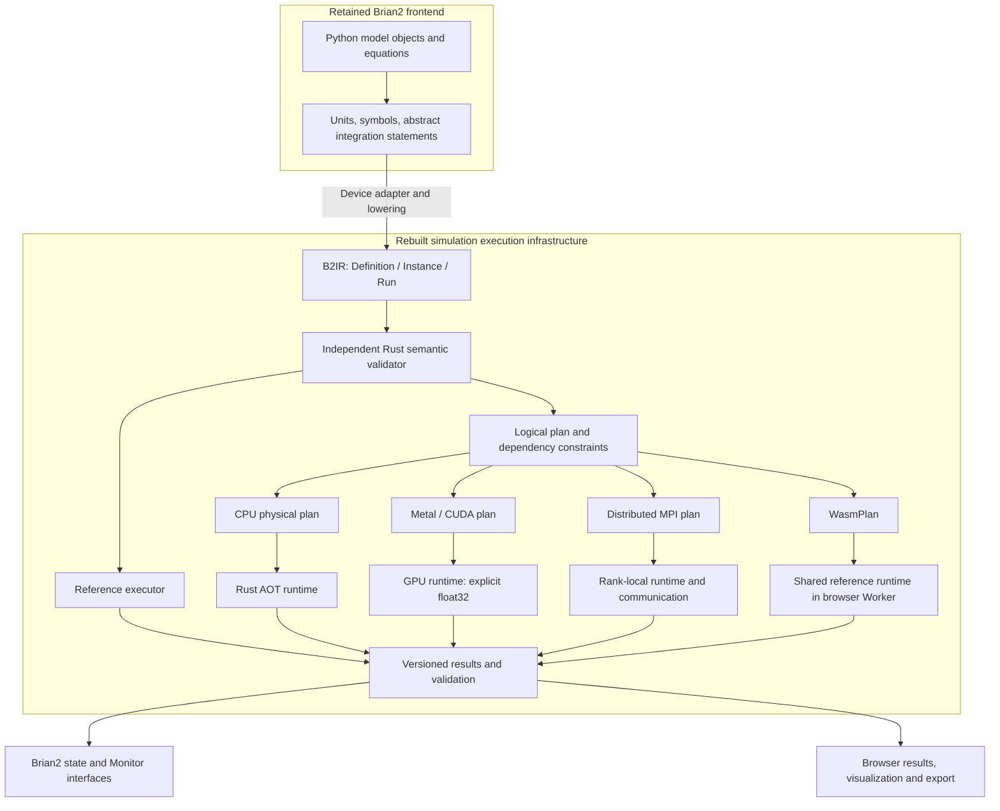

# 论文大纲与论证设计

> 写作阶段记录：以下内容按各节记录日期保留，不是当前实现或验收状态。当前稿件、图表数量和验证入口见[论文索引](README.md)。

更新日期：2026-10-07。v3 按系统/方法论文组织，保留三项核心贡献；当前工作稿八组主图、五张主表、15 项引用。完整工作稿覆盖方法及证据边界，正式投稿时按期刊篇幅压缩。

## 1. 论文核心

**一句话主张**

> We present brian2-atlas, a unified intermediate representation and execution architecture for heterogeneous and distributed neural simulation, retaining Brian2 as a modeling frontend. B2IR makes model execution semantics explicit and supports rebuilt CPU, GPU, and browser execution within declared capability and numerical contracts. Distributed topology construction, partitioned state and synaptic storage, and ordered event exchange extend execution across nodes.

**要解决的问题**

如何在沿用 Brian2 方程式建模体验的同时，让模型构建、状态与突触存储、事件处理跨节点分布，并以明确的时间、依赖和随机身份契约约束分区后的执行？统一 IR 如何同时支撑本地 CPU/GPU 和浏览器执行？

论文开篇先说明用户价值：让沿用 Brian2 建模的受支持模型利用跨节点计算与内存资源，进入与成熟 HPC 神经模拟器可共同评估的问题规模。三项贡献依次为统一 IR、重写的异构后端和分布式实现；分布式容量提供核心规模证据。随后解释模型构建、事件语义和局部存储为什么必须协同设计。

“完整执行核心替换”须由依赖与调用边界支撑；“所有 Brian2 程序都可直接迁移”须由兼容证据支撑，两项分别表述。前端还在使用 Brian2 的积分方法展开和一次性初始化工具，这属于需要明确归属的复用。

创新性论证及对 Brian2CUDA/GeNN/Wasm 的比较见 [NOVELTY.md](NOVELTY.md)。标题覆盖统一 IR、异构执行与分布式执行；CPU/GPU 和浏览器分别给出平台能力及实证结果。

## 2. 三项贡献

### C1：支撑分区与多目标执行的统一语义契约

将前端模型降为 B2IR，显式记录类型/单位、索引域、canonical schedule、事件与延迟、读写 effects、随机身份，以及 Definition/Instance/Run 三层身份。独立 Rust 验证器检查模型；reference 执行器提供可对照实现。逻辑依赖及目标计划把契约落实到分布式 MPI、Rust CPU、Metal/CUDA 和浏览器 WASM；WebGPU 的独立细胞子集单列。

可论证的价值：将分区和硬件策略置于可检查的模型语义边界内。模型有效性、后端能力、计划合法性和数值模式分别判定。ExecutionPlan/WasmPlan/DistributedPlan 共享语义基础，不声称当前具备统一的跨目标自动优化器。

需要的证据：语义实例、非法模型拒绝、调度与随机边界测试、计划实例、同一共同子集的交叉执行，以及关键策略消融。测试覆盖不等同于形式化正确性证明；共享前端产生的错误仍可能跨执行器保留。

### C2：重写的异构执行后端与资源效率

在统一语义与计划基础上实现 Rust CPU、CUDA、Metal 和浏览器 WASM 执行路径，明确 WebGPU 子集及模型专用 WASM AOT 的边界。通过新的代码生成、数据布局、所有权、事件处理及生命周期实现，扩展平台覆盖，并评估已有平台上的速度与内存收益。

可论证的价值：Metal 扩展了本系统的 GPU 平台范围；新实现的收益同时包含运行时间、峰值内存和可完成的模型规模。对此前因内存不足无法完成的模型，报告实际失败阶段、资源限制及新引擎的完成记录。

需要的证据：同模型、同硬件与明确精度下的对照，完整计时与进程树内存，以及关键机制消融。实际 OOM、主动内存预算终止及严重换页分别标记；不能将局部工作负载收益写成所有平台的普遍加速。

### C3：面向跨节点容量的分布式执行架构

保留 Brian2 建模前端，以新引擎承担分布式拓扑构建、rank-local 状态和目标入边存储、脉冲交换及事件投递。将模型构建阶段的内存需求与运行阶段的分片执行一起处理，解释全局边/RNG 身份及事件顺序如何在分区过程中落实。

可论证的价值：受支持模型能够使用跨节点的计算与内存资源。四节点 32 ranks 完成约 413 万神经元、241 亿递归突触网络的 100.5 s 仿真，提供当前最直接的规模证据。

需要的证据：分布式构图和所有权算法、1/2/4-rank 正确性与内存对照、大规模运行及资源记录、通信和计算分解。完成记录支持该规模的可执行性；强扩展、超算级节点数及相对 NEST 的效率须由对应实验支撑。MPI 内 GPU 路径单独说明只卸载 state update 的范围。

### 三项贡献的共同验证

将小型语义测试、代表性 CPU/GPU 工作负载、浏览器可移植执行、大规模 MPI 网络、记录及恢复实验串成验证层级。结果回答何时更快、何处节省内存、能完成多大网络，以及哪些语义/精度边界仍有限制。

可论证的价值：给出可复核的适用范围，而非只报告单个最好加速比。

需要的证据：完整样本、测量区间、环境、失败项、源码与输入身份。大规模运行完成并不自动证明统计等价、论文生物学结论或成本优势。

## 3. 五个研究问题

| ID | 研究问题 | 最直接的回答材料 |
|---|---|---|
| RQ1 | 新引擎能否在明确支持范围内接管 Brian2 执行并保留声明的行为？ | 前端/运行时边界；调度、状态、事件、RNG 差分；能力矩阵 |
| RQ2 | 分片执行与分布式建图能支持怎样的网络容量和资源占用？ | MPI 分区内存数据；四节点 32-rank 全规模多脑区案例；通信分解 |
| RQ3 | 哪些计划与布局选择产生可归因的 CPU/GPU 收益？ | 同实例策略消融；受控吞吐与完整重放测量；负面结果 |
| RQ4 | 长时程记录、重放与恢复在什么范围内可用且可复现？ | CPU/GPU 分段和恢复；全规模可塑性案例；MPI 长记录及其恢复边界 |
| RQ5 | 已验证模型能否作为独立制品分发，在浏览器中本地执行和交互？ | WASM/native 差分、严格 bundle 导入、Worker 隔离、方程编辑、WebGPU 子集与全图 WASM AOT 离线演示 |

## 4. 正文章节

### 1. Introduction — 约 700–900 词

段落顺序：方程式建模的价值 → 跨节点计算与内存需求 → 分布式构图、所有权和事件语义的协同难题 → B2IR 与分布式执行架构 → 大规模完成证据与三项贡献。

先引用 Brian2 的建模及代码生成贡献；已有 GeNN、Brian2CUDA、NEST 和 NIR 为背景。问题要用可观察的技术实例提出，例如同 tick 中 reset 与 on_pre 的顺序改变，或不同 rank 的累加次序改变结果，避免泛称其他模拟器“没有现代架构”。

结尾首先预告分布式大规模案例，再交代 CPU/GPU 与浏览器验证范围。最终摘要及引言的性能数字等 Fig. 3–5 的证据冻结后再填。

### 2. Architecture and semantic contract — 约 1,000–1,200 词

**2.1 Retained frontend and replaced execution core**：列出保留的 Brian2 对象、单位/表达式解析、state-updater 展开、初始化工具；解释 Device 接入、整网接管及结果回填。以真实调用路径说明依赖边界。

**2.2 B2IR**：类型与索引域；Definition/Instance/Run；canonical 调度与 clocks；显式事件/RNG/数值模式。哈希提供身份与完整性，不等同于语义正确性。

§2.4 增加 Next Brain 对实际运行 B2IR 的交互检查；S18 / Supplementary Figure S1 配对线上保存的 FlyWire DM1 WASM 活动回放与默认参数 B2IR 模型草稿，展示逻辑顺序、依赖、读写集合和编译操作，不将其描述为完整物理优化路径。

**2.3 Validation and reference execution**：前端检查、独立 Rust 验证、后端 eligibility、reference 执行、结果校验分别负责什么。列出可拒绝的具体反例。

**2.4 Logical and physical execution plans**：依赖图、策略合法性、策略成本、运行时绑定和 EXPLAIN。保持阶段快照语义；无法采用优化策略的模型使用其受支持 canonical 路径。

配 Fig. 1、Fig. 2，Table 1。关键术语定义在此完成。

### 3. Execution mechanisms — 约 1,400–1,700 词

**3.1 Distributed MPI execution**：神经元与目标入边归属、全局 RNG/边身份、spike 交换、fixed-total 分布式构图、内存分片、输出收集。区分通用实现与多脑区适配器；按具体版本说明通信优化。

**3.2 CPU execution**：模型专用 AOT、SoA、常驻 worker、target ownership、degree balancing、事件布局与延迟队列；选择两到三个具有消融证据的机制深入解释。

**3.3 Metal and CUDA execution**：显式 f32、canonical DAG、edge/target ownership、scan/sparse/bitset 等策略；缓冲与提交/重放。强调浮点顺序、脉冲阈值及读回范围。

**3.4 Browser execution and portable artifacts**：通用 WasmPlan/BrowserExecutor 复用 native reference 的验证与执行核心，在 Worker 中分批推进；模型导入、受限方程编写、取消/隔离和结果导出形成完整工作流。区分 WebGPU 独立细胞 f32 路径和全图 FlyWire 的模型专用 WASM AOT。建模/打包阶段需要的 Python/Rust 与访问者运行时无 Python/仿真服务的边界分别画出。

**3.5 Execution lifecycle and hybrid ranks**：结果协议、跨 run 状态、checkpoint、rolling recording；逐后端列出能力。MPI＋GPU 的 state-update 卸载作为集成示例，小节内明确 Metal 实测与 CUDA 未实测边界。

算法框建议只放两个：依赖约束下的计划选择；保持源/边与到达顺序的 owner-local 事件投递。算法必须从实际实现抽取，不能画出尚未实现的自动优化流程。

### 4. Evaluation methodology — 约 800–1,000 词

**4.1 Workload selection**：小语义例、CUBA/COBAHH/STDP、PD14、FlyWire、LK 派生模型、多脑区 MPI，以及浏览器 bundle 导入、Equation Lab、全图 WASM AOT。每个 workload 对应一个研究问题。

**4.2 Correctness criteria**：同执行器重放、同数值模式差分、跨精度比较、跨随机流统计分别定义。明确参考实现的共享依赖与盲点。

**4.3 Performance and memory**：分别定义模型准备/编译、原生热循环、完整重放、端到端持久化；RSS 与进程树/cgroup、显存、CPU core-hours 区分。按实际实验给出重复次数和顺序，不能统一假称所有历史实验都重复五次。

**4.4 Baselines and provenance**：CPU Brian2 C++、GPU Brian2CUDA/GeNN/Brian2GeNN、MPI NEST；列出软件版本、编译参数、线程/rank/绑核与输出要求。原版、修正适配器、未通过数值门的对照单独标记。

### 5. Results — 约 1,700–2,100 词

**5.1 Semantic conformance and supported scope**：回答 RQ1。给出关键反例及完整能力表，不把跨平台跳过项计为通过。

**5.2 Distributed capacity and resource use**：回答 RQ2。先用 FlyWire 1/2/4 ranks 展示本地存储收益，再给四节点 32 ranks、约 413 万神经元/241 亿递归突触、100.5 s 的完成证据。强扩展和独立 NEST 性能主张只在对应实验完成后加入。

**5.3 CPU and GPU performance**：回答 RQ3。先同线程/同机对照，再各后端最佳已测配置；给出机制消融和小模型反例。CPU/GPU 数值模式不同必须显式标识。

**5.4 Long-duration execution and recovery**：回答 RQ4。LK 派生模型的长时程与恢复；CPU/GPU 生命周期验证；MPI 长输出。全规模 LK 的原始证据属于不同分支，需要逐项绑定版本。

**5.5 Browser portability and interactive execution**：回答 RQ5。报告通用 WASM 在 native/Node/browser 的验证链、不同 batch 大小、模型导入/方程编辑、Worker 取消与隔离；用全图 FlyWire WASM AOT 的 13 个固定输入对照和静态站点离线验收展示模型制品分发。WebGPU 报告实测 f32 差异，不能以通过生命周期测试代替数值等价。

**5.6 Observed boundaries**：集中呈现精度轨迹分歧、性能弱点、通信占比及科学统计差异，随后转入讨论。若篇幅紧，将本小节并入各结果小节，避免重复。

### 6. Related work and discussion — 约 700–1,000 词

按问题比较：Brian2 前端与代码生成；GeNN/Brian2CUDA 的执行路径；NIR/NeuroML/PyNN 的抽象层次；NEST/NEST GPU 的分布式设计；MLIR 系列编译工作。

本工作的差异是待逐项论证的组合：具体 Brian 执行语义、独立验证、计划层及浏览器、原生与分布式执行范围。不得声称首次使用 IR、首次 GPU/MPI 仿真或首次运行 24-billion-synapse 网络。

讨论前端依赖、兼容子集、验证非形式化证明、精度与随机流差异、共享主机噪声、独立 seed 不足、分支集成状态。未来工作围绕已测边界提出，不把完整替换定位弱化为只增加一个执行目标。

### 7. Conclusion — 约 150–200 词

重申执行核心重建及前端保留；总结被数据支持的正确性、性能、容量和可复现范围。结论不引入新倍数或新兼容主张。

### Code and data availability / supplementary material

发布时提供版本化源码、环境锁、图表数据、重算命令、较小复现模型与大型证据清单。作者、单位、贡献、资助及披露由实际参与者填写，不从代码提交量推定。

## 5. 主图与主表设计

| 图表 | 设计 | 要回答的问题 | 数据状态 |
|---|---|---|---|
| Fig. 1 | 既有管线与新系统边界对照；B2IR/验证 → 逻辑计划 → CPU/GPU/WASM/MPI → 结果 | 替换了什么、保留了什么？ | 可立即绘制；应展示独立 reference 分支 |
| Fig. 2 | threshold/on_pre/reset 语义例、effects 依赖、合法/非法重排、实际 plan 片段 | 如何约束优化且保持可观察行为？ | 先选已有测试中的一个最小反例，必要时本地复现 |
| Fig. 3 | MPI rank-local 内存；1/2/4-rank 时间；全规模多脑区资源/完成情况 | 分布式系统提供什么容量与资源能力？ | 完成证据可用；最新 Rust/NEST 性能仍等待该批终态 |
| Fig. 4 | CPU 工作负载对照＋自身线程扩展＋1–2 项机制消融 | CPU 收益来自哪里？ | 历史报告齐备，待筛选同版本数据与原始样本 |
| Fig. 5 | Metal/CUDA 完整重放，分面标硬件/精度；默认与策略消融；标失败对照 | GPU 在哪些条件有效？ | 交付矩阵已闭环，统一图表口径即可推进 |
| Fig. 6 | 长时程记录内存、恢复前后轨迹/状态、恢复耗时分解 | 长时程生命周期是否可用？ | LK/CPU/GPU 已有证据；不同 cohort 不连成一条曲线 |
| Fig. 7 | 模型导出/浏览器验证/Worker 执行/结果导出；通用 WASM 差分；全图 AOT 离线案例；WebGPU 独立子图 | 模型能否脱离原生安装与仿真服务进行本地执行？ | 已有通用与应用层验收，按三种 browser profile 分列 |
| Table 1 | 前端保留/执行替换及 CPU、Metal/CUDA、WASM、WebGPU、WASM AOT、MPI、MPI-GPU 能力/精度矩阵 | 架构边界与兼容边界 | 根据当前各分支代码与测试制作 |
| Table 2 | 工作负载、N/E、模型时间、精度、后端、重复数、计时范围、证据版本 | 所有结果是否可比较？ | 从证据矩阵逐行抽取 |

主图最多七组。浏览器运行时与可移植模型进入主文，FlyWire 全图 WASM AOT 作为 Fig. 7 的具体案例；MNIST 分类分数及游戏 UI 细节放补充材料，其分类分数不是引擎正确性或连接组结构优势证据。PD14 与 FlyWire 可合并为 Fig. 4 的规模案例，保留完整数据于补充材料。

### Fig. 1 可编辑结构草案

图注草案：Brian2 保留建模和前端编译职责，独立验证后的 B2IR 驱动参考执行和目标执行计划。各目标具有单独的能力与数值契约。图中的 MPI 计划来自 MPI 分支；各目标的并列表示架构范围，不表示所有功能组合已经在同一发行版本中验证。MPI 内 GPU 状态更新卸载作为局部放大图或补充图介绍。WebGPU 与模型专用 WASM AOT 的不同 lowering/host 路径在 Fig. 7 展开，不能并入通用 BrowserExecutor 来扩大其支持范围。

## 6. 实际写作顺序与完成条件

1. **先完成边界与图表索引**：Fig. 1、Table 1、每张结果图的版本/输入/原始数据来源。完成标准：每个箭头与能力项都能定位代码或测试。
2. **撰写架构与机制**：Sections 2–3；将既有代码设计转换成算法、约束和复杂度说明。完成标准：读者能解释一个模型如何执行及为什么某策略不适用。
3. **固定 Methods 与结果数据**：Sections 4–5；复用已验收数据，对影响主张的缺口做有限补证。完成标准：每个数字可重算，每个计时范围明确。
4. **回写 Introduction、摘要和讨论**：只保留正文已经支撑的贡献。完成标准：摘要中每句经验性结论能回指结果图或表。
5. **准备 preprint v1 包**：可构建稿件、引用、源码身份、图表数据及局限性。若最新全规模 NEST 对照未收尾，v1 仍可使用已有 MPI 容量结果，并将性能比较列为后续版本。

本阶段不要求重跑全部历史基准，也不要求扩展全部 Brian2 能力。是否增加实验，以是否改变本文核心结论为准。

## v3 章节扩展

- §2.1 与 Table 1：主线集成、前端补丁及 CPU 扩展兼容范围。
- §3.7：MPI 可塑性、成功边界恢复与固定候选代际保护。
- §3.8、§4.6、§5.7：有界原生训练计划及独立硬件验收；作为执行架构扩展，不改变三项核心贡献。
- §5.2：三 Rust realization 与三 NEST reference 的描述性结果；保留原资源 cohort，科学等价与公平速度比较仍未验收。
- §4.7、§5.8、Table 5：三组树突模型 CPU 对照，包括 Rust 较慢的案例。
- Supplement S10–S13：当前检查快照、分布式状态、训练资格矩阵和新增基准原始定位。

## v3 已发表模型与用户工作流

§5.8 分为显式 NMDA 和树突门控两案例，分别连接模型原型、统一 IR 能力、数值验证和性能/容量。Figure 8 / Table 4 为 NMDA；Table 5 保留树突正负性能结果。Onasch 全文复现状态放 S14，不把源环境扫描直接计为 Atlas 测试。引言与 §6.3 说明统一执行契约如何减少多目标协调；三项贡献不变，使用负担是设计目标而非已测量的新贡献。

## v3 兼容性附录

Appendix A / Table 6 按功能列出 CPU reference/AOT、CUDA/Metal、通用 WASM 与 MPI CPU 的受限契约、排除项和证据未覆盖项。S16 给出精度、时钟、突触、记录、生命周期与拓扑限制，并单列 WebGPU、专用 WASM AOT、混合 MPI 和训练扩展。

## 异构 MPI 分工与验收

§3.5 说明显式 CPU/Metal/CUDA rank 分配、混合精度与主机事件处理；§5.9 / Figure 9 连接实际 CPU+Metal 仿真记录和单 L4 CUDA MPI 训练的分别验收。S17 / Table S1 列出组合资格，不将适配器列表等同于跨 OS/ABI 的多厂商集群已实测。
