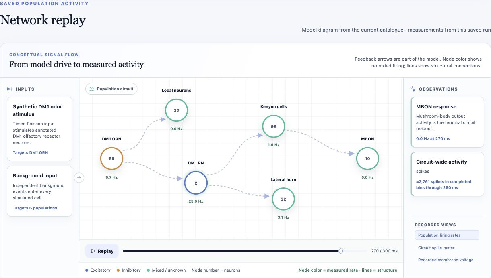
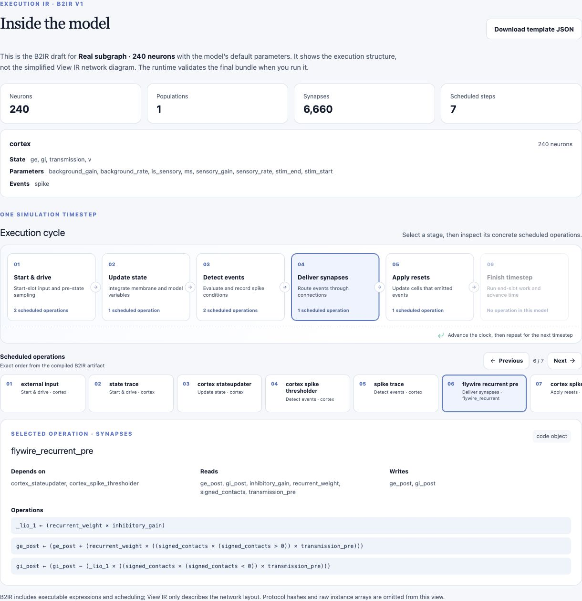
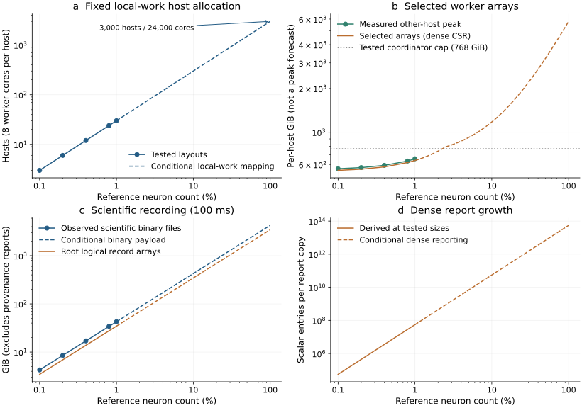

# Supplementary methods and evidence

These supplementary methods document the execution-plan and browser studies, implementation identities, distributed plasticity and recovery, multi-area cohorts, native training, and published-model validation workflows accompanying [the manuscript](MANUSCRIPT.md). Experiments retain their source identities and acceptance scopes. Implementation references use [brian2-atlas commit `ae649a244e28d7d4b3eb5df4e35215e14c1378c7`](https://github.com/RockLi/brian2-atlas/tree/ae649a244e28d7d4b3eb5df4e35215e14c1378c7); experimental records and specifications are archived in [brian2-atlas-preprint tag `biorxiv-v1`](https://github.com/RockLi/brian2-atlas-preprint/tree/biorxiv-v1). Complete raw outputs are not included in the accompanying evidence package.

## S1. Identity and evidence levels

Three kinds of evidence are distinguished throughout the study:

1. **Implementation inspection:** source and specification describing the executed algorithm and capability checks.
2. **Retained machine-readable observations:** existing samples or verification results extracted into the manuscript data package and checked for arithmetic consistency.
3. **Retained report summaries:** previously recorded medians or resource observations whose complete raw archive was not recovered into the accompanying evidence package. These remain labeled as summaries and are not plotted with reconstructed uncertainty.

[figure_data.json](data/figure_data.json) contains the extracted data and SHA-256 hashes of the source files read during extraction. It does not contain all raw output arrays. [collect_evidence.py](scripts/collect_evidence.py) reads existing local reports; it launches no simulation or remote work. [build_manuscript.py](scripts/build_manuscript.py) rebuilds figures and a standalone HTML reading copy from the saved figure data and the retained Neural Lab screenshot described in S7.1.

| Figure | Evidence level | Main source |
|---|---|---|
| 1 | Implementation diagram, including analysis and physical selection | AtlasIR.md, EXECUTION_PLAN.md, plan.py, planner.py, GPU_AUTOTUNE.md, WasmPlan and DistributedPlan implementations |
| 2 | Explanatory sequence plus rerun regression | test_summed_linked_reader_observes_every_tick; documented scheduling counterexample |
| 3 | Extracted per-run samples and resource observations | MPI rank-local optimization-report.json; primary terminal-resource-report.json |
| 4 | Retained five-repeat report medians and peaks | FLYWIRE_CROSS_HOST_RESULTS.md |
| 5 | Retained GPU sample summaries with individual times | population-scale/audit-result.json; precompiled-comparison report.json.gz |
| 6 | Retained single-observation resource summary | LITWIN_KUMAR_RESULTS.md |
| 7 | Scope diagram, fixed-input verification and a captured interface run | WASM.md; FLYWIRE_MNIST_BROWSER.md; wasm-check.json; neural_lab_capture.json |
| Table 3 | Hash-verified archived report samples and selected policies | Six archived benchmark reports summarized in plan_selection.json; see S9 |
| 8 / Table 4 | Extracted NMDA CPU samples and separately scoped same-core MPI medians | published_models/evidence.json; source-specific records; see S14 |
| Table 5 | Default dendritic CPU medians and scoped numerical gates | data/v3/evidence.json; see S13–S14 |
| 9 | Source diagram and separately scoped hardware qualification | data/mpi_heterogeneous/evidence.json; see S17 |
| 10 | Accepted capacity observations and complete-output audit records | data/capacity/evidence.json; see S19 |

The earlier primary resource report records raw-output auditing as not yet passed at collection time. The subsequent primary-postrun/full-report.json records a passed internal output audit. Both stages are preserved, rather than overwriting the earlier flag. Scientific acceptance and comparative performance acceptance remain false in that later report. Manuscript completion claims use the terminal and later raw-audit records together.

## S2. Frontend and execution boundary

The source path is AtlasDevice.network_run → frontend model preparation → lower_network → AtlasIR integrity/semantic validation → target planning and execution → load_results and public state/monitor updates. Delayed or queued build modes use a separate Device build entry. Exact control flow differs by target; the diagram summarizes ownership rather than pretending every mode invokes one identical function sequence.

Retained Brian2 responsibilities include model objects, namespace and unit handling, numerical-update statement generation, and initialization. New execution responsibilities include native/GPU program emission, scheduling, state layout, queues, MPI exchange, and result production. The Device derives directly from the base Device class. Atlas's own CUDA planning, code generation, compilation and execution are implemented in [cuda.py](https://github.com/RockLi/brian2-atlas/blob/ae649a244e28d7d4b3eb5df4e35215e14c1378c7/brian2-rust/python/brian2_rust/cuda.py) and its Atlas runtime modules. Brian2CUDA, Brian2GeNN and GeNN are external comparator dependencies only; they are not used to execute an Atlas simulation. The CUDA target requires NVIDIA's compiler and driver. This supports a downstream execution-core replacement claim, not complete independence from Brian2 or universal compatibility with existing scripts.

Source records:

- [Device implementation](https://github.com/RockLi/brian2-atlas/blob/ae649a244e28d7d4b3eb5df4e35215e14c1378c7/brian2-rust/python/brian2_rust/device.py).
- [Model lowering](https://github.com/RockLi/brian2-atlas/blob/ae649a244e28d7d4b3eb5df4e35215e14c1378c7/brian2-rust/python/brian2_rust/export.py).
- [AtlasIR specification](https://github.com/RockLi/brian2-atlas/blob/ae649a244e28d7d4b3eb5df4e35215e14c1378c7/brian2-rust/AtlasIR.md).
- [Execution plans](https://github.com/RockLi/brian2-atlas-preprint/blob/biorxiv-v1/history/brian2-rust/EXECUTION_PLAN.md).
- [MPI specification](https://github.com/RockLi/brian2-atlas-preprint/blob/biorxiv-v1/history/brian2-rust/MPI.md).

The AtlasIR baseline has three hash layers and a reference-f64 profile. Target f32 selection is explicit and does not silently change that baseline into a different schema. The completed effect graph includes implicit refractory accesses beyond the serialized explicit effects. Target emitters and the reference derive these accesses to constrain their execution order. Plans are checked against the model and policy rather than accepted on the strength of a supplied hash alone.

## S3. Reproducible semantic example

The regression constructs three single-neuron groups and one synapse. The synaptic weight starts at one; its clock-driven derivative is 1/ms. A summed updater publishes the current weight to a target variable. A third group reads that variable via a Brian linked variable and advances dx/dt = external/ms with Euler at dt = 1 ms. A start-slot monitor observes four ticks. The documented canonical x sequence is [0, 1, 3, 6]. The [0, 0, 0, 0] comparison illustrates the rejected transformation that postpones the summed writes until the end; it is not output produced by the corrected engine.

The regression can be run in the repository Python environment:

```sh
PYTHONDONTWRITEBYTECODE=1 PYTHONPATH=brian2-rust/python:. \
  python -m pytest brian2-rust/tests/test_synapses.py \
  -k summed_linked_reader_observes_every_tick -q
```

The test compares all captured monitor, final reader and final target arrays across reference, AOT and Brian NumPy; these arrays agree for this example. Figure 2 is an explanatory rendering of the documented example; the saved test checks implementation agreement rather than claiming a formal proof for arbitrary transformations.

## S4. CPU and memory cohorts

The CPU graph benchmark uses the full FlyWire v783 weighted graph, a uniform excitatory LIF workload, seed 783, dt = 0.1 ms, and one second of simulation. Both backends use f64. It does not fit transmitter signs, morphology, physiology or behavior, and it does not exercise STDP. Original data provenance is the [FlyWire v783 release](https://zenodo.org/records/10676866), attributed under its reported CC BY 4.0 license.

| Environment | M1 Ultra cohort | Linux cohort |
|---|---|---|
| Machine | 20-core M1 Ultra, 128 GiB | Dual EPYC 9454, 96 physical cores, approximately 1.1 TiB |
| OS | macOS 14.5 arm64 | Ubuntu 24.04, Linux 6.8.0-101 x86_64 |
| Python | 3.12.14 | 3.12.3 |
| Rust | 1.98.1 / LLVM 22.1.8 | 1.98.1 / LLVM 22.1.8 |
| C++ | Apple clang 15 with libomp | GCC 13.3 / OpenMP |
| Placement | System scheduler | CPUs 0–15, NUMA node 0; close/core OpenMP placement |

The recorded Brian2 version is 2.10.1.post199. Simulation binary source is cb04068c239be9cbacdbdf84fc014ba4954d711b; final measurement tooling is b4929a5d. Graph SHA-256 is 4f0a4a31332ba489d796fefc7228c7471d0d0ca0939805ffe7369bfca1e12682. These identities describe the measured benchmark. All five-repeat summary values in Figure 4 are parsed from [the retained report](../history/brian2-rust/FLYWIRE_CROSS_HOST_RESULTS.md). Large raw artifacts are outside the manuscript package; the [archive catalog](../archives/README.md) records retained files and availability. The retained summary alone does not establish public access to every raw output.

For PD14, the laptop is an eight-core M3 with 16 GB unified memory, using four Rust workers, dt = 0.1 ms and disabled recording. The [resource report](../history/brian2-rust/PD14_LOCAL_16GB.md) records separate frontend and child peaks and the controlled stop of the C++ preparation attempt. Its partial C++ project was removed after stopping; the manuscript must not promise that those incomplete generated files are preserved. Compact fixed-total recipes and native initialization change memory use, while matching logical model parameters does not establish bitwise-identical random graph generation between backends.

The [assembly lifecycle report](../history/brian2-rust/LITWIN_KUMAR_RESULTS.md) separates final performance selection/confirmation from earlier memory and recovery cohorts. Figure 6 uses the reported JSON-optimized one-worker memory cohort only. It does not merge those observations with later optimized timings. The model guide explicitly labels this triplet-plasticity variant as not a full paper reproduction.

## S5. GPU protocols and complete comparator accounting

The population-scale ring has degree eight, 256 ticks, a drive of 1/16 per tick, pre-delay edge_index modulo eight, and post-delay three. The 256 ticks cover 250 ms. One bootstrap result and one warmup precede five randomized measured rounds. All GPU executions are sequential within each allocation. Matched f32 and retained f64 diagnostics are distinct. Source-manifest SHA-256 is 193e01a6f6f1d9ab18c148154750f9a65fc68ce3fcaa1416f4ea18e0118d5a00, with the production benchmark path unchanged from 4439f3b05 for this cohort.

The [retained ring measurements](https://github.com/RockLi/brian2-atlas-preprint/blob/biorxiv-v1/paper/data/figure_data.json) documents all default/prefix/bitset policies and external variants. The manuscript package contains the complete retained machine-readable summary, including excluded workers; Figure 5 selects default own-GPU execution and numerical controls to show the host-specific behavior. The following table is generated from those records and is linked rather than manually maintained:

[Supplementary GPU comparison table](data/gpu_comparisons.md).

The original direct-GeNN large-ring bootstraps emitted 200,705 spikes on L4 and 200,710 on A100 against 200,704 in the independent recurrence. They failed qualification and supply no ranked replay time. Barrier variants qualify, but their success is not a general diagnosis of the original failure. Brian2GeNN schedule-corrected and f32-factor variants remain labeled as modifications. Timing includes actual adapter lifecycle costs; comparing the displayed times is not a pure GPU-kernel comparison.

The [retained recurrent CUBA measurements](https://github.com/RockLi/brian2-atlas-preprint/blob/biorxiv-v1/paper/data/figure_data.json) uses 4,096 neurons, 131,072 synapses, 2,048 ticks and five randomized rounds. CUDA arithmetic uses the declared precise-basic policy. The direct GeNN adapter uses Brian-Euler arithmetic, and synaptic current is retained as a diagnostic rather than included in qualification because its readback phase differs. All six worker types pass matched gates on both GPUs; f64 diagnostics remain failed for the f32 outputs at this size. Raw compressed reports and result NPZ files are present in the local cohort directory. Figure construction reads reports but does not rerun or revalidate all NPZ contents.

## S6. Distributed cohorts and capacity audit

The [retained rank-local comparison](https://github.com/RockLi/brian2-atlas-preprint/blob/biorxiv-v1/paper/data/figure_data.json) uses two Linux nodes, Rust 1.86.0, MPICH 4.2.3 ch3:sock, and one compute thread per rank. One rank uses one node; two ranks use one per node; four ranks use two per node. Before and after implementations alternate, with one warmup and three measured resting runs per rank count and implementation. Nine post-change odor/cut-condition checks complete the recorded 33-run set. Thus there are **six warmups and 27 non-warmup observations**, not 33 timed repeats. Only the 18 measured resting runs contribute to Figure 3's time and peak comparisons.

The full EI graph includes 139,255 biological neurons and 580 inputs. Results and events match the same-source native reference. The earlier implementation is identified as f54a6798 in the source report; final binary and input identity lists are retained in its artifact-facts and rebound manifests. The full before/after runtime behavior is not assigned to a later MPI branch HEAD.

For the [retained multi-area run](https://github.com/RockLi/brian2-atlas-preprint/blob/biorxiv-v1/paper/data/figure_data.json), model time is 100.5 s with an observation window [0.5, 100.5) s on the physical grid. The seed is 1729 and chi is 1.9. The later raw-output audit binds:

| Item | SHA-256 |
|---|---|
| Model | 9526a75e00e7cd4c3457691610fce4072c2014c6e6c6b53ea8a62f588dcac6bd |
| Plan | 240c3a14ab8366811e5837d6451a3ab2d849220f17a7564a06d366fc459f49bd |
| Executable | 8e0f21edf5e44bb193b1f6152cf560f702e07750bc0a171699f69b4a048352a5 |

Each node runs eight ranks with a 256 GiB proxy budget and eight-core CPU quota. The small controller is accounted for separately. Individual proxy peaks must not be added into a synchronized peak. Terminal verification, raw audit and the [retained final-archive summary](https://github.com/RockLi/brian2-atlas-preprint/blob/biorxiv-v1/paper/data/figure_data.json) describe successive stages. This paragraph identifies the original seed-1729 resource cohort. The completed later three-realization descriptive cohort and exploratory NEST references are described in S11; neither supplies a matched speed ratio or scientific-equivalence acceptance.

## S7. Browser and mixed-rank boundaries

The [generic WASM path](https://github.com/RockLi/brian2-atlas-preprint/blob/biorxiv-v1/history/brian2-rust/WASM.md) shares the reference core; the [WebGPU path](https://github.com/RockLi/brian2-atlas-preprint/blob/biorxiv-v1/history/brian2-rust/WEBGPU.md) is restricted and experimental. The [full-connectome AOT application records](https://github.com/RockLi/brian2-atlas-preprint/blob/biorxiv-v1/paper/data/figure_data.json) uses generated source and a memory-only host. Its protocol hash is included in the saved figure data. All 13 fixed-input observations match CPU activity/input hashes and predictions. The 559,742,976-byte allocation is WASM linear memory, not browser process memory. Browser cache/offline checks and 26 image-preprocessing fixtures are separate validations; neither supplies a new full-test-set accuracy result.

[MPI GPU offload](https://github.com/RockLi/brian2-atlas-preprint/blob/biorxiv-v1/history/brian2-rust/MPI_GPU.md) has recorded local MPI+Metal execution and explicit mixed-f32 state updates. Its 118 passed/12 skipped verification summary concerns that delivery cohort. The CUDA implementation path has not been validated on NVIDIA hardware within this mixed-MPI experiment, and cross-host heterogeneous operation is not established. Single-machine CUDA evidence cannot substitute for that missing combination.

### S7.1 Neural Lab interface capture

Figure 7b is an unmodified screenshot of the live workspace element, captured on 11 September 2026 from the retained Neural Lab build with asset version `50d818ceef70c8ec`. A local static server served the retained browser build. The simulation ran in an isolated Chrome 152 browser session using the generic WASM/f64 reference path. The screenshot omits the browser chrome and the website header/model navigation outside the workspace element; no plot, result or metric was redrawn or replaced.

The default adaptive LIF configuration used 160 independent neurons, 600 ms duration, 0.1 ms timestep, seed 42, drive 1.65, heterogeneity 0.55, membrane time constant 20 ms, refractory period 2 ms, adaptation increment 0.06, and adaptation time constant 120 ms. Initial states and inputs were not synchronized. The completed run displayed 3,706 spikes, mean rate 38.60416666666667 Hz per neuron, and 100% active neurons. Its plan identity was `3ea73cfa0d5f7c573cb750030c8303af30092e896eddd8991b0bb889357f4b01`. Twelve state probes were available, with neuron 0 selected. The displayed 403 ms includes loading, compilation and transfer and is retained only as part of the actual UI; this one capture is not a timing benchmark or an additional conformance cohort.

The [original screenshot](figures/source/neural-lab-workspace.png), [exported experiment bundle](data/neural-lab.browser.json), and [capture provenance](data/neural_lab_capture.json) are included. The provenance records the viewport, configuration, observations and SHA-256 hashes of the screenshot, bundle, WebAssembly binary and principal frontend assets. This generic reference-runtime demonstration is distinct from the 13-input full-connectome AOT study. The screenshot does not establish generic full-connectome or WebGPU performance.

## S8. Rebuild and release status

From the repository root, using Python with Matplotlib, NumPy, Pillow and either Mistune or MarkdownIt:

```sh
python docs/preprint/scripts/build_manuscript.py
```

This uses saved figure, plan-selection, v3 and capacity evidence data plus the retained screenshot and regenerates ten SVG/PNG figures, the self-contained HTML reading copy, Tables 3–5 and the compatibility appendix, the figure contact sheet and consistency report. To refresh historical extraction from existing source checkouts, collect_evidence.py accepts optional --gpu-root and --mpi-root paths. The separate collect_v3_evidence.py reads existing small records and the local source review; its external archive root is explicit in that script. collect_capacity_evidence.py retains only accepted local capacity records; it launches no simulation or remote job. Rebuilding the manuscript from already retained data does not require the external raw archives. PDF export uses local Chrome and pypdf through export_pdf.py. Extraction and rendering use retained records and do not execute simulation benchmarks.


## S9. Execution-plan selection and GPU calibration

### S9.1 Source scope and planning mechanisms

The CPU planner separates legality checks from generated-work heuristics. Plan derivation records compact/general/canonical emission choices, eligible fusion, route ownership, and final-active-tick summed evaluation. The [CPU planner source](https://github.com/RockLi/brian2-atlas/blob/ae649a244e28d7d4b3eb5df4e35215e14c1378c7/brian2-rust/python/brian2_rust/planner.py) and [plan construction and explanation](https://github.com/RockLi/brian2-atlas/blob/ae649a244e28d7d4b3eb5df4e35215e14c1378c7/brian2-rust/python/brian2_rust/plan.py) describe the implementation at the pinned Atlas commit. [GPU_AUTOTUNE.md](https://github.com/RockLi/brian2-atlas-preprint/blob/biorxiv-v1/history/brian2-rust/GPU_AUTOTUNE.md), gpu_autotune.py and gpu_tuning_cache.py document the separate optional measured selection and decision-cache paths. The source hashes are recorded in [plan_selection.json](data/plan_selection.json).

The work proxy assigns different weights to expression operations and includes indirect synaptic state traffic, item counts and minimum useful task sizes. It is used to limit eligible parallel work. It does not predict end-to-end time, choose a backend automatically, establish global optimality or implement general arena reuse. The explain interface reports selected paths and reasons and distinguishes declared resource payload from uninstrumented dynamic memory. Runtime binding adds observations only after execution.

### S9.2 Retained calibration cohort

The [calibration records](https://github.com/RockLi/brian2-atlas-preprint/blob/biorxiv-v1/paper/data/plan_selection.json) identify the source manifest and retained measurements. The selected final cohort has M3, L4 and A100 hosts, each with quiet/wide 4,096-neuron STDP cases and 1,024 ticks at dt = 1/1,024 s. Quiet uses degree 8, drive 1/64, pre-delay edge_index modulo 16, and post delay 16. Wide uses degree 32, drive 1/16, pre-delay edge_index modulo 8, and post delay 3. The quiet case has zero spikes. Initial voltage is (i modulo 16)/16, initial weight is 0.25, and topology uses seed 42 with source-major, sorted-target creation order. Full equations, recording, degree statistics and topology hashes are preserved in each saved report.

The four candidate policies are baseline, synapse prefix, ordered target bitmaps, and prefix plus bitmaps. One warmup and three randomized full replays per distinct plan precede a final winner replay. Every sampled observable fingerprint must equal the baseline fingerprint. The selector requires at least 5% median improvement and a candidate maximum below the baseline minimum; otherwise it retains baseline. Five later winner replays are a separate sequence. [Candidate tables](data/plan_selection_tables.md) list all recorded candidate medians, ranges, status and selections, including overlapping M3 observations.

Table 3 uses the profiling medians for the selection columns. In the original audit summary, the field named selected_ms instead refers to the five later replays. This revision derives both quantities from their separately archived sample lists and labels them explicitly. Total calibration includes planning, compilation, warmup, result hashing, final replay and cleanup. It excludes later ordinary result transport/loading. The large gap between calibration and a replay is retained rather than claiming an end-to-end speedup.

The retained audit reports 54 passed tests and 19 other-platform skips per host, 92 completed tuning reports, 36 benchmark snapshots/288 fields, and 4,830 additional paired native fields. Its tests cover candidate exclusion, baseline/final failures, plan deduplication, lifecycle and result-publication behavior. These are historical audit outcomes. Verification covers report hashes, recorded selection rules and result fingerprints rather than a full native-array audit or repetition of the historical tests. All saved selected/later replay f32 gates pass; quiet f64 diagnostics pass and wide f64 diagnostics fail.

### S9.3 Exact-input decision reuse cohort

The [decision-cache records](https://github.com/RockLi/brian2-atlas-preprint/blob/biorxiv-v1/paper/data/plan_selection.json) identify this study's source manifest and retained host runs. Each final case performs a calibration followed by three exact-input hits. The saved [per-case table](data/plan_selection_tables.md) includes all three hit times and their median. Compilation and allocation reuse are enabled, so cold calibration and warm hits differ in more than decision-cache work.

Activation timing includes input hashing, planning, validation, compiler/device-context checks, replay, result hashing, serialization/loading and cache publication. Brian frontend lowering is excluded. Reported medians therefore are not pure kernel timings or full Network.run timings. Every hit uses a fresh validated executor and checks a complete replay against the original baseline fingerprint. Changed inputs miss; exact store/restore replay must also restore RNG state. The metadata cache has eight entries, no disk persistence, and no model arrays or simulation results. It does not make decisions transferable to different activity patterns or guarantee their continued speed advantage.

The retained final test cohort reports 42 passed/4 other-platform skips per host; a separate default-path M3 regression reports 54 passed/19 skips. The retained audit includes 60 verified hits, 60 misses, 48 benchmark snapshots/384 fields and 3,024 additional paired fields. Numerical gates retain the quiet-pass/wide-fail f64 distinction. Different policies selected across the two source cohorts are preserved, including baseline on A100 quiet in the cache cohort.

### S9.4 Extraction and reproducibility

[collect_plan_evidence.py](scripts/collect_plan_evidence.py) reads the two retained manifests, locates six final benchmark reports in the T7 content-addressed gzip archives, verifies uncompressed byte counts and SHA-256 identities, and saves the exact report bytes under [plan-selection-reports](data/plan-selection-reports). It derives twelve host/case summaries, checks the recorded candidate-selection rule, sample fingerprints, replay medians and cache hit/miss sequence, and writes plan_selection.json. The machine-readable reports include recorded numerical checks; extracting them does not repeat those checks on all raw arrays. Full raw arrays remain in the external archives.

The manuscript build verifies the selected policies and medians again from this saved data and generates Table 3 and the supplementary candidate/cache tables. A rebuild requires no GPU, external disk or simulation once the data package is present. The six report hashes and inspected source hashes are separate from the original experimental source manifests, which remain the identities for the reported measurements.


## S10. Implementation version and compatibility scope

The implementation is pinned to [brian2-atlas commit `ae649a244e28d7d4b3eb5df4e35215e14c1378c7`](https://github.com/RockLi/brian2-atlas/tree/ae649a244e28d7d4b3eb5df4e35215e14c1378c7). The public API is `import brian2_atlas` followed by `set_device("atlas", engine=...)`; `AtlasDevice` is the public class. The previous Python package, class and Device names remain compatibility aliases of the same implementation and Device instance. [API and installation validation](https://github.com/RockLi/brian2-atlas/blob/3a46296a897a03ea6126f42ef26f0b8c35072e5e/migration/atlas-public-api.json) covers both names, CPU/reference and AOT execution, example workflows and installed training/checkpoint/Metal behavior. Experimental source identities and validation results are provided by the linked evidence records.

[The retained compatibility contract](data/v3/compatibility_review.md) describes bounded CPU reference/AOT SpatialNeuron tree morphologies, f64/default-schedule restrictions, deterministic NeuronGroup GSL-method interfaces, and restricted start/end NetworkOperation callbacks. Spatial/GSL support is not asserted on GPU or MPI. Callback continuation requires aligned native/callback clocks and supported slot ordering; arbitrary callbacks inside native tick phases are not accepted.

Frontend patches affect index dependencies, typed expressions and function implementation metadata. The paper therefore retains Brian2 modeling facilities without asserting an unmodified upstream frontend. Official-example scanning distinguishes dependency/admission failures, zero-duration preparation, bounded smoke execution and downstream-analysis failures. Full-run tests are separate. No aggregate count of all Brian2 examples or claim of complete scientific validation is supplied.

## S11. MPI stateful execution and later multi-area cohorts

[The retained MPI training contract](data/v3/mpi_training_review.md) binds mutable explicit/binary-CSR state, canonical pre/post order, trace/lastupdate, absolute clocks, RNG, refractory state, monitor history and pending events. Binary-CSR and explicit paths retain different per-edge parameter/delay boundaries. Fixed-total procedural construction remains a single tick-zero activation and rejects mutable segmented continuation. Fixed-candidate live/born/active_after semantics preserve generation identity without growing or migrating topology.

Successful-boundary store gathers owner state at the coordinator after normal rank termination. Disk restore checks definition/topology, rank/partition/device order, precision, package/runtime/compiler and ABI identities; RNG restoration is explicit. A failure has no new committed boundary. This design is not live per-rank fault tolerance, source-upgrade migration, or a partition-local checkpoint-memory claim. The 30-test MPI delivery cohort and its XML are retained in [evidence.json](data/v3/evidence.json); 1/2/4 CPU-rank parity and fresh-process replay refer to that delivery snapshot, not a restart of the 24.1-billion-synapse network. Local Metal ranks offload neuron updates while STDP, threshold/reset, queue and communication work remains on CPU.

[The latest retained multi-area ledger](data/v3/mam_acceptance_ledger.md), checked on 6 October 2026, records three descriptive Rust realizations (1729/1750/1751) and exploratory full-duration NEST references (1729/1730/1731). Seed1751 has a passed raw-output gate and six completed descriptive estimators. The Rust cohort collection receipt is SHA-256 2b59079743eddcbc0ee44d6e85226702103df73173c80581811b9c0493f84a1b. These are ledger/collection observations; the accompanying evidence review does not independently rehash the hundreds of gigabytes of neural outputs.

The scientific gate remains unadmitted because historical sample definitions and observed LvR/spectrum differences are unresolved, and prospective margins, final tests, multiplicity and power are not supplied. Distinct rank layouts, output policies and timing intervals also prevent a fair NEST speed/cost ratio. Figure 3 and its wall/resource numbers retain the original seed-1729 snapshot. Later seeds are not inserted into that historical scaling or resource plot.

## S12. Native-training contracts and frozen qualification matrix

[The native-training overview](data/v3/native_training_review.md), [ordered dynamic plans](data/v3/dynamic_training_review.md) and [historical static GPU delivery](data/v3/static_training_gpu_review.md) distinguish training-plan generations from simulation AtlasIR. Hard forward spikes and declared surrogate VJPs, detached discrete decisions, full/TBPTT contracts, bounded tape admission, optimizer state and carry/recovery define the accepted computation. Ordered synaptic transforms, stochastic pathwise derivatives, and Poisson score/boundary rules have individual capability checks. They do not establish unrestricted Brian autodifferentiation or the exact derivative of a hard spike function.

The following counts are read from existing terminal/acceptance records. The initial delivery XML counts were checked during evidence extraction; later acceptance records retain their terminal and hardware scopes. A passed stage has narrower meaning than the entire current development tree. Cohorts overlap and must not be summed.

| Frozen stage | Passed / skipped | Recorded scope | Interpretation |
|---|---:|---|---|
| Initial MPI plasticity and queues | 30 / 0 | CPU MPI; separate local mixed-Metal examples | STDP, pending continuation and boundary recovery |
| Initial native-training delivery | 20 / 0 | CPU and actual Metal | Declared surrogate/VJP, optimizer and restored replay |
| Cache/weak/SDE pipeline, 53 modules | 3,194 / 1,181 | CPU, Metal, local MPI 2/8; no NVIDIA/cloud | Earlier pipeline snapshot, 4,375 identities |
| Indexed endpoints, 14 modules: CPU | 441 / 288 | CPU and local MPI | 729 identities; its own source snapshot |
| Indexed endpoints, 14 modules: Metal | 585 / 144 | CPU/Metal and local MPI | Same 729-identity endpoint scope; separate successful audit terminal |
| External-input ownership, 5 modules | 148 / 101 | CPU and local MPI; Metal/CUDA not accepted | Later 249-identity frontend scope |

[The evidence index](data/v3/evidence.json) links retained acceptance JSON, XML, review notes and terminal receipts with source-file hashes. The earlier 53-module snapshot's input audit and later terminal receipts refer to successive verification stages. Its success cannot substitute for a later frontend audit. The indexed-endpoint README retains an earlier pending-Metal statement; the subsequent metal-acceptance.json and successful audit terminal establish that snapshot's later acceptance. The external-input ownership change still has CPU/local-MPI evidence only. Toolchain and Brian versions are taken from each frozen record rather than inferred from the current shell or general documentation headers.

Historical static training and RK/refractory extensions retain their original single-L4 CUDA evidence. The later qualification below uses its separately recorded source and binaries. [The cross-host/multi-physical-GPU plan](data/v3/crosshost_training_scope.md) is a validation proposal rather than an executed result. Multiple local ranks sharing one card do not prove multi-card or multi-host execution. Training MPI also replicates complete model/input/tape arrays, unlike the static capacity builder's partition-local connectivity.

[External training qualification](data/v3/external_training_qualification.md) records a finite queue with performance_run=false and complete_evaluation=false. The separate [architecture assessment](data/v3/external_training_architecture.md) records x86_64 native execution alongside ARM64 comparison runtimes, and an unresolved Metal-library loading failure. Those observations cannot support a fair framework speed ranking or a Metal numerical-failure claim. No training accuracy/throughput figure is constructed from that evaluation.

The [current validation index](data/release_validation/acceptance.json) records the merged source, the bounded PD14 rerun and the assessment of which historical experiments require re-execution.

### S12.1 Maintained-commit CUDA qualification

The [Modal L4 qualification](https://github.com/RockLi/brian2-atlas/blob/ae649a244e28d7d4b3eb5df4e35215e14c1378c7/migration/cuda-cutoff-followup.json) passed all 708 previously skipped CUDA cases from the three captured training increments and one compiled-library ABI regression (709 passed, zero failures or skips). The scope covers 15 training modules, including single-process execution and two MPI ranks sharing one GPU. Four missing C-linkage declarations were repaired before this run; the initial failures and complete rerun records are retained. These are functional and numerical checks, not training-performance measurements. The qualified CUDA source is `b769c21004a89e2a6f3a14521f23012db654aadd`; runtime/test contents match the qualified repair commit `8dc70802a9b380e3beb1df007c92542b982f2f5d`. The per-case manifest, source hashes, JUnit records and initial failure are retained in [the acceptance archive](https://github.com/RockLi/brian2-atlas/blob/b769c21004a89e2a6f3a14521f23012db654aadd/migration/evidence/cuda-followup-20261009.tar.gz). The 138, 524 and 184 earlier stage skip counts overlap; their union contains 708 cases. Simulation GPU benchmarks and mixed-device simulation offload have different scopes.

## S13. Additional dendritic CPU evidence

The workload source is the contextual-dendritic-gating repository snapshot dbb77525f2662199544f5a0d3dcc9c18b0e1c853. The inspected model guide is retained as [dendritic_review.md](data/v3/dendritic_review.md). The archived [nonlinear](data/v3/dendritic_nonlinear.json) and [linear](data/v3/dendritic_linear.json) single-neuron aggregates retain their original implementation identities. Their exact hashes, numerical-gate fields, timing definitions and median-ratio checks appear in evidence.json.

Both single-neuron aggregates declare the same host, process affinity, protocol and topology within each campaign, Cython/Rust/Rust/Cython order, warmup exclusion and unprofiled samples, with ten measurements per backend. Per-activation comparisons of feedforward/silent weights pass at rtol 1e-12 and atol 1e-14. Their Cython/Rust ratios are 12.491379440383696 and 14.752074507741593. These selected-state checks do not establish all-trajectory equality. Construction, export, compilation, checkpoints, result dumps and plotting remain outside the specified primary intervals. Other upstream figure families retain unresolved scientific gates and are not claimed as complete paper reproduction.

The retained adapted model consists of sixteen source files with tree digest 89cb7eba9d314176f61e05795c1f6aebf08cb84825df46a59b0fb60d0ae2b108; the run metadata records model-source revision 73feb595ede908a368947d932055dc0a4e1b3817. The upstream reference snapshot cited above and this retained adapter are distinct provenance records. The common runtime snapshot does not replace the external model-source identity.

The frozen-source network retest is bound to common-source identity cc67a82bfeed8ce850c264b4ace7924b9b56be116b4132bb3e4eed9e2b020112 ([manifest](data/common_source/manifest.json), [freeze](data/common_source/freeze.json)); its regenerated model SHA-256 is 52a5202630b2689abda2eabfa87fd43b32ca15041266af0f2613d4b302378490. The frozen topology is unchanged. The matching independent Rust validator is built from source matching this snapshot; Cargo.lock, rustc 1.98.1 and the existing Zig 0.16.0 C/C++ environment are retained. Activation order is Cython, cache off, cache on, cache on, cache off, Cython, with one discarded warmup and three unprofiled measurements each. [The production aggregate](data/common_source/aggregate.json) and [same-source ablation](data/common_source/aggregate-uncached.json) both pass protocol, affinity, topology and all 21 state-array gates. Their common Cython median is 9.796825735 s; Rust medians are 11.564384068 s with the cache disabled and 7.631756929 s with production defaults. All four newly exported model hashes match, and all complete native state/event dump hashes match. The production Cython/Rust ratio is 1.283692055; cache reuse reduces runtime by 34.006%.

**Table S5 | Same-source endpoint-cache ablation.** Both policies use the same frozen source, regenerated AtlasIR, full topology, numerical precision, compiler flags and Cython control. Each row reports six measured observations per backend over 100 ms model time; all reported times are steady-state simulation/required-recording medians in seconds. Ratios are Cython divided by Rust. Cache-off execution is an explicit experimental ablation; endpoint reuse is enabled by production defaults.

| Rust cache policy | Samples per backend | Brian2 Cython (s) | Rust AOT (s) | Cython / Rust |
|---|---:|---:|---:|---:|
| Disabled (ablation) | 6 | 9.796826 | 11.564384 | 0.847 |
| Enabled (production default) | 6 | 9.796826 | 7.631757 | 1.28 |

The cache is selected only for pure float64 endpoint expressions independent of the accumulated destination and edge-dependent or rebound inputs. It is refreshed in each original activation, after scalar statements, without reordering reductions. The three NMDA current sums have source-level evaluation counts of 1,112,596 edges × 1,000 ticks versus three endpoint vectors of 2,400 values × 1,000 ticks. [The active regression](data/common_source/active-regression.json) checks pre/post sums, offset subgroups, multiple clocks, plastic event updates and a continued-run scalar/state change; 105 source and 42 target spikes are nonzero, NumPy comparisons pass, and cached/uncached outputs are bit-exact. The retained [test log](data/common_source/regression-tests.log) records 29 passed related tests. [The complete evidence audit](data/common_source/evidence-audit.json) binds reports, raw-array hashes and source identities.

Table 5 reports default implementations. The network short protocol uses the source manifest linked above. The two single-neuron cohorts use the source versions identified in their respective evidence records.

## S14. Published-model validation and reproduction scopes

The additional [published-model evidence index](data/published_models/evidence.json) retains 15 existing small source/report records. It separates scientific source-model reproduction, Atlas paired numerical validation, repeated engine measurements, and capacity observations. [collect_published_models.py](scripts/collect_published_models.py) copies those records and checks median arithmetic/acceptance fields; it runs no model, remote job, or raw-array audit.

### S14.1 Explicit/general NMDA workload

The upstream source is janskaar/approximate_NMDA_model at 68e6dd970cfc6bab26459fcb8c34ee0f16560d9e, as documented in the retained [source identity](data/published_models/nmda_source_identity.md). The primary benchmark is brian_benchmark_explicit.py. Each excitatory NMDA edge owns nonlinear rise and gate state; the restricted/aggregated Brian2 implementation is a separate control, not the paper's approximation. The original scientific workload retains one second, 10,000 RK4 steps, f64, 0.5 ms recurrent delay and the original 28-field monitoring scope.

| Neurons | Total simulated synapses | Per-edge NMDA synapses | Deterministic Atlas/Brian gate |
|---:|---:|---:|---|
| 2,560 | 11,796,480 | 5,242,880 | Passed declared same-event diagnostic |
| 5,120 | 47,185,920 | 20,971,520 | Passed declared same-event diagnostic |
| 10,240 | 188,743,680 | 83,886,080 | Passed declared same-event diagnostic |
| 20,480 | 754,974,720 | 335,544,320 | Structural/statistical/repeated-output evidence; no full same-event gate |

The same-event diagnostic replaces the unseeded external PoissonInput generator with matching externally generated Bernoulli events at the declared synapse slot. Its parameters and input hashes are preserved; it is not the unchanged-source performance denominator. Independent-stream per-edge state screens at 5,120 fail and remain recorded. At 10,240, maximum voltage/gate differences are 8.326672684688674e-17 V and 3.7192471324942744e-15. The retained numerical record has exact-field requirements, fixed absolute bounds and an empty failed-requirements list. Passing this diagnostic does not establish identity of independent RNG streams.

Table 4's 2,560-neuron row uses the selected primary eight-worker record in cross_host_20260915.json, not the later thread-sweep eight-worker row. The 5,120, 10,240 and 20,480 rows use their formal scale-specific native-target records. All primary Linux rows pin CPUs 0–7, exclude a warmup and contain five measurements per backend, except six at 5,120. The interval includes native initialization, simulation/monitoring and result dump; Python preparation, IR generation, compilation and result backfill are separate. Medians are recomputed from the retained raw timing lists. These cohorts are not pooled or substituted for the earlier FlyWire timing definition.

Reported sampled native RSS is approximately 5.53%, 7.25%, 7.94% and 8.27% higher for Atlas. The small-cohort summaries retain reported peaks; the large formal records also retain per-run peak lists and their medians. The table does not turn these measurements into frontend-inclusive RSS or a common synchronized process-tree metric. Compiler choices and native targeting belong to the tested implementation, not an isolated attribution to IR planning.

The [same-core thread/MPI control](data/published_models/nmda_cpu_threads_vs_mpi_10240.md) uses the exact same 40 physical CPU IDs on a dual-socket EPYC host. Forty-worker and 40-rank simulation/recording medians are 257.773659188 s and 153.674558348 s, giving 1.6773997072714204. Each has one excluded warmup and five measurements. MPI is compared with Atlas shared-memory execution, not a distributed Brian2 baseline. A separate best-found 48-thread configuration and fixed-40-rank multi-host placement studies remain distinct. [Multi-host evidence](data/published_models/nmda_mpi_multinode_20480.md) preserves communication saturation; changing rank placement at fixed total ranks is not increasing-resource strong scaling.

The accompanying [validation note](data/published_models/nmda_nmda2025_external_validation_note.md) and [completion audit](data/published_models/nmda_completion_audit.md) also describe 2,000 matched exact/approximate NEST decision-network trial pairs across five coherences, or 4,000 simulations. This reproduces the stated scientific-model comparison in NEST. It is not execution of those decision trials by Atlas, and the large approximation cost ratio is not an Atlas engine speedup. CUDA/Metal observations have separate f32 contracts and are not divided by the f64 CPU denominator. The original private note retains its historical author/project styling; the manuscript uses Xinjun Li / Independent researcher and brian2-atlas.

### S14.2 Contextual dendritic gating

The Fig. 2 and S1 [ensemble records](data/published_models/evidence.json) each cover seeds 0–9 and a 16 × 200 parameter grid per seed, totaling 32,000 cells. They report ensemble-mean correlations 0.999603840046829 and 0.9995134296279679, with sign-mismatch fractions 0.02375 and 0.0009375. The reported purpose is scientific_reproduction_no_timings. These are source-model reruns in a locked Brian environment and comparisons to published surfaces; they do not claim an equally large Atlas/Brian paired ensemble.

Separate paired 200 ms gates retain controlled noise/input, state trajectories, weights and exact soma events. The nonlinear/linear fixtures have one/four exact soma spikes; their maximum dendritic trajectory differences are 3.0531133177191805e-16 and 2.636779683484747e-16. The 10 s gates retain final feedforward/silent weight comparisons, while Table 5 uses the independent, warmed timing campaigns described in S13. Short complete-topology execution does not establish a full 45 s Figure-3 performance result.

The [retained complete inventory](data/published_models/onasch_full_reproduction_inventory.md) defines the remaining scientific boundaries. The following condensed matrix describes those recorded gates rather than upgrading them because all pipeline jobs terminated.

| Model/figure family | Recorded scope | Status for this paper |
|---|---|---|
| Fig. 2 / S1 | Full ten-seed source-model scan; paired Atlas short trajectories and 10 s final weights | Admitted, with source reproduction and engine checks separated |
| Fig. 3 | Completed imprint/recall pipelines and selected numeric/export gates | Whole-figure gate pending; short engine workload only |
| S2 / S3 | Completed ensembles with retained failed distribution checks | Whole-family acceptance withheld |
| Fig. 4 / 5 | Completed runs with failed recall/association correlation criteria | Full scientific/performance claim withheld |
| Fig. 6 / S6 | Completed task runs with failed dominant-assembly criterion | Whole-task acceptance withheld |
| Fig. 7 | Twenty-seed imprint campaign; frozen gates pass ten and fail ten | No admitted full recall/lesion ensemble |
| Fig. 8 / S7 | Structural and selected recall gates pass; broader source/window/coverage issues remain | Selected gates only; no whole-family acceptance |
| S4 / S5 | Octave/MATLAB-derived controls with their own numerical/rendering scopes | Source-model context; not Atlas execution/performance evidence |

Cache redraws can establish retrieval and rendering of published outputs, while new source-model reruns test experiment reproduction. Atlas paired gates test accepted execution semantics; timing requires the qualified workload and its own protocol. The manuscript makes no complete Onasch-paper reproduction claim.

## S15. Ecosystem integration and user-facing scope

Existing [Brian2CUDA](https://github.com/brian-team/brian2cuda), [Brian2GeNN](https://github.com/brian-team/brian2genn) and [Brian2Wasm](https://github.com/brian-team/brian2wasm) are complementary projects that already reuse Brian2 model descriptions. Brian2CUDA documents its extension import and cuda_standalone device; Brian2Wasm documents an Emscripten environment and browser-folder build. Their documented entry points distinguish the target-specific installation and execution paths. This comparison concerns separately implemented target paths and coordination requirements; it does not claim that those projects force scientific equation rewrites or lack convenient APIs.

brian2-atlas consolidates lowering and execution contracts within one architecture. The inspected AtlasDevice accepts reference/aot/metal/cuda/mpi engine choices and explicit numerical/rank options. Common validation, model identity, planning/explanation and native result loading provide shared integration surfaces. The browser uses separately validated export/bundle/Worker delivery, rather than pretending that wasm is an interchangeable value in the native Device selector. Native-only functions, topology representations, precision and continuation eligibility remain target-dependent.

| User-facing surface | Shared foundation | Remaining target-specific work |
|---|---|---|
| Model and observation definitions | Brian objects/equations/units; supported state/monitor integration | Check the selected backend's capability subset |
| Native execution selection | One Device integration and common AtlasIR/plan identity | Choose engine, precision, workers/ranks and hardware resources |
| Browser execution | Verified semantic artifacts and portable reference core | Export/deliver assets; respect browser/profile limits |
| Interpretation and continuation | Declared numerical, clock, RNG, event and lifecycle contracts | Match supported topology/device/source constraints; cross-target checkpoint migration is not implied |

This integration is intended to minimize model-specific adaptation and coordination effort. The paper does not measure user time, install-step counts or learning burden, and therefore does not claim empirically optimal ease of use. Hardware toolchains and scientific validation remain visible where they affect execution meaning. The retained published workflows demonstrate concrete model reuse and output validation; they are not a substitute for a usability study.


## S16. Feature compatibility matrix and interpretation

Appendix A, Table 7 supplies a compact user-oriented summary alongside Table 1's execution-path overview. B denotes a bounded implemented contract, X an explicitly excluded target contract and NR a target-wide qualification not established by this manuscript's retained evidence. Neither a shared AtlasIR parser nor source-tree integration upgrades an NR cell to support. A B is not a claim that every combination of the listed features is legal or has been jointly tested.

### S16.1 Version and evidence boundary

The matrix synthesizes the retained [CPU compatibility review](data/v3/compatibility_review.md), the execution/lifecycle contracts described in Sections 2–3, and the frozen qualifications in S7/S9–S12. Supplementary source-contract copies and SHA-256 identities appear in [the compatibility source index](data/compatibility/evidence.json). The additional MPI/WASM/GPU documents were inspected on 7 October 2026 to check exclusions and interface distinctions; they are implementation-contract documents, not new test or hardware results. Each evidence record identifies the source and scope of its checks.

### S16.2 Important restrictions behind B cells

| Feature family | Restriction relevant to model migration | Evidence/contract anchor |
|---|---|---|
| Equations, precision and functions | Brian-generated explicit update statements enter AtlasIR. CPU admits declared f32/f64 and typed state; GPU requires an explicit f32 profile. Portable pure-expression functions differ from target-specific native functions. Function support in one target does not imply a native body is portable. | Sections 2.2/2.5/3.3; retained CPU review; GPU Function contract |
| Synapses and delays | Clock/event-driven state, pre/post effects and delays must pass target admission. MPI permits local synaptic/target writes and read-only presynaptic inputs; mutable remote presynaptic reads, pre-summed reductions and binary-CSR heterogeneous per-edge delays are excluded. | Sections 3.1/3.7; MPI contract; S11 |
| Clocks, events and links | CPU/reference and portable runtime implement canonical clocks, events and linked reads within adapter constraints. GPU NR cells avoid inferring universal clock/custom-event coverage from individual graph kernels. MPI requires one shared clock, fixed event slots and ordinary spikes; links, custom events and EventMonitor are excluded. | Sections 2.2–2.4/3.4; CPU, WASM and MPI contracts |
| CPU-specific extensions | SpatialNeuron requires tree morphology, f64 and default spatial scheduling. The GSL-method interface is deterministic f64 NeuronGroup only. Python callbacks are bounded start/end operations between native continuation segments; arbitrary tick-internal callbacks and queued-build combinations are excluded. | Section 2.1; S10; retained CPU review |
| Recording | Supported state/spike output does not imply unrestricted synapse monitors, derived expressions, event variables or schedule combinations. Reference-only edge-domain features are not silently assigned to AOT. Source arrays, sample clocks and capacity are checked separately. | Section 3.5; retained CPU review; S10/S11 |
| Continuation and checkpointing | CPU/GPU preserve supported pending/RNG/monitor state under their native lifecycle contracts. MPI explicit/binary checkpointing is a successful boundary with compatible topology, rank/device layout, precision and implementation identity. Browser stepping preserves intra-run batch state; a Python store/restore interface is not thereby qualified. | Sections 3.5/3.7; S9/S11; WASM contract |
| Topology and distribution | AOT/MPI filesystem CSR differs from portable in-memory explicit topology. Generic WASM rejects filesystem CSR/native-only functions. Large fixed-total MPI capacity runs do not qualify mutable procedural continuation, repartitioning or live fault tolerance. | Sections 3.1/3.4/3.7; S11; MPI/WASM contracts |

### S16.3 Separately scoped execution paths

WebGPU is experimental independent-cell f32 execution: general synaptic networks, delay queues and STDP are excluded. Model-specific WASM AOT is a separately frozen memory-only application and does not expand generic bundle eligibility. Mixed-device MPI has retained local Metal neuron-update offload; CPU still executes threshold/reset, synapses, queues and communication, while CUDA offload hardware qualification is absent. Native training uses another plan family and its snapshot/hardware matrix in S12; simulation support is not an autodifferentiation guarantee.

Arbitrary topology growth, automatic backend placement, cross-target checkpoint migration, custom CodeObject mixing and universal Brian2 compatibility are not claimed. Counter-RNG repeatability within declared Atlas profiles does not mean reproduction of NumPy/C++ random bit streams, and feature eligibility does not substitute for numerical or scientific validation of a particular model.


## S17. Heterogeneous MPI execution and vendor qualification

Figure 9 describes explicit rank assignment in the AtlasIR simulation path. The [retained evidence index](data/mpi_heterogeneous/evidence.json) contains ten small source/contract records, including four XML reports, a CPU/Metal runtime report, source-emission policy, and a separately qualified CUDA MPI training record. [collect_mpi_heterogeneous.py](scripts/collect_mpi_heterogeneous.py) copies existing records and checks count/runtime consistency; it launches no simulation or hardware job. Historical delivery hashes remain distinct from the inspected current selector.

**Table S1 | CPU/GPU combination and evidence matrix.** Implementation, hardware execution and scaling qualification are different statuses; rows are not pooled test cohorts.

| Configuration / path | Implemented contract | Retained execution evidence | Qualification boundary |
|---|---|---|---|
| CPU + Apple Metal, AtlasIR MPI simulation | Explicit rank_backends; GPU population updates with mixed-f32 | Local actual MPI processes; 25 mixed/inventory checks; example CPU/Metal dispatches [0, 32], 82 spikes | One host; host threshold/reset/synapse/queue/monitor/exchange work; no speedup conclusion |
| CPU + NVIDIA CUDA, AtlasIR MPI simulation | CUDA source emission and CUDA Runtime adapter; cuda:N chooses the local visible ordinal | Source-emission checks; no retained NVIDIA compilation/execution qualification for this path | Implemented adapter, hardware qualification absent |
| NVIDIA CUDA MPI, historical native training | Separate versioned forward/reverse training plans and target-partitioned work | One L4, 31 CUDA MPI tests passed; 100 passed/64 Metal skips in its complete cohort | Multiple ranks share one physical GPU on one host; distinct from simulation offload |
| CPU + Metal + CUDA in one communicator across vendors/hosts | Selector represents Metal/CUDA assignments; project requires compatible OS/CPU ABI, MPI and shared paths | No admitted joint hardware execution | A vendor list is not cross-platform deployment qualification |
| Other accelerator APIs/vendors | Simulation selector accepts cpu, metal, cuda or cuda:N | No adapter or hardware evidence retained for other APIs | No claim of arbitrary-vendor GPU support |

The historical simulation profile is b2-mpi-cpu-f64-gpu-update-f32-v0. GPU updates receive staged f32 state/parameters and return values to f64 host storage before canonical host event processing. Device order participates in plan identity and compatible-boundary restoration. CPU ranks load no GPU library; missing GPU libraries or execution errors follow MPI abort semantics without an implicit CPU fallback. Vector counter draws preserve global neuron/tick/draw-site identities within the declared profile; changing rank devices does not guarantee the same floating-point trajectory.

The four historical simulation XML reports sum to 118 passed and 12 skipped, consistent with simulation_verification.json. Its example_runtime record has two ranks, cpu/metal assignment and [0, 32] dispatch counts. These demonstrate the assigned work's actual execution, not GPU utilization or performance scaling. GPU state updates still exclude the declared TimedArray/scalar-RNG/refractory-write cases; staging has a bounded payload and host/device transfer costs remain.

The CUDA training record binds its accepted source manifest and native binary to a single L4 allocation. Its first failed MPI-bootstrap attempt remains separately retained; the successful MPICH 5.0.1 cohort cannot retroactively qualify that failed launch. Single-machine CUDA simulation, this CUDA training stage and CPU+Metal simulation are three different execution paths. Cross-host heterogeneous deployment, simultaneous Metal/CUDA operation, multiple physical GPUs and comparative speed/memory scaling remain unqualified.


## S18. Recorded activity and AtlasIR inspection in the online workbench

Supplementary Figure S1 combines the user-selected saved FlyWire DM1 browser run with the corresponding online model inspector. Both views were captured directly on 7 October 2026; no new simulation was submitted. The [capture record](data/b2ir_visualization/capture.json), [visible run text](data/b2ir_visualization/online_run.txt) and [visible inspector text](data/b2ir_visualization/online_inspector.txt) retain the displayed provenance, parameters, selected node, replay time and image identities.





**Supplementary Figure S1 | Recorded circuit activity and inspectable execution structure in Next Brain.** (a) The user-selected saved Browser WASM FlyWire DM1 run at the dm1-240 scale: 240 neurons, reference-f64, 300 ms of biological time and 2,796 full-run spikes. Replay is positioned at 270 ms. The six-group diagram comes from the current catalogue, while colors and displayed rates come from saved activity. (b) The corresponding model-page AtlasIR draft with default parameters displays one execution population, 6,660 synapses and seven scheduled operations. This draft is not presented as the archived artifact of the saved run. (c) The flywire_recurrent_pre node depends on cortex_stateupdater and cortex_spike_thresholder; it reads ge_post, gi_post, inhibitory_gain, recurrent_weight, signed_contacts and transmission_pre, and writes ge_post and gi_post. Its operations separate excitatory and inhibitory conductance updates. The network layout and executable AtlasIR schedule provide complementary views; biological diagram groups and execution populations are different abstractions. No complete backend optimization path is visualized.

The run page explicitly identifies its network layout as the current catalogue diagram and its activity as saved measurements. It does not expose an archived AtlasIR bundle or source hash for this browser run. The AtlasIR page explicitly identifies its contents as a draft at the selected scale with default parameters. The [downloaded input template](data/b2ir_visualization/flywire-template.json) is retained with its SHA-256 identity; this is not a source hash or evidence that the pictured draft is identical to the saved run's executed bundle. These views are therefore paired as complementary interface illustrations, not as a hash-matched execution audit. The former Adaptive LIF actual-run capture remains archived separately in [adaptive_lif_previous](data/b2ir_visualization/adaptive_lif_previous/capture.json).

For print readability, the three panels are appended to the [manuscript PDF](../output/pdf/brian2-atlas-preprint.pdf) as continuously numbered pages. The AtlasIR view shows logical scheduling and serialized code-object effects, rather than the planner's completed implicit-effect graph, physical dispatches, calibration candidates or all runtime quantities. No usability, performance or scientific-validation conclusion is drawn from these interface captures.

## S19. Connected synthetic capacity and resource admission

The [retained capacity evidence](data/capacity/evidence.json) binds two accepted 30-host observations to terminal launch/resource records, complete-output audits, deployment checks and final QA. The collector copies existing local records and checks acceptance/count consistency; the audits themselves were executed against complete remote outputs. Full raw model/state/spike files remain in the isolated remote experiment directories and are not included in this manuscript package. The retained audit summaries are [the 86M record](data/capacity/86m-qa-report.json) and [the 128M record](data/capacity/128m-qa-report.json); the [archive catalog](../archives/README.md) locates the detailed experiment reports.

**Table S2 | Two accepted connected capacity configurations.** Both use 30 populated ranks on 30 physical hosts, one physical worker core per host, f64, dt = 0.1 ms and 100 ms model time. Each size has one observation. These are capacity configurations, not timed repetitions or a strong/weak scaling curve.

| Quantity | 86M configuration | 128M configuration |
| --- | ---: | ---: |
| Neurons | 86,000,000 | 128,000,000 |
| Recurrent connections | 86,000,000,000 | 128,000,000,000 |
| Launch to exit (s) | 506.856 | 791.265 |
| Maximum local initialization (s) | 276.363 | 451.704 |
| Maximum local simulation (s) | 199.513 | 317.893 |
| Maximum rank spike exchange, included in simulation (s) | 95.114 | 159.885 |
| Maximum per-host worker cgroup peak (GiB) | 64.268 | 94.746 |
| Spikes retained | 108,726,602 | 161,862,526 |
| Delivered synaptic events | 106,225,436,196 | 158,132,612,657 |
| Complete output bytes | 4,581,199,143 | 6,818,070,501 |

The accepted configurations use the same isolated engine snapshot, with an opt-in neuron ceiling of 128M and an unchanged default ceiling of one million. Whole-population target-owner-local construction is used throughout. The engine archive SHA-256 is `7d79504ed7b710b3a003aedddac477b07e661f56206542eafeab7503f5c7108e`. All 148 catalogued engine-source files were read back before the 128M run. The reference binary SHA-256 is `b9dd123cbf6c7514be1207e4f271cee93a55409fc50d03980d2758858023f01e`; model-specific MPI programs were rebuilt for each model and their hashes appear in the deployment records.

The separately staged experiment-script hashes are `9185e03f4fe244e945db9b78bbe5be7fc312cb737d22a69b5db05fad4c284045` (86M) and `15234df77fa90fe9dcdf600de05f1c4e4bfb0b51bde12da5a3dda3297fcba5ab` (128M with the 600M initial-value budget). These scripts are outside the cited engine archive. The historical cohorts use the same LIF equations, initialization, weight/delay distributions and recording policy specified in Section 4.8, but have 30 populations (24 excitatory and six inhibitory), one complete population per rank, and projection seeds 2026100700 + source×30 + target. They are distinct from the five-point weak-scaling layouts. Canonical population order is lexicographic by name; rank ownership follows that order, while projection seeds use numeric creation indices. Exact connection counts use largest-remainder allocation. The graph is synthetic and permits multapses and autapses.

The 24,000-neuron/24-million-edge, 30-population, 30-host pilot passed 303 independent single-process Rust-reference checks: exact spike times/indices/counts/events and zero checked state/trace difference. Every rank was populated and CPU-affinity-bound, with target-owner-local construction. This small-model gate is reused for the identical algorithm at the two larger sizes; it is not an independent full reference execution at either large size. Large-output audits check finite state/trace values, refractory consistency, counts, all host/rank identities, exactly 1,000N connections and exclusive target ownership for every projection. This checks engineering consistency and does not establish biological equivalence or rule out shared specification errors.

Limits were fixed before each accepted configuration: 256 GiB and one CPU per worker host, no swap, 128 GiB disk reserve, 8 GiB per output file and 1,800 s timeout. Preparation used 64 GiB/four CPUs; complete-output auditing used 128 GiB/four CPUs. Thirty hosts ran on EPYC 9454 hardware with nominal 50,000 Mb/s bonds, which is not measured usable throughput. Two nodes used data mounts; root-volume use was explicitly allowed on the other 28. Cgroup peaks include proxy/rank and charged cache, with the controller accounted separately. All launch guards and workers exited zero, no OOM was recorded, and final worker-cgroup cleanup passed.

The static necessary-array estimates were approximately 54.04 and 80.43 GiB per rank for target indices, weights, 64-bit delays and CSR offsets. They exclude states, pre replicas, queues, scratch, result buffers and cache. At 128M, every populated rank owns 4,266,666,000–4,266,667,000 edges; the prospective cumulative local-edge guard was 4.29 billion, below the controller u32 bound. The largest projection has 142,222,245 edges and fits the frontend signed-int32 Synapses.N. IR and per-file limits are separately enforced. These constraints and the configured neuron ceiling are not a measurement of maximum physical capacity.

An earlier 8.6M-neuron/8.6B-edge workload on four hosts and 32 physical worker cores completed 100 ms and 1 s. Its four-population partition and realized graph differ from the 30-host workloads, and it is excluded from Figure 10's controlled weak-scaling curve. The larger accepted runs cover 100 ms only. Counts of 86M and 128M correspond to 0.1% and approximately 0.149% of an 86-billion reference neuron count; this normalization is not an anatomical or functional fraction of a human brain. Full-scale 86-billion-neuron feasibility, maximum capacity, long-duration behavior at the two larger sizes and superiority over other simulators remain unvalidated.


A separate [256M fixed-host observation](data/capacity/historical-256m-evidence.json) completed 256 million neurons and 256 billion connections for 100 ms on 30 hosts with two populated ranks and two distinct physical worker cores per host (60 in total). It used 60 populations, 3,600 projections and a separate isolated 256M-ceiling snapshot; default neuron admission remained one million. Launch-to-exit was 879.067 s, maximum local initialization/simulation 453.491/395.447 s, and maximum host worker cgroup peak 180.593 GiB. It retained 323,710,412 spikes, counted 316,251,210,651 delivered events and produced 13,642,135,459 output bytes. The 603-check numerical pilot and complete-output/resource audit passed. This is approximately 0.298% of the reference neuron count; it is excluded from the controlled five-point weak-scaling curve because its process/core allocation, population structure and engine snapshot differ. Its engine/source/fixture and output hashes are retained in the linked evidence.

## S20. Five-point connected synthetic weak scaling

The [retained weak-scaling evidence](data/capacity/weak-evidence.json) binds all five accepted observations to their per-layout numerical gates, source identity/readback, deployment audits, terminal resource records and complete-output audits. [collect_scaling_evidence.py](scripts/collect_scaling_evidence.py) copies accepted local records; it starts no remote jobs or simulations and requires the audited 860M endpoint before exporting this study. Full arrays remain in the identified remote experiment directories, bound by model and output-file SHA-256 values.

**Table S3 | Accepted weak-scaling measurements.** Each configuration has one observation, eight distinct physical worker cores per host, reference-f64, dt = 0.1 ms and 100 ms model time. Expected mean indegree is 1,000. Stage maxima may occur on different ranks. Spike exchange is included in simulation; collection is included in launch. Preparation includes input hashing, but launch excludes preparation/deployment and the post-run audit.

| Measurement | 0.1% | 0.2% | 0.4% | 0.8% | 1% |
|---|---:|---:|---:|---:|---:|
| Hosts | 3 | 6 | 12 | 24 | 30 |
| Ranks / physical worker cores | 24 | 48 | 96 | 192 | 240 |
| Neurons (million) | 86 | 172 | 344 | 688 | 860 |
| Connections (billion) | 86 | 172 | 344 | 688 | 860 |
| Preparation (s) | 240.848 | 495.473 | 1067.713 | 2984.819 | 4688.101 |
| Compilation, included in preparation (s) | 5.445 | 10.497 | 25.222 | 79.599 | 124.593 |
| Launch to exit (s) | 605.101 | 663.992 | 793.267 | 1049.728 | 1142.852 |
| Maximum initialization (s) | 350.512 | 345.226 | 345.166 | 353.325 | 369.185 |
| Maximum simulation (s) | 236.931 | 297.882 | 412.833 | 612.796 | 666.834 |
| Maximum spike exchange (s) | 98.530 | 136.009 | 198.226 | 335.153 | 366.522 |
| Maximum collection (s) | 3.209 | 7.424 | 16.273 | 44.559 | 68.218 |
| Maximum host cgroup peak (GiB) | 560.681 | 574.193 | 602.212 | 658.590 | 689.135 |
| Worker cgroup CPU use (core-hours) | 3.199 | 6.770 | 15.406 | 36.260 | 47.676 |
| Spikes retained | 108,769,645 | 217,497,687 | 434,992,090 | 870,024,909 | 1,087,452,431 |
| Delivered synaptic events | 106,262,508,754 | 212,492,400,071 | 424,968,802,699 | 849,968,136,011 | 1,062,437,152,208 |
| Complete output bytes | 4,581,148,763 | 9,164,908,296 | 18,354,146,341 | 36,896,516,518 | 46,298,756,762 |
| Independent small-model checks | 243 | 483 | 963 | 1923 | 2403 |

The engine archive SHA-256 is `dd71c3e2c5fb09705de885042bf3ed63c60a82cc3e859bb4baa22f2b532d35d2`. All 156 catalogued source files were read back against their frozen hashes. The unchanged numerical kernels are used with an opt-in 860M neuron ceiling and a one-million default. All per-layout small-model checks passed with exact spikes/events and zero checked state/trace difference. Twenty local resource/layout checks, the isolated Rust budget test and 16 Python resource tests passed before launching the large study. These gates do not independently reproduce the large graphs or establish anatomical/scientific human-brain equivalence.

The final 30-host worker launch uses a separately identified [admission guard](data/capacity/weak-guard-host-reserve48-v3.py), SHA-256 `cff75b3a91196096eb188da36a2e422ce9c91ff5b20d3dfd6dc9b9aacf81d1de`, retaining a 48 GiB available-memory reserve. Earlier worker layouts, preparation and independent output auditing retain 64 GiB. Eleven guard tests verify positive admission, rejection below the threshold, unprivileged execution and active memory/swap/CPU/task/file limits. The final 2,403-check numerical gate also passed under this guard. The engine, model, AtlasIR, compiled program, eight-core placement and hard execution caps are unchanged; preparation is measured once from the hash-bound reused inputs.

Each three-host block owns 19 excitatory and five inhibitory populations, whose different sizes preserve exactly 80%/20% of neurons. Each complete population belongs to one rank. The host pattern is six excitatory/two inhibitory, six/two, and seven/one; it repeats at all scales. Exactly 1,000N connections are allocated across every population pair by deterministic largest-remainder allocation. Each projection permits autapses and multapses. Model and projection seeds, equations, initialization, delay/weight distributions and recording are specified in Section 4.8. Host count changes the global network and graph realization, while preserving useful per-rank population/incoming-edge work approximately.

MPI uses the retained MPICH 4.2.3 ch3:sock runtime over private networking. Hosts have matching dual-socket EPYC 9454 hardware; nominal 50,000 Mb/s bonds are not measured usable throughput. CPU IDs 1, 13, 25, 37, 49, 61, 73 and 85 were verified as distinct physical cores on every host. Runtime affinity uses topology-aware ordering; acceptance checks each host owns exactly the admitted physical-core set and eight ranks, with required pinning. Nodes are shared rather than exclusive, so before/after load, CPU and availability snapshots are retained and single timings have no inferred error bars.

Limits were prospective and finite: worker/coordinator memory 665/768 GiB at 3–12 hosts and 655/660 GiB worker limits (by host population layout) with 768 GiB on the coordinator at 24/30 hosts, eight worker cores per host, zero swap, a 64 GiB host-memory reserve at 3–24 hosts and a 48 GiB reserve at 30 hosts beyond the requested worker memory limit, 128 GiB disk reserve, 64 GiB per-file cap and 1,800 s execution timeout. Preparation/auditing have separate 320 GiB/four-core guards, with 7,200/1,800 s timeouts. The local edge cap is 4.29 billion per rank, below the unsigned-32-bit index bound; maximum useful incoming work is approximately 3.621 billion edges per rank. Initial-value and IR admission limits are four billion values and 64 GiB. All terminal workers/guards exited zero, OOM counters remained zero, and worker-service cleanup passed. Cgroup peaks include charged cache; summing peaks from different hosts does not yield a simultaneous cluster peak.

Dense source CSR offsets depend on global neuron count on each rank, and projection/rank metadata also grows. Over the tested range, all threshold producers fit one batch; its receive capacity therefore also grows with global neuron count. The generator splits consecutive producers before their combined capacity exceeds the signed-32-bit MPI count limit, so this buffer must not be extrapolated as 8N bytes at arbitrary N. Spike exchange includes packing, synchronization, sorting, validation and scattering rather than pure network time. The observations test a bounded synthetic capacity/scaling range through 1%, not maximum capacity, a proportional anatomical brain model, full-86B feasibility, long-duration behavior at the large sizes, or matched superiority over another simulator. Fixed-model strong scaling and repeated timing remain distinct qualifications. Supplement S21 examines full-reference resource components and their distinct conditions.

## S21. Conditional resource analysis at an 86-billion-neuron reference count

### S21.1 Scope and workload mapping

This analysis concerns the synthetic recurrent E/I workload in S20, with reference-f64, expected mean indegree K = 1,000, dt = 0.1 ms and 100 ms model time. N = 86 billion therefore gives E = KN = 86 trillion connections. It does not represent reconstructed human anatomy, a validated whole-brain dynamical model, or a new execution. The [machine-readable analysis](data/full_scale/analysis.json), [scenario table](data/full_scale/resource_scenarios.csv) and [analysis script](scripts/analyze_full_scale_resources.py) bind arithmetic and assumptions to the accepted observations and frozen source archive. The twelve inspected source files are retained and hash-verified against the experiment catalogue.

Preserving the three-host/86-million-neuron block gives H = 3N/(86 million) hosts and R = 8H ranks/physical worker cores. The endpoint extended by a factor of 100 maps to 3,000 hosts and 24,000 physical worker cores, with 24,000 populations and 576 million population-pair projections. This is a conditional local-work allocation, requiring bounded indices, buffers, reporting and recording. It is not the host requirement of the current implementation, a guarantee that the tested host memory suffices, or a prediction of runtime. Graph realizations and activity may change with scale. The measured 1% launch time is not extrapolated.

### S21.2 Source-derived memory accounting

For one rank owning n neurons and e incoming edges, the retained immutable synapse arrays use 20e bytes: target indices u32 (4), weights f64 (8) and per-edge delay ticks usize (8) on the tested 64-bit target. Local e is approximated by Kn in the conditional table; largest-remainder projection allocation can slightly perturb individual local counts, and no full-scale edge-count matrix is constructed here. Temporary original-edge identities are used during initialization, then dropped for this deterministic additive pathway. Runtime neuron state uses 33n bytes: v/current (16), lastspike (8), refractory-until (8) and a byte flag (1). These exclude allocation capacity, queues and metadata.

There is one dense source-offset array per incoming projection. Summing source populations gives 8(N + P) bytes per rank, where P = R is the population count; the eight ranks on a host therefore retain 64(N + P) bytes. At the full reference count this is 640.750 GiB per rank and 5.006 TiB per host before other arrays. This replication survives adding hosts. Dense index construction also uses a temporary 8n_source-byte cursor for one projection, and temporary 8e_projection-byte original-edge identities coexist with weight/delay construction. They are lifetime-specific temporaries and are not summed across all projections as simultaneous allocations.

Spike-receive capacity requires a separate qualification. `slot_codegen.py` flushes consecutive producers before their summed population count would exceed 2^31 - 1; `exchange_spike_batch` then checks the batch capacity and resizes one reusable Vec<u64>. For this workload every individual population remains below the limit. At tested N the single batch has capacity N; above that range, the existing generator splits batches. Thus 8N is not the full-scale receive-buffer formula. The element payload has an upper bound of 8(2^31 - 1) bytes, just below 16 GiB per rank and 128 GiB per eight-rank host, excluding Vec over-allocation and MPI scratch. Every proposed schedule and count/displacement still needs qualification. Batching limits the buffer; it does not remove global spike dissemination or establish efficient communication at 24,000 ranks.

**Table S4 | Full-reference conditional resource components.** Array sizes are logical element payloads on a 64-bit target. They are not a predicted process RSS/cgroup peak, and rows belonging to different lifetimes must not be summed as a simultaneous requirement. Root recording and output estimates assume the observed 1% activity per neuron persists for 100 ms. “Unchanged dense” terms identify costs to redesign, not a feasible execution configuration.

| Component / condition | Full-reference quantity | Interpretation |
|---|---:|---|
| Neurons / connections | 86 billion / 86 trillion | Count-normalized synthetic workload |
| Fixed local-work allocation | 3,000 hosts / 24,000 cores | Conditional allocation, not current host requirement |
| Largest local population / incoming edges | 3,621,053 / approximately 3,621,053,000 | Largest-remainder allocation can perturb edge totals |
| Largest host's immutable synapse arrays | 536.206 GiB | 20 bytes per edge; other memory excluded |
| Immutable synapse arrays across ranks | 1.720 decimal PB | 20E bytes; not total cluster memory |
| Largest host's local neuron arrays | 0.885 GiB | 33 bytes per local neuron |
| Unchanged dense source CSR | 640.750 GiB/rank; 5.006 TiB/host | Global source rows replicated per rank |
| Batched spike-receive element bound | <16 GiB/rank; <128 GiB/host | Existing signed-count-aware generator; capacity overhead excluded |
| Root counts / collected final neuron arrays | 640.750 / 2002.344 GiB | Concentrated recording and post-run collection |
| Root logical spike history | 810.215 GiB | 8 bytes per spike; Vec capacity can exceed this |
| Scientific binary payload | 4.578 decimal TB | Final arrays and two spike streams; excludes reports/headers/final-fired/traces |
| Population-pair projections / dense report entries | 576 million / 55,296,000,000,000 | Four scalar entries per projection/rank in each report copy |
| Binary topology recipes in all rank shards | 331.776 decimal TB | 24 bytes/projection/rank, before neuron input/headers |

### S21.3 Activity, queues and recording

For roughly stationary activity f Hz and mean delay d = 1.5 ms, a logical pending-edge estimate is 4efd bytes per rank, because this experiment stores u32 pending edge indices. For the largest host, f = 1, 12.645 and 40 Hz give approximately 0.161, 2.034 and 6.434 GiB of live queue entries. These are activity scenarios, not capacity reservations or hard upper bounds. Transients, heterogeneous delays, ring-slot capacities and allocator growth matter: the accepted 1% run retained up to 1.728 GiB of queue capacity per rank. Averages cannot establish a transient peak.

All ranks receive the spikes and retain population fired/last-fired vectors for canonical event delivery. Their logical global storage depends on activity; a stationary scenario is approximately 16Nf dt bytes per rank for two usize vectors, before retained peak capacities. Communication includes global allgather/allgatherv, validation, sorting and scattering. At endpoint activity S/N = 1.264479571 spikes per neuron per 100 ms, full-reference payload delivery is 8S = 869.962 decimal GB per rank over the run; aggregate recipient payload R(8S) is 20.879 decimal PB. This is logical recipient payload, not measured fabric traffic or a bandwidth/runtime forecast; MPI algorithms, same-host sharing and network topology alter physical traffic.

Rank zero retains counts (8N bytes) and one compact spike history (8S logical bytes). Post-run collection adds v/current/lastspike/flag arrays (25N bytes) on that rank, with temporary conversion/receive buffers during each population's collection. For unchanged activity, these selected root arrays total 3.372 TiB, excluding its synapses, CSR, queues, capacity overhead and report strings. The observed 1% history allocation was 15.000 GiB versus 8.102 GiB of logical records, illustrating why payload is not peak memory. Distributed/streamed recording and collection are conditions for avoiding this central concentration.

The two scientific binary files store final arrays and both logical spike streams. A selected payload formula is 33N + 16S bytes. At unchanged endpoint activity it gives 4.578 decimal TB for 100 ms. Trace samples, final-fired vectors, headers and provenance reports are additional. Files of this size exceed the tested 64 GiB per-file guard; output sharding/streaming or newly qualified finite limits would be required. This is not a forecast of total output, and it is not extrapolated to longer model times or different activity.

### S21.4 Projection metadata, construction and output provenance

The unchanged population-pair representation has P² projection recipes/objects on every rank. Binary shards serialize edge-count/seed/pending-count words for each recipe, even on non-owner ranks: at least 24P² bytes per shard, giving 13.824 decimal GB per shard and 331.776 decimal TB across all shards, before population inputs. The four per-neuron instance columns alone contribute 4N initial values and 25N binary bytes. They exceed the experiment's four-billion-value admission policy at full reference count. The frozen experiment driver admits only the five tested host counts and its opt-in 860-million-neuron ceiling; these and the 64 GiB IR limit are finite tested policies, not full-reference qualification. The endpoint model JSON was 53,438,046,766 bytes; neither its frontend peak nor compilation/preparation time is fitted or linearly forecast. Lazy/shared recipes, streamed instances and newly qualified finite admission limits would be needed.

Projection reporting already batches 128 projections: the gathered packet is at most 640R u64 values, 0.114 GiB at R = 24,000. However, the reporting function appends the complete dense report string on every process. It retains two integer rank statistics, one build-time value and one CSR-byte value for every projection/rank pair: 4P²R = 4P³ scalar entries per report copy. At full reference count there are 55,296,000,000,000 entries; even a conservative two bytes per entry corresponds to at least 110.592 decimal TB (100.583 TiB) per serialized copy, before other fields. The current formatting is larger. This is a combinatorial lower-bound warning for an unchanged representation, not a proposed memory allocation. Root writes this provenance into both runtime and summary JSON. Sparse owner records, aggregated counters and bounded streaming would need to replace this path. Simply multiplying the observed complete output by 100 would miss this growth.

### S21.5 Measured range and conditional extension



**Supplementary Figure S2 | Source-derived conditional resource analysis.** Solid segments describe tested layouts, observed memory/output, or source-derived quantities at those layouts; dashed segments beyond 1% are conditional estimates/bounds from arithmetic, not executions. (a) Fixed local-work host allocation. (b) Other-host measured peaks and selected arrays retaining dense CSR and the batched receive bound. Selected arrays exclude state, queues, recording, report metadata, allocator and cache; they do not predict peak memory. (c) Scientific binary output and root logical record arrays under fixed endpoint activity and 100 ms, excluding provenance reports. (d) Projection-by-rank report entries under unchanged dense reporting. Axes are logarithmic. No runtime fit, uncertainty band, full-scale host admission or actual full-scale capability is implied.

### S21.6 Conditions for further extension

The tested local-work distribution provides a basis for further distributed capacity studies. Extending it requires reducing global source-index replication, preserving count-safe batched communication while qualifying thousands of ranks, bounding projection metadata/reporting and frontend construction, and distributing recording/result output. New index/layout choices must preserve source/edge identities and event ordering, pass independent numerical gates, and be measured for memory and communication at intermediate scales. The selected array payloads and buffer bounds here are not sufficient evidence that any proposed redesign fits a given host configuration.

This study was self-funded. Execution at the full 86-billion-neuron count was not evaluated within the available computational resources. Resource arithmetic identifies a conditional allocation and specific implementation changes for further investigation; it does not establish full-scale execution feasibility or imply that additional machines alone suffice.
