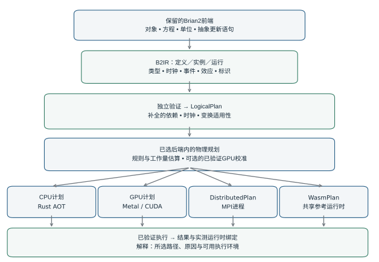
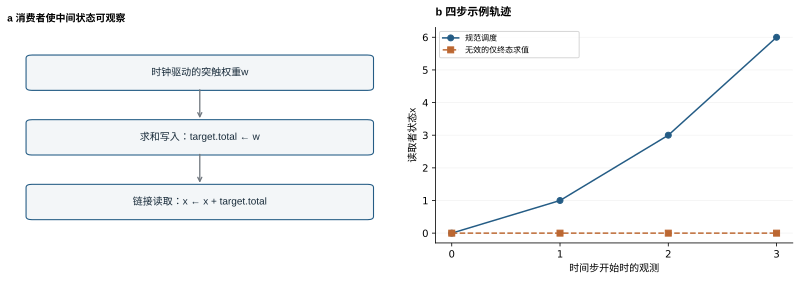
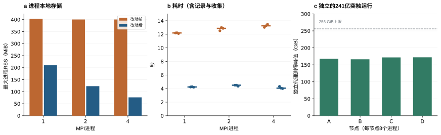
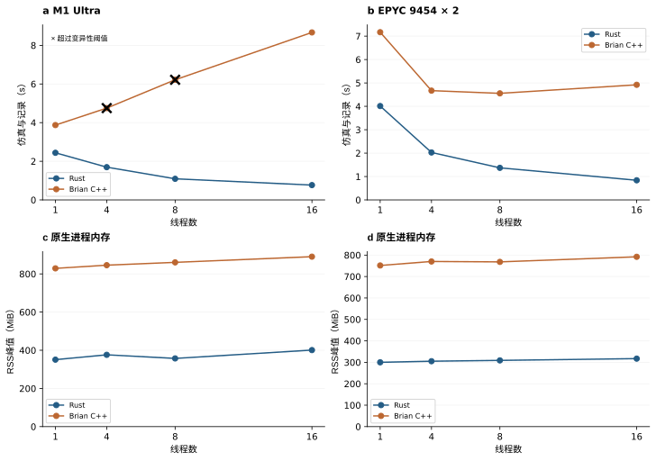
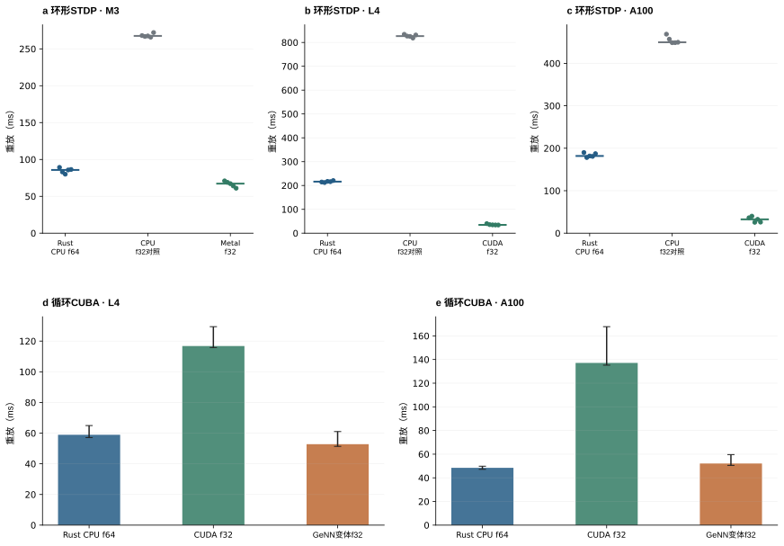
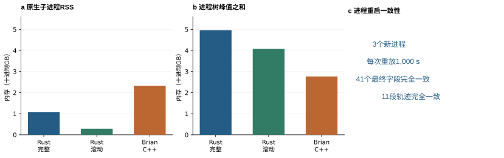
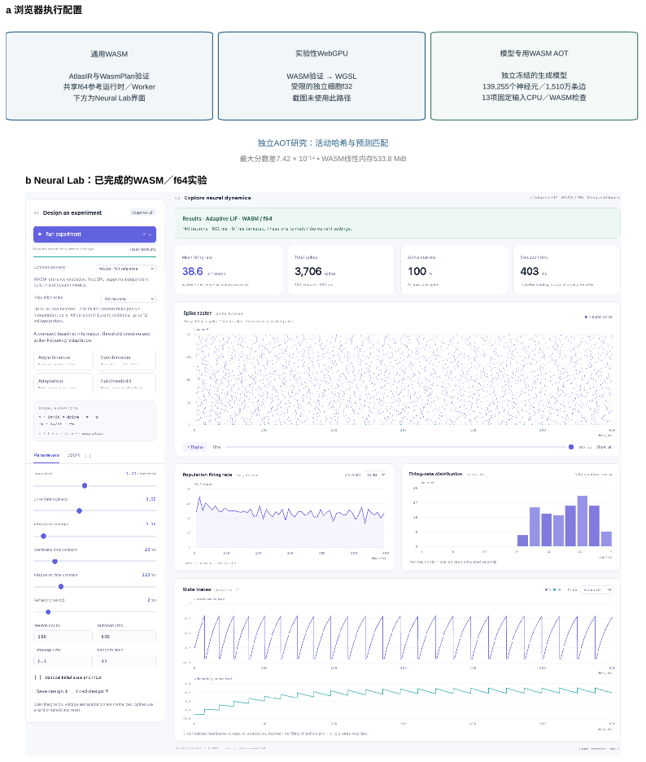
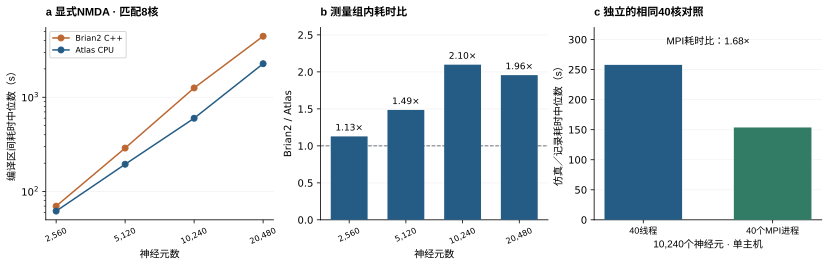
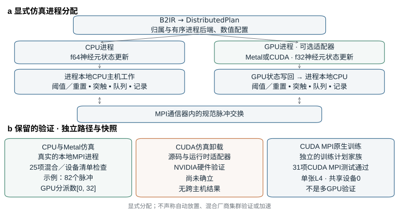
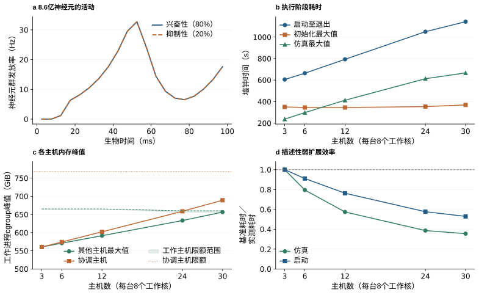

# 面向异构与分布式神经仿真的统一中间表示与执行架构

<strong>Xinjun Li</strong> 独立研究者

## 摘要

基于方程的神经建模具有灵活性，但跨处理器和计算节点执行模型，需要明确控制顺序、数据归属与数值行为。本文提出brian2-atlas：保留Brian2建模接口、重建执行架构，并以共同的模型到执行契约连接异构与分布式目标。其统一中间表示AtlasIR描述带类型的状态、时钟、调度、效应、事件及随机流标识，由独立Rust验证器检查。执行计划分析约束物理实现变换；各目标实现分别支持Rust CPU、CUDA与Apple Metal GPU、浏览器WebAssembly及MPI，并具有明确的适用契约。基于数据归属的事件处理、紧凑拓扑构建和分区存储，将模型准备连接到分布式执行。受支持的MPI路径还能跨仿真片段保留可变突触状态、延迟事件和边界检查点。在重复测量的全连接组CPU实验中，相对于同一Linux主机上实测最快的Brian2 C++配置，实测最快的Rust配置将仿真与记录耗时缩短至约1/5.43。一个包含298,880,968条突触的模型在16 GB笔记本上完成执行，而对照C++准备路径超过了受控内存预算。分布式执行在四个节点、32个rank上，为4,129,924个神经元和24,126,516,728条循环突触完成了100.5秒模型时间。五档合成网络弱扩展实验从三台主机上的8600万个神经元，扩展到30台主机、240个物理工作核上的8.6亿个神经元和8600亿条循环连接，完成100 ms模型时间。这些结果确立的是已测试的容量配置，并不证明与NEST具有统计等价性或在匹配条件下具有速度优势。已发表模型工作流将验证扩展到显式NMDA动力学和情境树突可塑性。匹配八核的NMDA测量组获得最高2.10倍加速，统一源码上的树突网络复测，通过效应安全的端点表达式复用获得1.28倍加速；历史树突测量组保留各自的源码身份。浏览器研究展示可移植的参考执行及独立的全连接组应用。受限的原生训练扩展提供显式前向与反向执行计划，并使用替代脉冲梯度。本文刻画的是语义、数值与资源边界，而非普遍兼容性或性能优越性。

## 1. 引言

神经仿真将数学模型开发与大量相互作用状态更新的实际执行问题结合起来。随着研究推进，研究者会改变微分方程、突触规则、延迟、刺激方案和记录需求。Brian2通过嵌入Python的方程模型描述与执行代码生成支持这一过程[1](#ref1)。当实验计算需求变化时，保留这一建模接口具有价值。模型可能从小型探索网络开始，发展为全连接组工作负载，最终需要超出单机能力的内存或计算资源。

跨这些环境执行，涉及的不只是算术表达式翻译。同一阈值检查放在突触投递之前或之后，可能观察到不同状态；重排突触加法会改变浮点累加；延迟事件可能在一个仿真片段结束后仍待处理，并且必须在下一片段到达。跨MPI rank划分网络会改变状态存储位置和脉冲可见性；根据局部索引分配随机流，会在分区改变时改变模型实例。这些性质都是计算实验的一部分，需要在模型准备与执行的边界上明确表示。

已有多个成熟系统将模型定义与高效执行分离。GeNN为图形硬件生成仿真代码[2](#ref2)，Brian2GeNN将Brian模型接入该系统[3](#ref3)，Brian2CUDA则通过Brian可扩展的代码生成基础设施生成CUDA代码[4](#ref4)。Brian2Wasm提供浏览器部署路径[12](#ref12)。分布式神经仿真也已有成熟基础：NEST处理了大机器规模下的内存与通信问题[5](#ref5)；一个约含410万个神经元、240亿条突触的多区域皮层模型，此前已在MPI-GPU集群上仿真[6](#ref6)。本文研究的问题，是如何通过执行架构，将保留的建模前端连接到这些不同计算环境。

这些扩展已保留Brian2建模接口的很大一部分，但通过各自实现的执行路径提供互补目标。研究在CPU、GPU与浏览器之间迁移时，可能需要协调各目标的安装、功能支持、精度选择、生命周期行为和部署流程。这些协调成本与编写神经元方程不同。因此，共享Python建模语言，本身并不意味着共享执行契约。

brian2-atlas面向用户的目标，是尽量降低受支持模型的这类协调负担。共同的转换流程、模型标识、能力检查、执行计划和结果集成，使目标选择基于共享模型表示进行。原生CPU、CUDA、Metal与MPI通过同一个Device集成选择；浏览器使用由同一语义边界导出的、经验证的可移植产物。各目标仍需要专用编译器和资源，但当计算环境改变时，用户有共同入口检查适用性与执行含义。这减少了架构层面的集成接口；本研究没有测量用户耗时，也没有证明所有场景都具有最小工作流。

我们研究一种围绕显式全模型执行语义组织的架构。前端将受支持模型转换为AtlasIR。独立验证器检查表示，逻辑依赖约束各目标计划；随后由实现控制代码生成、存储、调度、事件处理、通信和结果。这允许不同物理策略共享一个可用于核对行为的具体对象，也将模型构建纳入执行设计：紧凑拓扑配方可以直接进入原生或分布式构建器，无需先在Python前端展开全部连接。

本文围绕三项贡献展开。第一，AtlasIR定义独立检查的执行契约，涵盖状态域、调度、事件、效应以及模型和运行标识；执行计划分析据此约束变换并解释物理策略选择。第二，重写CPU、CUDA、Metal与WebAssembly路径，扩展平台覆盖，并提供新的性能和内存权衡，包括可选的、具有完整结果检查的GPU策略校准。第三，分布式实现结合拓扑构建、局部归属和有序事件交换，跨节点执行网络；可塑性与边界续运行支持，使其超出静态容量演示。评估通过语义示例、重复性能测量、策略选择与校准成本研究、内存受限皮层微回路、四节点多区域运行、浏览器部署和两个已发表模型工作流连接这些贡献。实验刻画所测实现，不假设每个有效AtlasIR模型都受每个目标支持。

## 2. 架构与语义契约

### 2.1 保留前端与替换执行核心

实现通过AtlasDevice接入Brian2，由`import brian2_atlas`注册，并通过`set_device("atlas", engine=...)`选择。该Device直接继承基础Device接口。Brian2继续提供模型对象、方程和单位处理、符号解析，以及数值状态更新器产生的抽象更新语句。一次性前端初始化也可以使用Brian的NumPy代码对象。这些是明确保留的依赖。仿真时间循环由新引擎执行，完成的数组与事件记录返回Brian2状态和监视器接口。

对于受支持网络，Device收集模型对象与可执行语句，转换为AtlasIR，验证所得文档，并构造目标计划。CPU提前编译（AOT）产生模型专用Rust代码及单独表示的实例；GPU目标构造自己的程序、缓冲区与分派序列；MPI生成可识别rank的Rust可执行程序和C通信适配层。通用浏览器执行使用参考运行时的WebAssembly构建。图1区分这些路径与保留前端。Atlas直接实现各执行路径：其CUDA后端不委托Brian2CUDA、Brian2GeNN或GeNN执行，这些软件包不是Atlas的运行时依赖。CUDA编译与执行使用NVIDIA工具链和驱动。这种独立性针对下游仿真后端；上文列出的Brian2前端依赖仍然保留。

架构替换与源代码兼容具有不同含义。引擎替换所接纳模型的下游仿真基础设施，并不实现任意Brian2 Python程序可调用的全部功能。能力检查在执行前识别不支持的行为。附录A（表7）总结各执行目标的功能适用性；补充材料S16解释限制和证据。实现位于brian2-atlas仓库，固定提交见“代码与数据可用性”。每个测量组记录所用源码、输入、工具链与硬件。验收结论适用于实际测试的能力组合。

保留前端包含对索引依赖顺序、函数实现元数据和带类型表达式处理的兼容性更改。因此，保留接口是一套具有已记录适配器与前端补丁的建模基础，并不意味着完全未经修改地使用上游Brian2检出版本。

CPU覆盖已超出最初的点神经元工作负载。参考与AOT路径支持受限的SpatialNeuron实现，使用树状形态上的半隐式电缆求解器、点电流输入和状态记录；目前要求f64与默认空间调度。确定性f64 NeuronGroup方程还支持声明的显式GSL方法接口与自适应误差控制；隐式方法、SpatialNeuron/Synapses与GSL的组合，以及GPU/MPI GSL执行仍在契约之外。受限的起始/结束NetworkOperation回调，在原生续运行片段之间执行。这些是后端专用扩展，不保证每个AtlasIR目标都具有可移植适用性。

**图1 | 保留建模、计划分析与重建执行基础设施。** Brian2提供模型准备和抽象更新语句；AtlasIR与独立验证确立语义边界。补全的依赖约束物理规划：CPU/GPU规划器选择受支持实现，可选GPU校准在已选后端内比较通过验证的候选。计划记录决策和标识，运行时绑定补充实测执行环境。通用原生参考与WASM共享Rust运行时；CPU AOT、GPU和MPI采用不同执行实现。WebGPU及模型专用WASM AOT是范围独立的路径，详见图7。分支表示已集成到开发树的执行目标，测量组标识与能力检查定义实际验证范围。该架构不意味着可自动跨后端家族分配任务。

### 2.2 AtlasIR：定义、实例与运行

AtlasIR将模型分为三个具有独立标识的层。<strong>定义（definition）</strong>包含神经元群、突触、函数、时钟、可执行调度，以及数值和随机数契约。<strong>实例（instance）</strong>提供初始状态、参数、拓扑或拓扑配方、待处理事件和种子。<strong>运行（run）</strong>指定绝对起始时间、时长以及各时钟的时间步区间。独立哈希区分结构、初始化数据和请求执行的变化。编译产物复用仍受兼容性规则约束；独立哈希不允许任意替换实例或运行层。

每个符号包含存储类型、七分量SI量纲向量，以及标量、神经元或突触等索引域。表达式表示读取、类型转换、算术、比较、函数、带索引输入和随机抽样。更新对象包含标量和向量语句、条件写入、所属时钟、执行位置与资源效应。语句顺序和旧状态快照显式表示。表示包含前端方程生成的离散更新程序，运行时不必从方程字符串推断积分方法。

事件是具名流。常规脉冲流、自定义事件、重置消费者、突触路径和事件监视器均有显式绑定。路径包含自己的延迟和待处理事件。不应期行为通过状态资源和版本化时序规则表示。多个时钟提供整数时间步区间，活动对象在下一个活动时刻按规范顺序执行。当边创建顺序影响事件展开或非交换更新时，该顺序被保留。

传输格式采用规范JSON与SHA-256层哈希。模型浮点值按IEEE-754位模式编码；整数状态也使用精确固定位宽编码，避免模型标识依赖十进制格式或JavaScript数值转换。消费者验证封装，并独立推断表达式类型与量纲。无效赋值、不一致事件绑定、伪造效应和格式错误的调度被拒绝。这些检查证明符合规范的有效性。哈希证明标识与完整性，不证明科学正确性。

### 2.3 依赖与可观察行为

规范调度按槽位、顺序、名称和标识符排列可执行节点。每个节点具有读写集合。先后节点受写后读、读后写与写后写冲突约束。消费者还推导隐式效应，尤其是阈值和状态更新涉及的不应期状态访问。遗漏这些访问，会使实际改变后续事件决策的变换看似合法。

一个小型关联状态示例说明依赖为何必须描述全模型。一条突触的时钟驱动权重初始为1，每毫秒递增；求和更新将该权重写入目标的total变量；第三个神经元群通过关联变量读取total，并积分到x。在声明顺序下，时间步起始监视器四步记录x = [0, 1, 3, 6]。若误以为只有最终total重要，把求和更新推迟到末尾，读取方此前输入保持为0，得到[0, 0, 0, 0]。补全的读集合暴露了中间消费者，阻止这一变换（图2）。

该示例来自比较参考、AOT与Brian NumPy执行的回归检查。它是优化约束的确定性示例，不是统计基准。只有合法性条件能够保持契约表示的可观察行为时，规划器才能融合或延后工作；否则CPU使用受支持的规范槽位路径，或拒绝不支持的配置。这种保守回退以性能换取明确执行含义。

**图2 | 全模型效应约束看似局部的优化。** 求和结果经另一神经元群的关联读取使用。序列展示四步示例及错误的仅最终求值变换。它们是解释性轨迹，不是不确定性估计。

### 2.4 执行计划分析与语义约束下的策略选择

逻辑计划包含规范节点、补全效应、依赖和时钟激活。物理计划在目标能力范围内选择布局和执行策略。CPU计划选择优化或规范生成；GPU计划关联逻辑工作、分派阶段与缓冲区。WasmPlan标识已验证的运行时顺序，DistributedPlan增加分区和通信节点。生成代码或浏览器执行之前，相关消费者重建并检查计划，不直接信任任意序列化计划数据。

规划区分变换是否合法，与受支持实现是否可能值得采用。CPU适用性检查涵盖时钟激活、调度收缩、神经元群和突触效应、关联读取、事件路径及待处理延迟。只有检查确立受支持调度的等价性时，才接纳固定阶段实现；否则选择2.3节的规范槽位实现。物理选择包括紧凑或通用生成、更新/阈值融合、路由分组、按目标归属处理事件，以及在中间观察允许时仅于最后活动时间步求和。这些决策直接被代码生成使用，并非编译后附加的描述报告。

工作负载启发式补充合法性检查。CPU规划器根据表达式操作估计工作量，对超越函数、除法和分布抽样赋予比简单算术更高的权重，并结合元素数、间接突触状态访问、最小有效任务规模和请求并行度。这些代理指标决定合法工作是否拆分，并限制过量任务创建。它们是局部调度启发式，不是拟合的墙钟时间预测器或总驻留内存模型。GPU规划同样区分独立时间融合与耦合依赖图，再按资源效应允许边或目标归属的工作，对不支持的依赖保留规范执行。

规范CPU求和更新可在归约端复用纯float64指数表达式，前提是它只读取该节点内稳定的端点状态与标量输入。规划器排除对累加目标自身、逐边值、向量代码中重新赋值的输入、随机抽样、外部函数及不支持类型的依赖；稀疏或小投影保留原逐边循环。所选缓存在每次原定节点激活的标量语句之后重建，不推迟求和、不重排边，也不改变表达式算术。选择理由、声明载荷和节点内生命周期均纳入经过检查的物理计划。

每个计划记录模型层标识、所选策略、声明缓冲区和分派结构。决策包括所选路径与解释理由，例如工作量不足、路径效应不安全或跨路径循环依赖。策略标识包含完整逻辑图、布局规模和依赖实例的选择。消费者在代码生成或执行之前重新推导计划，并拒绝不匹配。声明数组载荷与生命周期，和动态队列、未监测分配分开报告；计划清单不预测峰值RSS，也不证明通用缓冲区别名复用。

公开的explain_plan接口在执行前暴露这些决策，此时运行时环境尚未绑定。成功运行后，运行时绑定补充实测线程数、亲和性、已执行并行路径及可用计时。未监测量明确保持未知。可选GPU校准基于已验证候选的完整重放，提供第二种选择机制（3.6节）。后端与数值模式仍须显式选择：这些机制不自动搜索CPU、GPU、WASM与MPI部署，也不证明全局最优实现。

共享表示还支持Next Brain工作台中的交互检查。AtlasIR检查器展示有序调度、神经元群状态与参数，以及选中节点的依赖、声明读写和转换后的操作。Python运行视图检查实际执行产生的产物。补充图S1配对展示保存的FlyWire回路活动和对应目录模型在默认参数下的AtlasIR草稿。保存活动与模型草稿分别说明来源，不将草稿称为该次运行归档的执行产物。显示阶段用于组织逻辑操作和导航，不展示完整后端物理计划或优化搜索。

### 2.5 数值配置与执行边界

AtlasIR基线配置是reference-f64。GPU要求显式选择float32，并在目标契约中记录，即使公开数组以float64存储。整数和布尔状态保留自己的表示。更宽的输出容器无法恢复算术中损失的精度。因此，同配置一致性、可重复性和跨配置比较是不同评估问题。

**表1 | 执行路径与选定边界。** 本表总结所描述实现，不宣称每种组合均已测试。快照细节见补充材料。

| 路径 | 实现与代表行为 | 重要边界 |
|---|---|---|
| 原生参考 | Rust运行时；带类型状态、规范调度、时钟、事件、关联与监视器 | 参考实现，不是独立科学判据 |
| CPU AOT | 模型专用Rust；归属与槽位路径；支持可塑性、SpatialNeuron、GSL方法接口及边界回调 | 空间/GSL为受限CPU f64路径；回调槽位与续运行受约束 |
| Metal / CUDA | 生成GPU程序；独立神经元融合及具有声明延迟、可塑性、带类型状态和关联的耦合网络 | 显式f32算术；适用性与资源限制 |
| 通用WASM | Worker中的共享参考；可移植AtlasIR和严格封装验证 | 拒绝仅原生函数和文件系统CSR；WASM32限制 |
| WebGPU | WASM验证后生成WGSL；受限独立神经元f32模型 | 实验性；不支持通用突触网络、延迟队列或STDP |
| 模型专用WASM AOT | 纯内存主机中的冻结Rust生成程序；全连接组应用 | 独立特化，不代表通用封装适用性 |
| MPI CPU | Rust AOT/MPI适配层；目标归属；显式/二进制拓扑支持pre/post可塑性、片段及边界检查点 | 共享时钟；fixed-total程序化路径仅支持tick-0；无通用拓扑迁移或在线容错 |
| MPI GPU卸载 | 显式CPU/Metal/CUDA rank分配；CPU f64与GPU更新f32；支持分段STDP | 已测试本地CPU+Metal；保留主机事件/突触/MPI工作；未验证CUDA仿真卸载及跨主机混合厂商配置 |
| 原生训练扩展 | 版本化训练计划；CPU/GPU前向与VJP、Rust优化器、受限本地MPI | 独立计划家族；替代/离散梯度契约；硬件覆盖绑定各个快照 |

## 3. 执行机制

### 3.1 分布式构建、数据归属与事件交换

MPI将每个神经元分配给一个rank，将每条突触分配给其目标神经元的所有者。局部存储包含可变神经元状态、不应期状态、适用参数、外部源和入边连接。即使存储索引为局部索引，表达式与随机数生成仍可使用全局神经元和边标识。因此，分区改变数据位置，不重新定义模型标识。

对于静态拓扑，导出器写入各rank实例分片，以及描述大小和哈希的索引。生成源码引用元数据，不将整个网络嵌入为字面量。每个rank检查通信器与编译计划，将自己的分片流式加载到状态存储，并验证实际读取的字节。最终可变数组按原始位模式从所有者收集，不通过浮点求和合并，从而保留负零等值。

fixed-total连接使用分布式构建。Python生成紧凑配方，代替端点和参数数组。各rank处理互不重叠的全局抽样索引区间。整数集合操作建立全局源优先边标识，受限交换把生成边路由到目标所有者。每个rank在初始化和执行前，按要求的标识排序局部连接。权重、延迟和运行时随机抽样使用原始边标识。构建仍需要临时存储和排序，并非零复制生成或恒定内存准备。

这消除了在单个Python进程中物化全部循环连接的要求。成本包括逐投影源索引、临时边记录、通信和局部排序。所记录构建器包含O(E_local log E_local)排序阶段，以及每个投影O(N_source)的源索引存储。投影较多或分区不均匀时，这些项不可忽略。大分配前进行准入检查，但边数本身不能预测总内存，因为状态、队列、记录和临时副本也有贡献。

执行时，基线容量路径在相关阈值或事件源节点之后交换全局脉冲索引。集合操作按规范顺序进行；接收索引经过排序和检查。目标rank按局部连接展开事件。统一延迟可先排队源索引、到期再展开；异构延迟保留到达与入队顺序。消息到达顺序不替代模型事件顺序。随机抽样使用模型种子、流、绝对时间步和原始神经元或边标识，不引入依赖rank的种子。

5.2节的rank局部实验按神经元群/时间步粒度进行全rank脉冲交换。它保留复制的只读突触前状态、源偏移信息和部分监视器布局。这些成本解释了局部存储减少为何不保证强扩展。后续多区域实现采用额外构建和记录特化，其计时绑定各自快照。实验不证明通用前瞻执行、选择性订阅路由、动态重分区或故障集群节点恢复。

### 3.2 CPU执行与准备

CPU AOT编译针对模型特化状态更新和事件处理器。状态按变量组织，避免统一的逐神经元对象布局。适用工作路径按目标归属安排写入，避免入边事件对同一目标进行不受控并发浮点更新。工作分配可考虑入度，事件路由避免重复可安全共享的变换。小工作负载保留串行路径，因为同步成本可能超过有效工作。

优化布局以依赖为条件。规范槽位生成器处理无法证明固定阶段执行等价的受支持调度。这对关联读取、求和变量、自定义顺序和多个时钟尤其重要。因此，增加一个使中间状态可观察的消费者，可能改变模型所选物理代码。

准备过程同样进行特化。显式数组适合小型或已物化模型；程序化描述把fixed-total拓扑和初始化带入原生代码。文件系统CSR用显式内容标识表示导入图。这些路径以不同方式减少Python物化和生成项目体积，不提供普遍低内存保证。PD14实验在16 GB机器上分离评估了这一准备边界的实际作用。

### 3.3 Metal与CUDA执行

GPU计划区分独立神经元与耦合网络。对于适用的独立神经元群，一个执行通道可跨多个时间步推进一个神经元，以降低分派开销。耦合模型按有序阶段执行更新、阈值、事件、突触处理、重置和观察。效应允许时，各阶段按边或目标独立执行；共享写入或其他依赖保留规范顺序。

扫描投递检查有序入边连接。稀疏投递通过整数预留，将已发放脉冲的源展开到目标队列，再于浮点更新前恢复规范顺序。延迟路径考虑发放历史和到达顺序。整数队列预留不意味着无序浮点累加。适用策略取决于活动、连接、延迟和启动开销，因此实现记录显式策略标识。

Metal在Apple硬件上使用运行时编译和命令缓冲区提交。CUDA具有独立的编译、缓冲区与启动生命周期，包括重复运行的保留资源。复用编译程序和不可变拓扑减少重复准备，可写状态则必须重置或恢复。驻留、复制、结果提取和进程/文件成本都会影响接口。因此，GPU重放测量包括从重置到完成主机数组的过程，不只报告内核时间。

### 3.4 浏览器执行与可移植产物

通用WebAssembly与原生参考共享模型验证和执行代码。封装包含原始模型与计划编码。浏览器验证标识和语义，重建依赖并检查分派顺序。保留原始编码可避免JavaScript造成大整数精度损失。构建和交付后，运行时需要静态资源与浏览器，不依赖Python仿真服务。

Worker将执行与界面隔离，并支持批次、进度和取消。批次大小改变主机调度，不改变模型时间步。导入封装与受限方程编辑是不同入口：编辑产生新的经验证标识，加载则要求所提供标识匹配。可移植函数可用AtlasIR表示；通用消费者拒绝仅原生函数和文件系统图。

另有两条范围独立的路径。实验性WebGPU为受支持的独立神经元f32模型生成WGSL。模型专用WASM AOT在纯内存主机上编译冻结的Rust生成仿真，保留应用方程、顺序、随机抽样和序列化。后者运行5.5节全连接组应用，但不意味着通用封装加载器接受任意全连接组CSR输入。图7区分这些路径。

### 3.5 记录、续运行与异构rank

仿真状态不仅包含神经元数组，还包含不应期截止时间、队列事件、随机计数器、监视器历史和绝对时间。CPU与单机GPU生命周期操作跨运行和检查点保留受支持组件。滚动记录保留受限观察窗口，同时维护续运行所需状态；总内存收益取决于外围前端和结果表示。

分布式大网络研究采用独立记录路径，具有受限暂存和运行后收集。该研究完成不证明该规模的检查点恢复。后续显式/二进制拓扑路径支持分段可塑性和成功边界恢复，见3.7节；小网络证据与大型程序化构建测量组分开。可选混合设备MPI为每个rank接受显式有序后端分配：cpu、metal，或具有本地设备序号的cuda。它通过共同DistributedPlan支持异构CPU/GPU rank配置，Metal和CUDA适配器负责神经元状态更新。CPU rank使用f64；GPU更新要求声明的mixed-f32配置，输入和运算为f32，写回主机状态为f64。阈值、重置、突触、队列、记录和MPI交换仍在各rank的CPU上完成。设备分配属于计划与检查点标识，更改可能影响舍入及后续脉冲。本地Metal实验和范围独立的CUDA MPI训练记录见5.9节。仿真路径需要兼容的主机OS/CPU ABI与MPI环境；选择器接受两个适配器名称，不证明macOS-Metal/Linux-CUDA通信器可工作。

### 3.6 GPU策略校准与经验证决策复用

可选的逐次激活自动调优，在选定Metal或CUDA后端内比较四种策略：基线、并行突触前缀、有序目标位图及两者组合。它保留请求的事件投递与依赖图执行模式。该功能默认关闭，要求显式float32执行。这是受限校准流程，不把实测决策迁移到其他模型或活动模式。

每个候选从相同完整初始模型出发，包括待处理事件、绝对时钟和随机状态，并独立规划与验证。在构造另一个执行器之前，对字节等价的完整物理计划去重。不同候选可在本次激活中复用源码相同且经验证的内核，同时保持独立可写状态。每个不同候选执行一次完整预热和三次完整的从重置到结果的重放，轮次顺序随机化。指纹覆盖每个返回的神经元群和突触数组、dtype与形状、标量事件数，以及数值和RNG配置。每次重放必须与首次基线指纹完全一致。候选错误或不匹配会排除该候选并记录理由；基线失败则中止校准。这一后端内门槛不证明与reference-f64等价。

只有候选中位耗时至少低5%，且其最慢实测重放仍快于基线最快重放时，才替换基线。满足条件的最低中位数获选，否则保留基线。范围分离规则是保守的短样本启发式，不是置信区间或最优性证明。所选执行器再完成一次完整重放，必须通过相同结果检查。只有这一最终结果更新Brian2数组、监视器、时钟和延迟事件状态，因此性能分析不会反复推进用户仿真。最终运行失败会阻止结果提交。

四个不同候选最多需要17次完整执行：四次预热、十二次测量和一次最终重放。准备、编译、指纹计算与清理计入总校准成本，但不计入单次重放样本。最多四个执行器可能并存，因此调优可能比普通运行需要更多内存。所选重放更快，不意味着整次激活更快。

可选决策缓存每个Device最多保存八条元数据记录。键包含完整输入状态、拓扑、待处理事件、时钟、时长、RNG状态、实现标识和执行选项。暂定命中还必须匹配独立推导的计划与当前编译器/设备环境。新的经验证执行器完成一次完整重放，并对照原校准指纹检查结果。不匹配使记录失效，并触发当前输入的校准；中断或清理失败则中止。只有前端成功加载结果后才提交决策。精确store/restore重放要求恢复RNG状态；状态已变化的续运行通常不命中。缓存不保存仿真结果或原生缓冲区；编译和分配复用是独立选项。它验证匹配输入的正确性，不重新证明缓存策略仍最快。

### 3.7 分布式可塑性与成功边界恢复

对受支持的显式和二进制CSR连接，目标所有者维护带类型可变突触状态，并执行规范pre/post路径。Pair与Triplet STDP包含时钟驱动或事件驱动迹变量及其上次更新状态。突触后邻接按原始边创建标识排序；延迟pre工作保留声明的源和边顺序。写入局限于突触所有者及其目标神经元。该扩展保持归属契约并扩大可演化状态范围，不通过放松顺序来允许任意远程写入。

片段续运行保留绝对时钟、不应期状态、随机流标识、监视器历史和待处理事件。成功边界处，在rank正常终止后，由协调者收集所有者状态和待处理工作；随后通过经检查的临时文件与替换协议提交磁盘快照。恢复前验证拓扑和定义标识、rank与设备布局、精度、源码/运行时标识，以及编译器/平台兼容性，验证通过后才发布恢复数组。精确重放要求显式恢复RNG状态。失败激活不提交新边界。

固定候选结构可塑性可以在边界更改活动掩码、权重、迹变量和出生/激活元数据。代际检查阻止旧排队事件修改新激活边。候选数和端点保持固定；这不是通用CSR增长、重分区或迁移。fixed-total程序化构建保留单一tick-zero激活边界，拒绝可变状态或待处理事件续运行。检查点协调者与Python主机仍有完整状态开销，因此恢复不是O(local edges)的分布式存储方案。这些机制提供接纳配置的已测试重启行为，不提供rank或集群节点故障的在线恢复。

### 3.8 受限原生前向与反向执行

独立原生训练执行器接受版本化计划，覆盖稠密LIF、显式循环/共享参数图、标量方程、多状态方程及有序动态突触变换。Brian转换流程为受支持子集保留单位、解析方程、更新/重置顺序，以及规范参数/状态标识。CPU或选定GPU内核执行前向程序与向量-雅可比积（VJP）；原生Rust实现SGD或Adam。Python准备并传输计划和结果。这一计划家族是执行架构扩展，不是所有有效仿真AtlasIR文档的通用自动微分实现。

硬脉冲使用声明的替代VJP，布尔/整数控制和选定离散门停止梯度。耦合更新保留旧状态快照，并按声明更新/重置序列的逆序处理。动态计划包含受限pre/post变换、延迟事件状态、求和输入和时钟访问顺序。对接纳的随机程序，路径导数以已抽样轨迹为条件，Poisson路径使用显式似然与边界梯度契约。这些定义不宣称硬脉冲决策的普通导数或无限制随机自动微分。

请求可以携带前向状态与检查点参数、优化器状态、时钟，以及受支持随机/事件状态。完整BPTT和截断伴随窗口具有不同契约；截断本身不会减少已分配的计算记录带。准入检查在执行前限制记录带和传输规模。训练MPI按目标归属划分前向/反向工作，并为共享参数分配唯一优化器所有者，但目前每个rank仍复制完整模型、输入与记录带数组。因此，本地数值验证不证明大模型分布式内存节省、跨主机扩展或多个物理GPU扩展。

## 4. 评估方法

### 4.1 工作负载与测量组

本文实现发布于[brian2-atlas仓库，提交`e609068369a7ec370968cd885ef562c83e4daa03`](https://github.com/RockLi/brian2-atlas/tree/e609068369a7ec370968cd885ef562c83e4daa03)。工作负载驱动、冻结源码清单、输入及测量记录归档于[brian2-atlas-preprint仓库，提交`6c948b09d4b262fddd6cdb1876404386f2823c17`](https://github.com/RockLi/brian2-atlas-preprint/tree/6c948b09d4b262fddd6cdb1876404386f2823c17)。更新后的树突网络测量组使用该归档记录的统一源码快照重新导出模型并构建。各CPU、GPU、MPI、浏览器和训练测量组所用的确切源码版本、输入、工具链与验收范围均在补充材料中列明。

证据按具有标识的测量组组织。CPU全连接组研究使用FlyWire v783，包含139,255个神经元与15,091,983条有向加权边[10](#ref10)。这些边汇总54,492,922个接触点，接触点不作为独立边对象仿真。CPU动力学为统一兴奋性LIF。MPI研究采用EI变体，增加580个输入源及刺激/切断条件。共享图规模不意味着动力学工作负载相同。

内存研究使用Potjans-Diesmann微回路的直流输入改编[9](#ref9)。大型MPI研究改编Schmidt等人的多区域皮层模型[11](#ref11)。独立神经元集群工作负载是与Litwin-Kumar和Doiron相关的已记录triplet可塑性变体[13](#ref13)，明确不是该论文全部规则的复现。GPU测试模型分离延迟STDP和循环电流型动力学。浏览器应用检查使用固定输入与冻结的全连接组可执行程序。

**表2 | 主要测量组与测量范围。** 时长均为模型时间；重复测量属于各自比较，不构成统一协议。完整来源细节见补充材料。

| 测量组 | 神经元 / 仿真边 | 时长 | 设计 | 计时范围 |
|---|---|---|---|---|
| CPU FlyWire | 139,255 / 15,091,983 | 1 s | 两台主机；1/4/8/16线程；预热后各五次重复 | 仿真与记录 |
| PD14笔记本 | 77,169 / 298,880,968 | Rust 10 s；C++尝试0.1 s | 单次资源观测 | 原生主体与Device端到端分别计时 |
| GPU环形STDP | 4,096或16,384 / 度8 | 256时间步；250 ms | 预热及五轮随机顺序测量 | 从重置到主机结果 |
| GPU循环CUBA | 4,096 / 131,072 | 2,048时间步 | 预热及五轮交错测量 | 从重置到主机结果 |
| GPU策略选择 | 4,096 / 度8或32 | 1,024时间步 | 四候选；各一次预热、三次随机重放；获选后另五次重放 | 性能分析与总校准分别计时 |
| GPU决策复用 | 4,096 / 度8或32 | 1,024时间步 | 独立测量组；一次校准、三次精确输入命中 | 激活含传输；不含前端转换 |
| MPI FlyWire EI | 139,255 + 580输入源 / 15,091,983 | 1 s | 修改前/后；1/2/4 rank；三次静息重复及条件检查 | 仿真、记录、最终收集 |
| MPI多区域 | 4,129,924 / 24,126,516,728循环边 | 100.5 s | 原始seed-1729容量记录；三次Rust实现及三次探索性NEST参考 | 原始启动/资源；后续描述分析，无匹配速度比 |
| 相互连接合成网络MPI弱扩展 | 86-860百万 / 86-860十亿 | 100 ms | 3/6/12/24/30主机；每台八物理工作核；每规模一次观测 | 准备与从启动到完整输出分别报告 |
| 神经元集群生命周期 | 5,000 / 约5百万 | 记录/恢复最长1,000 s | 独立计时、内存和恢复测量组 | 编译仿真与恢复分别计时 |
| WASM AOT | 139,255 / 15,091,983 | 固定应用协议 | 13个新输入及浏览器/离线检查 | 一致性；无正式速度声明 |
| 显式NMDA CPU | 2,560-20,480 / 总计11.8-755.0百万 | 1 s；10,000个RK4步 | 匹配八核Linux；预热及五/六次重复 | 原生初始化、仿真、原记录和结果写出 |
| 树突CPU模型 | 单神经元变体及完整图3拓扑 | 10 s或接纳的100 ms | Cython/Rust/Rust/Cython顺序；每后端十或六个实测样本 | 稳态仿真与所需记录 |
| MPI可塑性 / 原生训练 | 受限测试模型；规模随契约变化 | 分段与优化器步协议 | 快照专属数值与重启检查 | 功能；无训练吞吐或准确率基准 |

### 4.2 正确性与数值比较

结构检查验证IR、标识、类型、量纲、调度和计划。执行检查比较最终状态、轨迹、事件标识与时间，以及生命周期状态。应用检查关注模型输出的解释。结构有效性不证明生物学正确性；实现结果一致也可能漏检共享的规范或前端错误。

数值程序允许时，比较采用精确数组或文件相等。CPU FlyWire检查全部最终电压、不应期状态、脉冲标识/时间/计数，以及16个神经元的电压轨迹。MPI rank局部检查把完整结果和事件文件与同源码原生参考比较。GPU研究使用显式f32对照和测试模型专用容差，单独保留f64诊断。循环CUBA的匹配f32门槛要求脉冲时间步/索引精确相等，最终电压容差rtol 1e-4、atol 5e-6。验证失败会报告，并从相应计时排名中排除。

重放检查评估从初始实例出发的可重复性；续运行检查评估片段边界；新进程恢复检查评估在新进程加载保存状态；浏览器批次不变性检查同一WASM程序在不同主机批次下的行为。这些是不同问题，均不证明普遍的跨平台位级等价。使用不同随机流的应用比较，需要统计解释，而非逐事件相同。

### 4.3 计时与内存

CPU FlyWire测量仿真与记录，不含预处理、编译、可执行程序启动和最终文件写入。四种线程数均在预热后进行五次交错重复，速度比比较同一主机上的中位数。保留匹配线程数结果及每个后端的实测最佳配置。受限配置搜索不证明全局最优。

GPU工作进程编译一次，产生初始输出，预热后在每台设备顺序执行五轮随机化测量。计时从重置/初始化开始，以完整主机结果结束。根据适配器不同，可能包含standalone进程启动、输出文件、读回、复制和加载/卸载。不含编译、导出、哈希和归档序列化。因此，大重放比可能反映生命周期差异。环形测量组中的串行Rust槽位执行器和编译f32表达式对照，不是经过调优的多核CPU基线。

原生子进程RSS不包含前端和编译器内存。最大逐rank RSS不是集群总内存。进程树峰值之和是另一指标；不同节点独立峰值不能加总为同时集群峰值。GPU缓冲区限制与WASM线性内存不包含其他分配。资源检查区分严重交换时的受控终止，与实际观察到的操作系统OOM终止。

### 4.4 基线与来源

原始CPU比较使用Brian2 C++ standalone；附加树突测量组使用Brian2 Cython运行时，单独报告。GPU比较包含Brian2CUDA、Brian2GeNN和直接GeNN，区分原版与修改适配器。这些系统作为单独配置的基准对照使用，不作为Atlas的执行组件。修正调度或算术的变体不称为原版软件包。NEST提供分布式比较背景，但本版本不报告已完成的匹配多区域速度比。不会把输出、资源或调优不同的历史运行直接相除来构造速度比。

补充材料将测量组映射到报告和源码标识。若干CPU与生命周期测量组的核验覆盖保留报告；完整原始数组在配套证据包之外。MPI rank局部与GPU神经元群规模图数据还从机器可读报告提取。图表区分报告汇总与单个记录样本。不重建缺失样本或不确定性区间。

### 4.5 策略选择与校准成本协议

选择研究在M3、L4和A100上使用两个延迟STDP工作负载：4,096个神经元、1,024个时间步，dt = 1/1,024 s，固定出度8（quiet）或32（wide）。拓扑种子42。quiet的驱动为1/64，pre延迟分布于16个时间步，post延迟16步；wide驱动为1/16，pre延迟分布于八步，post延迟三步。quiet在该协议下不产生脉冲，测试状态更新和空闲事件处理成本，而非活动突触吞吐；wide测试延迟可塑性。完整配置和拓扑标识随保存报告提供。

候选选择使用三轮随机性能分析，顺序种子1729。后续五次获选策略重放构成独立序列，不替换性能分析样本。保留独立编译f32对照和f64诊断门槛。缓存研究使用后续源码测量组，一次完整校准后进行三次精确输入命中，并开启编译/分配复用。激活计时包含规划、环境检查、执行、哈希和结果传输/加载，不含Brian前端转换。因此，冷校准与后续命中比较的是配置工作流的综合效果，不是决策缓存的独立因果效应。核验覆盖六份归档基准报告的哈希、选择规则、指纹和汇总，不是重复硬件测量活动或完整原始数组审计。

### 4.6 兼容性与学习验证

兼容性证据分为前端/转换准入、零时长准备、受限冒烟执行、完整时长执行和数值/生命周期比较。分阶段官方示例扫描器检查语法/依赖、首次运行准备和受限执行，不验证每个示例的科学输出。完整运行和显式数值检查提供更强且独立标识的证据。短冒烟运行通过不能替代科学或长时程门槛。

分布式可塑性检查用原始状态位模式，将1/2/4 CPU rank与Rust规范参考比较。片段与重启检查包含队列、时钟、RNG、不应期状态、监视器和可塑性迹变量。原生训练验证额外检查声明VJP、优化器状态和前向/状态传递/恢复行为。GPU结果使用记录的f32契约和显式CPU容差。测试数描述分别冻结的源码/硬件范围；重叠测量组不相加为唯一计数，也不自动由后续前端改动继承。补充矩阵区分已实现能力、已完成硬件检查与待完成组合。

### 4.7 已发表神经模型工作流协议

第一工作流使用Skaar、Haug和Plesser发布的显式/通用Brian2 NMDA基准[15](#ref15)，冻结于68e6dd970cfc6bab26459fcb8c34ee0f16560d9e。每条兴奋性NMDA边保留非线性上升与门控状态。源工作负载包含循环连接、0.5 ms延迟、dt = 0.1 ms的RK4、f64状态，以及一秒模型时间内原始28字段监测范围。规模为2,560-20,480个神经元、总计11,796,480-754,974,720条突触。基准执行原始显式形式，不替换为论文的科学近似。

确定性验证用两实现中声明的相同事件表替换未设种子的外部输入生成器。该诊断保留循环方程、连接、延迟及更新/监测调度，但与源码未改动的性能工作负载分开。同输入门槛覆盖至10,240个神经元；20,480规模保留结构、重复输出和统计证据，没有该规模的完整确定性门槛。正式Linux CPU测量组将两后端绑定到CPU 0-7，各八工作线程，每后端排除一次预热后测量五次，5,120规模为六次。编译区域区间包含原生初始化、仿真、监测和结果写出，不含Python准备、代码生成、编译及公开数组回填。这不同于原始FlyWire仿真/记录区间。独立线程/MPI对照使用完全相同的40个物理CPU、五次重复，测量其声明的仿真/记录区间。

附加CPU测量组使用情境树突门控模型仓库[14](#ref14)，冻结于dbb77525f2662199544f5a0d3dcc9c18b0e1c853。两个单神经元工作负载分别测试非线性NMDA与线性对照，时长10 s。独立100 ms协议使用完整图3网络拓扑，约含1.11百万条可塑性边，不宣称验证其完整45 s科学协议。

两后端在同一远程Linux主机顺序执行，进程亲和性固定为逻辑CPU 190。测量顺序为Cython、Rust、Rust、Cython。每次激活丢弃一次预热；单神经元变体记录五个未分析样本，网络记录三个，因此每后端得到十或六个实测样本。主区间为仿真加所需状态记录，不含构建、导出、生成、编译、结果写出及预热。可选性能分析是独立诊断。归档汇总保留数值状态门槛与计时边界；核验覆盖这些记录与算术，不是新的科学数组审计。

统一源码的网络复测，从该测量组冻结的前端重新导出模型，保留相同冻结拓扑和命名随机流，并使用匹配的Rust运行器独立验证。Rust 1.98.1采用opt-level 3、单代码生成单元、panic-abort及默认CPU目标；C/C++依赖使用现有Zig 0.16.0工具链。在同一主机与CPU 190上，激活顺序为Cython、关闭缓存的Rust、默认Rust、默认Rust、关闭缓存的Rust、Cython，每次保留一次预热与三个无性能分析样本。重新读取21个状态／拓扑数组：整数事件和拓扑要求精确相同，浮点数组使用rtol 1e-12、atol 1e-14。四次模型导出完全一致，默认／关闭缓存的原生最终状态和事件文件逐字节一致。独立活动测试模型将双向求和、带偏移子群、多时钟及续跑与NumPy对照。

### 4.8 相互连接合成网络弱扩展协议

附加研究随主机数增加网络规模，使用3、6、12、24和30台物理EPYC 9454主机。每台八个不同物理核，各运行一个有负载的单线程MPI rank。每个重复的三主机块增加8600万个神经元，由19个兴奋性群（80%神经元）和五个抑制性群（20%）组成。每个rank拥有一个完整群。块内三台主机分别拥有六兴奋/二抑制、六/二、七/一群，因此逐rank神经元和入边工作量近似恒定。五档配置分别包含24、48、96、192、240个群，以及86、172、344、688、860百万个神经元。

每个有向群对采用fixed-total有放回均匀随机连接，允许自突触与同端点多重突触。数量为源神经元数乘目标神经元数乘1,000、除以总神经元数后向下取整；最大余数分配保持恰好1,000N条边。这固定期望平均入度，不固定每个神经元入度。模型种子20261007；投影种子按数值群创建顺序取2026100700 + source×P + target，其中P为群数。图实现随规模变化。完整群目标所有者局部构建，保留源优先连接标识，避免逐投影计数/路由构建集合操作。

Euler LIF动力学使用reference-f64，dt = 0.1 ms，膜与电流时间常数分别20、5 ms，驱动1.05，阈值1、重置0，不应期2 ms。兴奋权重在[0.0027, 0.0033]均匀分布，抑制权重在[-0.0132, -0.0108]均匀分布。截断正态延迟均值1.5 ms、标准差0.25 ms、边界0.1-3 ms。初始电压循环经过1,000个确定值。保留100 ms内全部脉冲及每群两个神经元的电压/电流轨迹。

五档使用同一隔离引擎快照，显式开启8.6亿神经元上限，默认100万上限不变。初始值与IR字节预算分别40亿个值和64 GiB。前三档工作进程cgroup限制665 GiB，最后两档按六兴奋/二抑制与七兴奋/一抑制主机布局分别为655/660 GiB；协调者主机768 GiB；禁止交换。每次启动重新检查可用资源：3-24主机保留64 GiB主机内存，30主机保留48 GiB；磁盘预留128 GiB，单文件上限64 GiB，执行超时1,800 s。准备与输出审计分别采用320 GiB/四核限制、7,200/1,800 s超时。最终工作进程准入守卫只改变正内存余量阈值；准备与审计守卫仍保留64 GiB。主机为共享资源，每规模报告一次观测，不推断不确定性区间。

每个布局先通过独立小模型门槛：每三主机块24,000个神经元、2400万条边，群和归属结构相同。完整输出与独立单进程Rust参考比较，要求脉冲及事件总数精确相等，状态/轨迹差异不超过1e-12。大运行验收要求完整读取输出、状态/轨迹有限、不应期和脉冲计数一致、神经元/边/事件总数正确、有负载rank及主机标识、不同且获准物理核覆盖、独占目标所有者构建、成功终态资源记录及清理。比例采用860亿神经元参考计数，由已报告的成人神经元计数估计取整得到[16](#ref16)，仅表示计数归一化。源码标识和完整记录见S19与S20；历史固定主机容量测量组单独保留于S19。

## 5. 结果

### 5.1 语义一致性与受支持行为

关联求和示例暴露了只考虑最终输出会遗漏的跨群依赖，其回归比较参考、AOT与Brian NumPy。实现还拒绝无效IR、不支持能力、被修改计划和不匹配实例标识。这些边界显式暴露不支持行为，不静默改变执行。

CPU全连接组测量组提供更大执行比较。全部80次正式重放及预热，都通过同主机Rust/C++检查，所检查数组最大差异为0。每次运行产生3,853,674个脉冲；Rust计数462,577,974次加权边投递。两台主机之间，脉冲、记录轨迹和不应期状态一致，最终电压差异最大2.220446049250313e-16。同主机精确相同与跨主机微小差异分别报告。

这些结果支持所测试模型和观察，不合并表1中的边界。MPI接受的模型集合比通用参考窄，WebGPU比单机Metal/CUDA窄。使用共享参考代码的比较，无法排除运行时或规范共享的错误。

### 5.2 分布式容量与资源使用

在FlyWire EI测量组中，分区局部执行相对早期MPI实现降低了内存与时间。1、2、4 rank的最大逐进程RSS分别从403.5、400.5、400.5 MiB降至210.0、123.0、76.5 MiB；仿真/记录/收集中位数分别从12.1922、12.8721、13.2456 s降至4.2326、4.4974、4.0587 s（图3）。全部33次记录运行的完整结果与事件均与原生参考逐字节一致，包括六次预热、18次实测静息运行及九次额外条件检查。

这证明实现改进与逐rank内存下降，但优化版本的强扩展证据有限。四rank相对一rank中位数仅改善约4.3%，四rank样本范围占中位数7.54%；两rank更慢。四rank脉冲交换与排序约耗2.92-3.24 s，包含30,000次群/时间步交换。独立单次构建观测中，项目生成/编译峰值内存从历史7.49 GiB降至663.7 MiB。

多区域研究展示容量。冻结的chi = 1.9、种子1729配置包含32个区域、254个群、8,344个投影，完成100.5 s模型时间。四节点各八rank，共有4,129,924个神经元和24,126,516,728条循环突触。记录墙钟时间39,301.456712 s，约10小时55分钟；实测CPU使用量196.64248015核小时。独立逐节点代理峰值约178.5-184.8十亿字节，均低于256 GiB上限。终态检查与后续原始输出审计通过。

原始资源记录确立该实例、记录路径和配置的完成情况。43.66828524参与节点小时涉及共享主机，不代表独占资源分配或货币成本。图3保留这一历史测量组，不把后续运行合并为扩展曲线。

后续证据包含Rust种子1729、1750和1751，以及完整时长的探索性原生NEST参考，种子1729、1730和1731。最新seed-1751原始输出门槛和六个描述性估计器记录为完成，三个Rust图实现的描述测量组具有核验过的收集凭据。这增强了已展示规模下重复执行与输出分析证据，但不是同一匹配性能协议下独立计时重复。

科学验收与性能验收仍分开。比较保留系统性LvR差异及未解决的历史抽样约定；现代V1频谱视图尚未确立与发表样本匹配。三个探索性NEST参考不提供预先规定的等价界限、多重性处理或支持确认声明的充分统计功效。不同并行布局、输出策略和计时范围也阻止合理的NEST速度或成本比。因此，实现达到成熟分布式仿真器所处理的问题规模，但生物学等价、竞争性效率、实时执行及数百节点扩展仍未确立。

**图3 | 局部存储改进与扩展能力是不同问题。** 左：实测静息运行的最大单rank RSS。中：更改前后的单个仿真/记录/收集样本和中位数，不含预热。一rank用一节点，两/四rank用两节点。右：独立四节点多区域容量运行的代理峰值。测量组来自不同快照，不是同一扩展曲线上的点。

### 5.3 CPU/GPU性能与内存受限执行

Linux全连接组工作负载中，实测最佳Rust配置为16线程0.839 s；实测最佳C++配置为八线程4.555 s，中位耗时比5.43倍。单线程分别4.013和7.169 s。Rust从一线程到16线程改善4.78倍。主机有两个EPYC 9454处理器，但两后端均限制为单插槽16个物理核。这不描述整机96核性能。

M1 Ultra实测最佳比为5.05倍：Rust 16线程0.767 s，C++单线程3.873 s。C++四、八线程观测超过预定义15%变异阈值，只作描述性报告。选定配置的原生RSS在M1 Ultra为400.95与829.05 MiB，Linux为317.19与768.29 MiB。图4展示线程曲线与内存，不把原生RSS换称包含前端的内存。

PD14资源检查在16 GB M3笔记本上，为77,169个神经元和298,880,968条突触完成10 s模型时间。Rust仿真主体104.009 s，前端/构建/运行/加载125.586 s；原生子进程峰值6.314 GB，单独测得前端峰值0.319 GB。记录关闭。仅请求0.1 s的C++尝试，在编译前物化连接与参数时超过计划内存预算；严重交换时被停止，未观察到内核OOM终止。这展示准备和容量差异，但没有本地C++仿真耗时分母。

**图4 | 全连接组CPU测量。** 仿真/记录中位数抄录自保留的五次重复报告；原生RSS单独表示。M1 Ultra C++四、八线程点按报告标准标为不稳定。配套证据包没有原始CPU样本，因此图示报告中位数，不加误差棒。PD14作为容量结果，不是已完成速度比较。

16,384个神经元时，延迟STDP环形重放中位数在M3 Metal为67.19 ms、L4 CUDA为34.82 ms、A100 CUDA为32.58 ms；对应主机Rust f64槽位执行器分别85.73、216.02、181.80 ms。自有GPU全部四种策略的完整数组均与编译f32对照精确相同。前缀/位图选择没有统一改善中位数，这一测试模型不证明优于经过优化的多核CPU仿真。

外部比较需要说明验证细节。较大环形规模中，原始直接GeNN适配器在两台NVIDIA设备上均未通过初始检查，被排除计时；显式标注的屏障变体通过验证。Brian2CUDA和修正Brian2GeNN在该模型下完整重放明显更长，但适配器的进程、文件和加载/卸载成本也不同，不能解释为等价内核速度比。外部变体和验证失败保留于补充材料。

循环CUBA给出反例。4,096个神经元、131,072条连接、2,048步时，原生CUDA在L4耗116.79 ms、A100耗137.13 ms；声明的Brian-Euler适配器下，直接GeNN为52.79与52.11 ms，Rust CPU f64为58.92与48.46 ms。原生CUDA虽通过匹配数值门槛，仍慢于两者。该规模的f32/f64诊断失败，与通过的f32门槛分开。图5指向工作负载、分派、传输与生命周期成本，不给出平台整体排名。

**图5 | GPU收益依赖工作负载和生命周期。** 上：按主机分开的16,384神经元环形网络五次重放样本和中位数。下：循环CUBA中位数及报告最小-最大范围。Rust为f64，GPU和表达式对照为f32。下方直接GeNN使用已披露Brian-Euler适配器。所有区间均从重置到完整主机数组，不是独立内核计时。

### 5.4 长时程记录与恢复

神经元集群变体测试可变突触、电导动力学、稳态调节操作和长时程执行。独立重复确认显示，M1 Ultra和Linux上选定Rust配置的编译仿真/记录中位数更低。收益小于非可塑性FlyWire：完整0-11 s区间的比值为1.2697和1.0829。Linux使用32个Rust工作线程和四个C++线程，其单线程选择结果更有利于C++。这些观测不证明更高逐核效率。

早期单线程内存测量组的1,000 s运行中，完整Rust记录原生RSS为1.082 GB，一秒滚动窗口0.290 GB，C++为2.327 GB；对应进程树峰值之和4.961、4.074、2.767 GB。因此，此配置中前端和数据表示抵消了原生内存节省（图6）。这些是最终并行边执行器改动前版本的单次观测，不是最终性能测量的同一快照。

三个新进程恢复训练检查点，重放全部1,000秒自发活动，41个最终字段和11个记录轨迹片段均精确匹配。这确立所测进程重启行为。另一次短恢复/续运行观测，包含准备与检查点I/O，Rust为52.685 s，NumPy为2.329 s。因此，快速编译执行不意味着快速恢复准备。应用还出现自发发放率漂移，不证明平稳吸引子动力学或完整原模型复现。

**图6 | 记录内存与重启一致性。** 柱状图是1,000 s单次观测，单位十进制GB。原生子进程RSS与进程树峰值之和不同。恢复汇总涉及三个新进程重放，是正确性结果，不是持久性基准。一秒滚动窗口不消除其他位置的内存增长。

### 5.5 浏览器可移植性与交互执行

通用WASM提供从经验证模型封装到本地仿真和导出的工作流。保留检查覆盖原生/WASM比较、批次不变性、完整性、取消和受限方程编辑。共享参考运行时代码可测试可移植性与主机行为，但仍可能存在共享错误。WebGPU保持实验性独立神经元配置，并保留观察到的f32/f64差异。

Neural Lab通过交互浏览器工作台提供该流程。用户选择模型与执行配置、编辑参数、运行实验、检查脉冲和状态记录，并导出执行配置及其经验证封装。图7b展示本地WASM/f64运行后的真实界面：160个独立自适应漏积分发放神经元，时长600 ms，时间步0.1 ms，种子42。运行产生3,706个脉冲，对应每神经元38.60 Hz。工作区将模型方程与控件连接到脉冲栅格图、群体发放率曲线、发放率分布，以及选定神经元电压和适应轨迹。这次运行展示已实现交互与可见输出，与一致性测量组及下述模型专用AOT应用分开。

模型专用WASM AOT执行包含139,255个神经元、15,091,983条加权边的完整图。13次新仿真覆盖数字0-9固定输入和A/B/A序列。输入/活动哈希及预测与CPU参考一致，最大绝对得分差7.413514246934483e-14。这些检查确立固定输入与重复输入行为，不证明独立测试集分类准确率。本研究不报告新的10,000图像评估。

WASM线性内存559,742,976字节，约533.8 MiB；模型资源约54 MiB。不包含JavaScript、渲染和瞬时加载副本。浏览器检查停止静态服务器、从缓存重载并继续本地执行，展示所测离线路径，不保证持久缓存或移动设备内存适配。图7a区分通用执行、WebGPU和模型专用编译；图7b截图只使用通用WASM路径。

**图7 | 浏览器执行配置与交互仿真工作台。** （a）通用封装使用经验证的共享参考运行时；WebGPU支持受限f32独立神经元子集。独立AOT采用冻结生成模型与纯内存主机，13个固定输入检查关注CPU/WASM一致性，另有离线工作流检查。（b）未经修改的Neural Lab截图，来自本地WASM/f64自适应LIF运行：160个独立神经元、600 ms、dt = 0.1 ms、种子42、3,706个脉冲。控件、方程、输出汇总、栅格、发放率和状态轨迹属于同次完成运行。显示的403 ms是包含加载、编译和传输的一次UI观测，不是基准。截图不展示WebGPU或全连接组AOT执行。捕获来源与导出实验见补充材料。

### 5.6 策略选择、校准成本与决策复用

规划器把图2语义反例连接到具体实现选择：补全跨群读取阻止仅最终求值，不安全固定阶段调度选择受支持规范路径。计划记录暴露所选实现和理由。这些观察确立可执行规划边界；前述综合CPU加速，不单独分离规划与其选择的内核、布局和运行时策略的贡献。

GPU校准为NVIDIA quiet选择有序位图，wide选择前缀加位图（表3）。选择轮次中，L4 wide从122.26降至79.86 ms，A100 wide从154.33降至91.75 ms，减少34.7%与40.6%。M3两例都保留基线，因为其他候选未同时满足改善和范围分离条件。M3 wide基线性能分析样本约359-1,845 ms，仅有更低候选中位数不足以获选。保留基线不证明基线最优。

**表3 | GPU策略选择与校准成本。** 全部案例为4,096个神经元、1,024步。性能分析中位数来自三个选择样本，后续中位数来自五次独立获选策略重放。总校准含准备和选择开销。数值由保留的机器可读报告取整，不重建计时区间。

| 主机 / 案例 | 所选策略 | 基线分析（ms） | 所选分析（ms） | 后续获选重放（ms） | 总校准（s） |
|---|---|---:|---:|---:|---:|
| M3 quiet | 基线 | 79.63 | 79.63 | 63.60 | 4.31 |
| M3 wide | 基线 | 1,313.67 | 1,313.67 | 323.75 | 16.87 |
| L4 quiet | 位图 | 24.08 | 17.29 | 17.40 | 15.99 |
| L4 wide | 前缀 + 位图 | 122.26 | 79.86 | 81.00 | 24.36 |
| A100 quiet | 位图 | 30.90 | 20.84 | 19.86 | 14.91 |
| A100 wide | 前缀 + 位图 | 154.33 | 91.75 | 100.19 | 23.99 |

全部所选结果和五次后续重放通过保留f32门槛，并与完整编译f32对照一致。quiet的f64诊断通过；wide的f64诊断失败，保留为独立限制。校准耗4.31-24.36 s，远超单次重放。后续M3计时变化也说明独立测量序列不能作为可互换估计。这些结果支持在实测候选中作经验证选择，不证明比一次人工配置运行具有端到端加速。

独立决策缓存测量组每例三次精确输入命中跳过校准，同时保留完整结果检查。六例初始校准加传输耗3.707-26.255 s，命中激活中位数0.560-4.203 s。部分策略与早期测量组不同，包括A100 quiet保留基线。全部记录命中输出通过f32检查，wide的f64诊断仍失败。编译与缓冲区复用开启，贡献于该配置工作流；差异不单独归因于决策缓存。逐例结果和生命周期检查范围见S9。状态或活动改变可能需要重新校准；缓存命中不保证持续性能最优。

### 5.7 有状态MPI与原生训练功能

分布式可塑性交付测量组记录30项通过检查：19项训练/续运行/恢复，11项紧凑队列。CPU Pair/Triplet使用1/2/4 rank及规范参考的原始位比较。新进程MPI示例保留时间、权重、脉冲和待处理状态；本地CPU/Metal示例测试明确受限的神经元更新卸载。六类LIF应用的小型检查测试训练、冻结、固定候选重连和恢复重放。这些是记录源码版本的功能与确定性结果，不是生产规模训练或容错基准。

独立首个原生CPU/Metal测量组记录20项通过检查，覆盖替代BPTT、声明的reset/detach选择、掩码、截断窗口和新进程优化器重放。后续冻结训练组扩展有序动力学、随机程序和本地MPI检查。一个CPU/Metal流水线快照在53个模块中记录3,194项通过、1,181项显式跳过；后续带索引端点快照具有独立CPU及Metal/本地MPI验收，再之后的外部输入归属快照只有CPU/本地MPI验收。两者均不继承早期流水线结果。历史静态CUDA训练阶段在单块L4测试；较新的动态CUDA结果列于下述独立验收。跨主机及多物理GPU训练仍未验收。S12记录范围。不从这些检查推断完整公开数据集准确率或公平训练吞吐排名。

[Modal L4验收](https://github.com/RockLi/brian2-atlas/blob/b769c21004a89e2a6f3a14521f23012db654aadd/migration/cuda-cutoff-followup.json)通过三个已捕获训练增量中此前跳过的全部708项CUDA用例，另通过1项编译库ABI回归，共709项通过、零失败、零跳过。范围为15个训练模块，包含单进程以及共享单块GPU的两个MPI rank。运行前修复了4个缺失的C链接声明，初始失败和完整复跑记录均保留。这些是功能与数值检查，不是训练性能测量。

### 5.8 已发表神经模型工作流验证

#### 5.8.1 显式NMDA：状态密集执行与分布式执行

显式NMDA通过通用Brian2 → AtlasIR → 执行计划路径，测试时钟驱动非线性突触ODE、延迟路径、突触后求和归约、派生监视器及群体发放率。通用改进并行化适用的逐边RK4状态工作，并对纯时钟驱动/求和连接省略未用事件路由结构。这些更改按模型依赖选择，不通过识别论文或模型名称选择。

10,240神经元时，相同事件诊断通过精确发放率/时间/拓扑要求及严格f64状态界限，最大电压与NMDA门差为8.33 × 10^-17 V和3.72 × 10^-15。独立输入流筛查在5,120规模最终逐边状态上失败的记录仍保留；相同事件诊断定义另一种明确声明的比较，不抹去这些失败。20,480规模完整754,974,720突触配置完成运行，全部28个公开字段有限，Rust重复输出标识相同；确定性跨引擎验证仍限于较小规模。

**表4 | 已发表显式NMDA工作负载，匹配八核CPU测量组。** 两后端均以dt = 0.1 ms、RK4/f64、原始延迟和监测运行一秒。时间为4.7节定义的编译区域中位数，单位秒，包含原生初始化和写出。比值比较各冻结组内中位数。报告的原生采样RSS增幅与总进程内存不同。

| 神经元 | 总突触 | 每后端样本 | Brian2 C++（s） | Atlas CPU（s） | Brian2 / Atlas | 报告RSS增幅 |
|---:|---:|---:|---:|---:|---:|---:|
| 2,560 | 11,796,480 | 5 | 69.942 | 61.998 | 1.13 | 5.5% |
| 5,120 | 47,185,920 | 6 | 289.100 | 194.660 | 1.49 | 7.3% |
| 10,240 | 188,743,680 | 5 | 1,256.384 | 598.964 | 2.10 | 7.9% |
| 20,480 | 754,974,720 | 5 | 4,443.328 | 2,271.710 | 1.96 | 8.3% |

收益伴随约5-8%更高的采样原生RSS。编译器目标和并行覆盖属于实测实现的一部分，结果不分离只由IR产生的加速。在独立双插槽主机、10,240神经元的同40核对照中，40个共享内存工作线程仿真/记录中位数257.774 s，40个MPI rank为153.675 s，比值1.68倍（图8）。跨机器固定总rank布局实验暴露逐时间步脉冲交换下的饱和，展示布局行为，不是增加资源的强扩展。加速器证据使用f32门槛，不与主f64 CPU计时相除。

**图8 | NMDA CPU规模与同核MPI对照。** （a）表4四个匹配八核组的编译区域中位数。（b）对应Brian2/Atlas中位数比。（c）独立10,240神经元组，在相同40个物理CPU上比较线程与MPI仿真/记录中位数。计时区间与测量组保持独立，不重建不确定性区间。精确输入状态验证覆盖至10,240；20,480结果确立单独审计的容量/输出范围。相关精确/近似NEST决策网络复现是科学模型比较，不是Atlas后端结果，补充材料另行描述。

#### 5.8.2 情境树突门控：指定科学结果与配对引擎检查

第二工作流结合树突动力学、NMDA电导、电压依赖可塑性、情境抑制、随机输入与归一化。在锁定Brian环境复现源模型，与配对Atlas验证，回答不同问题。已发表图2和S1参数扫描各重跑全部十个种子、32,000个网格单元。集合均值与发表曲面的相关系数0.999604和0.999513；权重变化符号差异分别2.375%和0.09375%。这些源环境复现记录不是32,000次Atlas/Brian配对执行。

独立200 ms Atlas/Cython门槛，在受控相同输入/噪声下记录树突轨迹和权重。非线性和线性测试模型分别有一个、四个精确匹配胞体脉冲；最大树突轨迹差3.05 × 10^-16和2.64 × 10^-16，均通过rtol 1e-12、atol 1e-14。论文时长10 s门槛和正式计时活动保留更窄的最终权重范围。

两个10 s单神经元变体，在四次测量激活中均通过归档最终权重门槛rtol 1e-12、atol 1e-14；Cython/Rust中位数比分别12.49与14.75（表5）。这些归档测量保留各自的原实现身份。

在统一源码快照上，重新导出的网络中，Cython及默认Rust中位数分别为9.796826与7.631757 s，Cython/Rust比值为1.28。同源码缓存策略消融显示，启用端点表达式复用使Rust运行耗时降低34.0%（S13）。独立节点诊断定位到三个求和更新中的重复NMDA指数计算；合法的端点复用，将100 ms内的源码级求值数从约11.13亿降至720万，同时保留边累加顺序。全部21项配对状态／拓扑检查通过，不同缓存策略的完整原生状态／事件文件精确一致。该100 ms协议不构成完整45 s科学工作流或其速度的验收。

**表5 | 附加树突CPU工作负载。** 时间均为报告的稳态仿真/所需记录中位数，单位秒。比值为Cython除以Rust。样本为每后端实测观察；不推断置信区间或端到端比。前两行是保留原实现身份的归档单神经元测量组；末行使用统一源码快照的默认实现。同源码缓存策略消融见S13。

| 工作负载 | 模型时间 | 每后端样本 | Brian2 Cython（s） | Rust AOT（s） | Cython / Rust |
|---|---|---:|---:|---:|---:|
| 单神经元，非线性NMDA | 10 s | 10 | 10.346926 | 0.828325 | 12.49 |
| 单神经元，线性NMDA | 10 s | 10 | 10.273518 | 0.696412 | 14.75 |
| 图3完整拓扑，统一源码，默认 | 100 ms | 6 | 9.796826 | 7.631757 | 1.28 |

这些结果将实测负载扩展至统一LIF之外，不使新Cython基线与早期C++比较可互换，也表明执行核心替换应按模型结构和计时阶段评估。其他图系列仍有待完成或失败的科学门槛，包括集合回忆和关联比较；S14保留详细矩阵。基于缓存的重绘、源模型重跑、配对引擎一致性与匹配性能，是独立证据层级。因此，结果展示指定已发表工作流，不表示上游研究全部复现。

### 5.9 异构CPU/GPU MPI：实现与验证范围

仿真规划器为每个rank接纳显式后端，在选定数值配置下保留归属、规范主机事件顺序和全局RNG标识。保留的本地Apple Silicon交付包含25项通过的混合GPU/设备清单检查；加上CPU与规划回归，该交付共有118项通过、12项环境跳过，不与后续验证阶段合并。双rank CPU/Metal示例记录82个脉冲和GPU成功分派计数[0, 32]，确认CPU rank不作GPU分派，Metal rank执行卸载更新节点。检查覆盖rank顺序、群分配、空所有者、延迟、不应期状态、受控数值预期及失败传播。

CUDA仿真源码生成与CUDA Runtime适配器已实现，但该混合MPI仿真交付没有NVIDIA编译/执行验证或跨主机异构结果。独立历史原生训练验证确有真实CUDA MPI执行：单块NVIDIA L4上，在100项通过/64项跳过组内，有31项CUDA MPI检查通过。这些rank在同一主机共享逻辑设备0，执行独立训练计划家族；不验证AtlasIR仿真卸载适配器、多物理GPU或同时Metal/CUDA rank。S17提供证据矩阵和保留记录标识。

**图9 | 异构rank分配与证据边界。** （a）仿真DistributedPlan为每rank分配CPU或GPU神经元更新。GPU框表示可选Metal/CUDA适配器，不表示两个厂商在同一通信器内的经验证组合。状态在阈值/重置、突触工作和有序脉冲交换前返回主机。（b）本地CPU+Metal仿真交付、尚未验证的CUDA仿真卸载路径，以及独立验收的单L4 CUDA MPI训练，是不同证据范围。不推断混合模式加速、自动设备发现/负载均衡、跨主机混合厂商兼容或多GPU扩展。

### 5.10 大型相互连接合成网络与弱扩展

五档配置完成100 ms模型时间，达到30台主机、240个物理工作核上的8.6亿神经元和8600亿连接。计数对应860亿参考的0.1%、0.2%、0.4%、0.8%和1%，采用同一引擎快照与4.8节协议。所有布局通过小模型数值门槛与完整大输出审计，资源正常退出并清理。这些是计数归一化的合成循环E/I网络，不是人脑解剖或功能比例模型。

**表6 | 已验收合成网络弱扩展观测。** 全部使用reference-f64、dt = 0.1 ms、100 ms模型时间及恰好1,000N连接。每主机八物理工作核。准备含导出、代码生成、编译和输入哈希；启动至退出不含准备、部署及独立运行后审计。阶段最大值可能出现在不同rank。每配置一次计时观测。

| 参考计数比例 | 主机 / rank | 神经元（百万） | 准备（s） | 启动至退出（s） | 仿真最大（s） | 主机峰值最大（GiB） |
|---|---:|---:|---:|---:|---:|---:|
| 0.1% | 3 / 24 | 86 | 240.848 | 605.101 | 236.931 | 560.681 |
| 0.2% | 6 / 48 | 172 | 495.473 | 663.992 | 297.882 | 574.193 |
| 0.4% | 12 / 96 | 344 | 1067.713 | 793.267 | 412.833 | 602.212 |
| 0.8% | 24 / 192 | 688 | 2984.819 | 1049.728 | 612.796 | 658.590 |
| 1% | 30 / 240 | 860 | 4688.101 | 1142.852 | 666.834 | 689.135 |

从三台增加到30台，最大局部仿真时间236.931增至666.834 s，启动至退出605.101增至1142.852 s。描述性弱扩展效率（基线时间除以实测时间）分别0.355与0.529。集中准备也从240.848增至4688.101 s，不计入两种效率。初始化、通信和收集另行记录。共享主机单次观测不确立精确扩展定律；固定模型且重复计时的强扩展是独立验证。

终点保留1,087,452,431个脉冲，计数1,062,437,152,208次已投递突触事件，输出46,298,756,762字节。协调者与其他主机工作cgroup最大峰值分别689.135、656.436 GiB，均未超过各自主机的限制：协调者768 GiB，工作主机655/660 GiB；其他主机中的最大峰值出现在限额为660 GiB的主机上。cgroup峰值包含计入的缓存。主机峰值发生时刻不同，不可加总为同时集群峰值。各布局数值门槛分别通过243、483、963、1,923、2,403项检查，脉冲/事件精确相等，检查过的状态/轨迹差为0；这是小模型比较，不是大图的独立参考执行。

有效局部神经元和入边工作近似不变，但按全局规模存储的源CSR偏移和脉冲接收缓冲区，使逐rank内存随网络增长。有序脉冲交换和结果收集也保留全局依赖。因此，实测容量不意味着恒定内存、恒定墙钟时间，或仅增加机器即可完成全部860亿神经元。早期86M/128M/256M固定主机容量和更小的8.6M一秒运行采用不同分区或快照，单独保留于S19。

S21针对相同期望入度下860亿神经元、86万亿连接，给出源码推导的条件资源分析。保持已测试局部工作量，映射为3,000台主机、24,000个物理工作核，以索引、元数据、通信和记录的经验证改动为条件；不是当前实现所需主机数或运行时间预测。保留稠密源CSR单项约占641 GiB/rank。现有生成器在signed-32-bit计数上限前已切分脉冲批次，使接收元素载荷低于16 GiB/rank；全局传播、稠密投影-rank报告及集中记录仍是独立扩展成本。分析识别进一步扩展条件，不确立全规模可行性。

**图10 | 具有完整输出验收的相互连接合成网络弱扩展。** （a）8.6亿神经元运行中的兴奋/抑制群体发放率，以5 ms区间显示。（b）五布局最大局部初始化/仿真区间和实测启动至退出。阶段最大值可能来自不同rank，不可相加。（c）协调者及其他主机最大工作cgroup峰值，含计入缓存与各自限制。（d）相对三主机的描述性弱扩展效率，分别展示仿真与启动。工作负载家族每台八物理工作核、每神经元期望1,000条入边、100 ms模型时间。每规模一次观测，不推断不确定性或拟合扩展定律。图实现随规模变化。

## 6. 相关工作与讨论

### 6.1 与已有系统的关系

Brian2面向方程的代码生成是保留的建模基础[1](#ref1)。GeNN提供独立生成执行系统[2](#ref2)，Brian2GeNN与Brian2CUDA已将Brian模型接入GPU[3](#ref3)、[4](#ref4)。Brian2Wasm的浏览器部署早于本研究[12](#ref12)。因此，前端复用、代码生成、GPU支持和浏览器交付分别是已有技术。本文贡献是指定的AtlasIR边界及独立检查、依赖约束的架构，以及已实现的归属、准备和分布式机制与其实测行为。

表示也有重要先例。NIR通过面向类脑计算的计算原语处理互操作性[7](#ref7)；SNN-MLIR开发从NIR经MLIR方言到C的编译路径[8](#ref8)。AtlasIR关注离散仿真语义：更新语句、规范调度、事件、效应与运行标识。这描述设计重点，不宣称其他表示无法编码相关行为，也不宣称引入IR本身是新颖贡献。

NEST扩展及MPI-GPU多区域研究，为分布式、通信和规模提供直接背景[5](#ref5)、[6](#ref6)。本研究241亿突触运行是实现能力结果，不是首创规模声明。竞争性效率需要匹配模型、数值约定、输出、资源分配与计时区间。当前数据确立分布式路径、重复容量演示和受限有状态续运行，并暴露较小测量组通信限制。原生训练扩展执行机制，但不构成已展示的超算规模学习比较。

### 6.2 显式契约的作用

契约使执行前决策可检查。关联消费者可阻止仅最终归约；目标归属在移动存储时保持事件顺序；后端可以拒绝不支持函数或精度选择，而不替换成不同计算；浏览器可独立于导出Python进程验证封装。执行计划把这些约束连接到所选布局与分派路径，解释记录使回退可检查。GPU校准在该受限空间内增加实测选择，仅提交经验证的最终结果。这些是前端-引擎边界表示相关语义的具体作用。

资源收益发生在不同阶段。配方改变准备及可行规模；CPU归属影响编译吞吐；GPU资源保留与分派影响重放；MPI分区改变局部存储。即使原生状态高效，记录仍可能主导总内存。分开这些阶段，比跨机器和模型综合加速更有解释价值。

### 6.3 跨执行目标的共同工作流

集成目标是在计算需求变化时，让用户保留受支持科学模型。Brian2CUDA和Brian2GeNN已复用Brian建模前端，Brian2Wasm已支持浏览器交付[3](#ref3)、[4](#ref4)、[12](#ref12)，因此前端复用已经是便利机制。brian2-atlas增加共同下游契约：同一转换边界定义状态、调度、事件与标识；目标计划暴露能力决策；原生结果通过保留状态/监视器接口返回；浏览器产物携带可验证模型与计划标识。

原生后端与rank选择是同一Device集成中的配置项。浏览器具有独立产物和交付步骤，数值模式仍须显式指定。硬件编译器、内存限制、接纳子集、结果和续运行约束仍依赖目标。共同架构旨在减少用户必须协调的模型专用适配器和独立执行约定，不承诺每个脚本只需更换后端名称。已发表工作流展示了复杂模型声明与观察的迁移；量化用户节省的工作或宣称最小负担，需要受控可用性研究。

### 6.4 限制与有效性威胁

兼容性子集保持明确，Brian2大量前端功能仍保留。共享规范、转换和参考代码带来共同失败模式。验证与回归检查不是形式化编译器证明。精度、操作顺序和库行为可能改变循环网络轨迹；少数匹配的聚合统计不能证明不同随机流等价。

性能采用受限搜索和异构开发环境。部分主机共享或用于交互；Mac CPU组有超过变异阈值的观测。一些表抄录报告，其完整原始归档尚未汇总进本证据包。GPU结果依赖生命周期与活动。原始MPI资源组只有一个种子；后续描述组在四节点上有三个Rust图实现。两者均不提供匹配NEST性能实验，较小研究还有明显集合操作开销；均不支持外推超算规模效率。

CPU工作估计为启发式，GPU调优器用三个样本评估小型固定策略集合，不搜索后端部署、全部分派模式或内存最优布局。校准开销、同时候选存储和输入改变时不命中，限制其实际价值；精确输入缓存不学习可迁移性能决策。两个选择工作负载与短测量序列不确立全局最优或通用摊销。仍需规划和决策缓存的独立消融，以归因各自性能贡献。

维护仓库已在固定提交中集成执行分支，并保留明确范围的验收记录；这不代表所有功能组合都已联合验证。历史基准、当前实现检查与后续冻结回归组各有标识。新端点或输入语义需要自身目标验证，不继承早期GPU通过结果。浏览器可移植性不使所有原生存储表示可移植，混合rank更新不确立完整分布式GPU执行。已发表模型和连接组数据是高要求工作负载；生物学结论需要超出本系统研究的验证。

扩展至8.6亿神经元的合成弱扩展观测，每档只有一次100 ms运行，使用显式扩大神经元限制的隔离快照。不重建人脑解剖，也不确立最大容量。本研究自行承担费用，未在可用计算资源内执行完整860亿神经元规模。该规模可行性仍未验证：稠密源CSR偏移依赖全局网络大小，投影元数据/报告随群数与rank数增长，记录/收集集中于rank 0。生成器已在signed-32-bit MPI容量上限前切分连续脉冲产生者，但远大于当前rank数的批次通信仍需验证。前端计数与初始值限制、IR/输出大小、通信和记录需要进一步评估。S21区分实现成本与保持局部工作量的条件分配。尚未证明仅增加机器就足够。

边界检查点目前在协调者收集完整所有者状态，禁止rank、设备、ABI或源码迁移。因此，程序化fixed-total容量与可变显式/二进制训练具有不同生命周期契约。原生训练MPI复制模型/输入/记录带存储，截断伴随不意味着受限流式记录带。替代与随机梯度定义限制数值一致性的含义。跨主机及多物理GPU训练扩展尚未验证。外部训练评估也包含不完整验证和不同可执行架构，因此不支持相对于其他学习框架、与架构无关的优势。

## 7. 结论

本文提出brian2-atlas：围绕统一、独立检查的表示组织神经仿真架构，在保留Brian2建模前端的同时重建下游执行。AtlasIR暴露调度、效应、状态域、事件与标识，使CPU、GPU、浏览器和MPI在明确契约内采用目标专用策略。所测实现改善全连接组CPU时间和原生内存，在笔记本内存约束下完成大型微回路，在四节点执行241亿突触网络，并在最高30主机、240物理工作核的五档合成弱扩展研究中达到8.6亿神经元与8600亿连接。浏览器实验展示可移植参考执行与独立全连接组AOT应用。MPI可塑性和边界恢复扩展有状态执行；受限原生训练计划家族在声明梯度契约下增加显式前向/反向执行。

执行计划把表示连接到可检查实现选择，经验证GPU校准可在受限策略空间选择更快重放。评估也识别限制：校准可能主导执行，GPU收益因工作负载不同，集合操作限制实测rank扩展，原生记录内存降低可与总进程内存增加并存。这些发现将贡献定位于具体执行和资源机制。集成开发树提供共同实现与工作流基础；后续验证涉及联合发布验证、更广比较效率、学习扩展，以及需要新引擎容量的科学应用。

## 代码与数据可用性

配套证据包包含源码/证据映射、机器可读图输入和确定性图生成脚本。[补充材料](../SUPPLEMENTARY.md)给出源码快照、模型与数据集来源、复现命令和保留报告记录。大数组及部分历史产物保存在这些记录标识的独立归档中，不包含于稿件包。

本文实现发布于[brian2-atlas仓库，提交`e609068369a7ec370968cd885ef562c83e4daa03`](https://github.com/RockLi/brian2-atlas/tree/e609068369a7ec370968cd885ef562c83e4daa03)。[brian2-atlas-preprint证据归档，提交`6c948b09d4b262fddd6cdb1876404386f2823c17`](https://github.com/RockLi/brian2-atlas-preprint/tree/6c948b09d4b262fddd6cdb1876404386f2823c17)提供工作负载脚本、源码清单和实验记录。[固定版本PD14复现入口](../../experiments/reproduction/pd14/README.md)记录其固定Atlas提交及成功的重新构建和运行结果。[验收索引](../data/release_validation/acceptance.json)及补充材料记录各实验的源码版本与验收范围。

[相互连接网络容量证据](../data/capacity/evidence.json)保留历史固定主机观测；[弱扩展证据](../data/capacity/weak-evidence.json)保留至8.6亿神经元的全部五个验收布局、数值小模型、终态资源报告、完整输出审计和源码标识。大型输入输出数组仍保存在标识的远程归档，保留记录包含哈希及准入/验收范围。这些隔离实验不构成当前开发发布的联合验证。

[条件资源分析](../data/full_scale/analysis.json)保留源码哈希、显式数组/计数公式和活动假设；其脚本生成S21与补充图S2，不启动仿真或远程作业。

## 作者贡献、致谢与披露

### 作者贡献

Xinjun Li构思并主持研究，开发执行架构与软件，设计并协调验证和性能研究，整理研究产物，解释结果，并准备稿件与可视化。作者对科学内容及最终稿件负责。

### 致谢

作者感谢Brian2、所引用仿真框架，以及本研究使用的已发表模型和数据集的开发者与维护者。其贡献在参考文献、模型描述和补充来源记录中注明。

### 资助

本研究未获得外部资助。计算与稿件准备费用由作者自行承担。

### 利益冲突

作者声明无利益冲突。

## 参考文献

1. Stimberg, M., Brette, R. & Goodman, D. F. M. Brian 2, an intuitive and efficient neural simulator. *eLife* **8**, e47314 (2019). [doi:10.7554/eLife.47314](https://doi.org/10.7554/eLife.47314).

2. Yavuz, E., Turner, J. & Nowotny, T. GeNN: a code generation framework for accelerated brain simulations. *Scientific Reports* **6**, 18854 (2016). [doi:10.1038/srep18854](https://doi.org/10.1038/srep18854).

3. Stimberg, M., Goodman, D. F. M. & Nowotny, T. Brian2GeNN: accelerating spiking neural network simulations with graphics hardware. *Scientific Reports* **10**, 410 (2020). [doi:10.1038/s41598-019-54957-7](https://doi.org/10.1038/s41598-019-54957-7).

4. Alevi, D., Stimberg, M., Sprekeler, H., Obermayer, K. & Augustin, M. Brian2CUDA: Flexible and Efficient Simulation of Spiking Neural Network Models on GPUs. *Frontiers in Neuroinformatics* **16**, 883700 (2022). [doi:10.3389/fninf.2022.883700](https://doi.org/10.3389/fninf.2022.883700).

5. Jordan, J. et al. Extremely Scalable Spiking Neuronal Network Simulation Code: From Laptops to Exascale Computers. *Frontiers in Neuroinformatics* **12**, 2 (2018). [doi:10.3389/fninf.2018.00002](https://doi.org/10.3389/fninf.2018.00002).

6. Tiddia, G. et al. Fast Simulation of a Multi-Area Spiking Network Model of Macaque Cortex on an MPI-GPU Cluster. *Frontiers in Neuroinformatics* **16**, 883333 (2022). [doi:10.3389/fninf.2022.883333](https://doi.org/10.3389/fninf.2022.883333).

7. Pedersen, J. E. et al. Neuromorphic intermediate representation: A unified instruction set for interoperable brain-inspired computing. *Nature Communications* **15**, 8122 (2024). [doi:10.1038/s41467-024-52259-9](https://doi.org/10.1038/s41467-024-52259-9).

8. García Gener, A. & Rollón de Pinedo, A. SNN-MLIR: An MLIR Dialect for Compiling Neuromorphic SNNs from NIR to Bare-Metal C. *arXiv* (2026), preprint. [arXiv:2606.09213](https://arxiv.org/abs/2606.09213).

9. Potjans, T. C. & Diesmann, M. The Cell-Type Specific Cortical Microcircuit: Relating Structure and Activity in a Full-Scale Spiking Network Model. *Cerebral Cortex* **24**, 785–806 (2014). [doi:10.1093/cercor/bhs358](https://doi.org/10.1093/cercor/bhs358).

10. Dorkenwald, S. et al. Neuronal wiring diagram of an adult brain. *Nature* **634**, 124–138 (2024). [doi:10.1038/s41586-024-07558-y](https://doi.org/10.1038/s41586-024-07558-y).

11. Schmidt, M. et al. A multi-scale layer-resolved spiking network model of resting-state dynamics in macaque visual cortical areas. *PLOS Computational Biology* **14**, e1006359 (2018). [doi:10.1371/journal.pcbi.1006359](https://doi.org/10.1371/journal.pcbi.1006359).

12. Brian team. Brian2Wasm. Software repository, accessed 11 September 2026. [Official repository](https://github.com/brian-team/brian2wasm).

13. Litwin-Kumar, A. & Doiron, B. Formation and maintenance of neuronal assemblies through synaptic plasticity. *Nature Communications* **5**, 5319 (2014). [doi:10.1038/ncomms6319](https://doi.org/10.1038/ncomms6319).

14. Onasch, S., Miehl, C. et al. Assembly-based computations through contextual dendritic gating of plasticity. Model software repository, snapshot dbb77525f2662199544f5a0d3dcc9c18b0e1c853. [Source repository](https://github.com/computational-neural-circuits/contextual-dendritic-gating/tree/dbb77525f2662199544f5a0d3dcc9c18b0e1c853).

15. Skaar, J.-E. W., Haug, N. & Plesser, H. E. A simplified model of NMDA-receptor-mediated dynamics in leaky integrate-and-fire neurons. *Journal of Computational Neuroscience* **53**, 475–487 (2025). [doi:10.1007/s10827-025-00911-8](https://link.springer.com/article/10.1007/s10827-025-00911-8).

16. Azevedo, F. A. C. et al. Equal numbers of neuronal and nonneuronal cells make the human brain an isometrically scaled-up primate brain. *Journal of Comparative Neurology* **513**, 532–541 (2009). [doi:10.1002/cne.21974](https://doi.org/10.1002/cne.21974).

## 附录A：各执行目标的功能兼容性

**表7 | 声明仿真契约内的功能兼容性。** B表示正文与补充材料描述的受限已实现契约；X表示在该目标声明契约之外；NR表示本文保留证据尚未建立覆盖目标整体的验证。NR不意味着没有实现。所有B仍受模型、精度、调度、拓扑和资源准入约束。CPU参考与AOT只在这些行合并，其更广功能集合不同。

| 功能 | CPU参考 / AOT | CUDA / Metal | 通用WASM | MPI CPU |
|---|---|---|---|---|
| 点神经元方程与显式更新 | B | B | B | B |
| 时钟驱动突触状态与pre/post可塑性 | B | B | B | B（显式/CSR） |
| 延迟路径与待处理事件队列 | B | B | B | B |
| 求和变量 | B | B | B | B（仅post） |
| 关联变量 | B | B | B | X |
| 多时钟 / 非默认调度 | B | NR | B | X |
| 具名自定义事件 / EventMonitor | B | NR | B | X |
| 可移植纯表达式Function | B | B | B | X |
| SpatialNeuron / GSL方法接口 | B（f64） | X | X | X |
| Python NetworkOperation回调 | B（起始/结束） | X | X | X |
| 状态与脉冲记录 | B | B | B | B |
| 续运行 / 成功边界检查点 | B | B | NR | B（显式/CSR） |
| 文件系统CSR拓扑 | B（AOT） | NR | X | B |
| 显式CPU/GPU rank分配 | X | X | X | B（已测Metal） |
| 跨节点仿真 | X | X | X | B |
| 通用拓扑增长 / 重分区恢复 | X | X | X | X |

GPU列表示声明的f32仿真配置，不意味着f64等价。通用WASM是可移植参考消费者，不包含仅CPU SpatialNeuron/GSL适配器或Python回调。浏览器批次边界保留状态，但不证明Brian store/restore或跨目标检查点互换。记录支持不意味着接受全部监视源、变量、时钟或槽位。

MPI采用共享时钟与受限事件槽位。可变突触状态、分段执行和成功边界恢复适用于接纳的显式/二进制CSR模型；大型fixed-total程序化路径仍为单次tick-zero激活。通用结构可塑性、动态分区迁移与故障rank恢复在契约外。WebGPU、模型专用WASM AOT、混合设备MPI和原生训练保留表1及S7/S11/S12/S16中的独立范围。矩阵描述各目标功能契约和独立标识的验证范围，不证明完整Brian2 API覆盖或所有功能组合联合验证。
