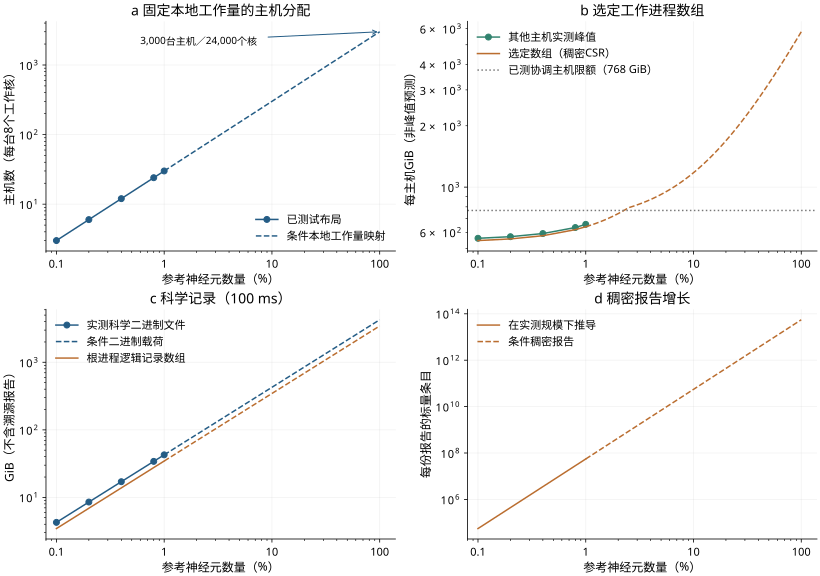

## S21. 以860亿神经元为参考规模的条件资源分析

### S21.1 范围与工作负载映射

本分析针对S20中的合成循环兴奋／抑制（E/I）工作负载，采用reference-f64数值配置，预期平均入度K = 1,000，dt = 0.1 ms，模型时间为100 ms。因此，N = 860亿对应E = KN = 86万亿条连接。它不代表重建的人脑解剖结构、经过验证的全脑动力学模型或一次新的执行。[机器可读分析](../data/full_scale/analysis.json)、[场景表](../data/full_scale/resource_scenarios.csv)和[分析脚本](../scripts/analyze_full_scale_resources.py)将计算与假设绑定到已验收的观测和冻结源码档案。所检查的12个源文件均已保留，并根据实验目录验证了哈希。

保持每3台主机分配8,600万神经元的工作块，可得主机数H = 3N/(8,600万)，MPI进程／物理工作核数R = 8H。将实测终点扩大100倍，对应3,000台主机和24,000个物理工作核，以及24,000个神经元群和5.76亿个群对投射。这是一种保持本地工作量的条件分配，要求索引、缓冲区、报告和记录的开销有界。它不是当前实现所需的主机数，不保证实测主机的内存足够，也不预测运行时间。图的具体实现和活动水平可能随规模变化。本文不外推1%规模下测得的启动时间。

### S21.2 根据源码核算内存

对于拥有n个神经元和e条入向边的一个MPI进程，保留的不可变突触数组占20e字节：在实测64位目标上，目标索引u32占4字节，权重f64占8字节，每条边的延迟步数usize占8字节。条件表用Kn近似本地e；最大余数投射分配会使各进程的本地计数略有变化，本分析没有构建全规模边数矩阵。初始化时使用临时原始边标识；对于此确定性的加性通路，随后将其释放。运行时神经元状态占33n字节：v／电流占16字节，lastspike占8字节，不应期结束时间占8字节，字节标志占1字节。这些量不包括分配容量、队列和元数据。

每个入向投射有一个稠密源偏移数组。对各源神经元群求和，每个MPI进程需8(N + P)字节，其中P = R为神经元群数；每台主机上的8个进程因此保留64(N + P)字节。在完整参考规模下，仅这一项就达到每进程640.750 GiB、每主机5.006 TiB，尚未计入其他数组。增加主机并不能消除这项复制。构建稠密索引时，还会为一个投射使用8n_source字节的临时游标；构建权重／延迟期间，8e_projection字节的临时原始边标识与之同时存在。这些临时量各有特定生命周期，不能把所有投射的临时量相加当作同时分配的需求。

脉冲接收容量需要单独限定。`slot_codegen.py`会在连续生产者的神经元总数将超过2^31 - 1之前提交批次；`exchange_spike_batch`随后检查批次容量，并调整一个可复用的`Vec<u64>`。本工作负载中，每个单独神经元群均低于该限制。在已测试的N范围内，单批容量为N；超过该范围后，现有生成器会拆分批次。因此，8N不是全规模接收缓冲区的公式。元素载荷的上界为8(2^31 - 1)字节，即每进程略低于16 GiB、每台8进程主机略低于128 GiB，不包括Vec超额分配和MPI临时空间。所有拟采用的调度及计数／位移仍须验证。批处理限制了缓冲区大小，但没有消除全局脉冲分发，也不能证明24,000个进程下的通信效率。

**表S4 | 完整参考规模下的条件资源项。** 数组大小指64位目标上的逻辑元素载荷，不是预测的进程RSS或cgroup峰值；生命周期不同的行不能相加作为同时存在的需求。根进程记录与输出估算假设已观测的1%规模下每神经元活动水平持续100 ms。“保留稠密实现”的项目指出需要重新设计的成本，并不表示可行的执行配置。

| 资源项／条件 | 完整参考规模下的量 | 解释 |
|---|---:|---|
| 神经元／连接 | 860亿／86万亿 | 按数量归一化的合成工作负载 |
| 固定本地工作量分配 | 3,000台主机／24,000个核 | 条件分配，不是当前主机需求 |
| 最大本地神经元群／入向边 | 3,621,053／约3,621,053,000 | 最大余数分配会使边数总量略有变化 |
| 最大主机的不可变突触数组 | 536.206 GiB | 每边20字节，不含其他内存 |
| 全部进程的不可变突触数组 | 1.720十进制PB | 20E字节，不是集群总内存 |
| 最大主机的本地神经元数组 | 0.885 GiB | 每本地神经元33字节 |
| 保留稠密源CSR | 640.750 GiB／进程；5.006 TiB／主机 | 每个进程复制全局源行 |
| 分批脉冲接收元素上界 | <16 GiB／进程；<128 GiB／主机 | 现有生成器考虑有符号计数限制；不含容量额外开销 |
| 根进程计数／收集的最终神经元数组 | 640.750／2002.344 GiB | 集中的记录与运行后收集 |
| 根进程逻辑脉冲历史 | 810.215 GiB | 每脉冲8字节；Vec容量可能更大 |
| 科学二进制载荷 | 4.578十进制TB | 最终数组和两条脉冲流；不含报告／文件头／final-fired／轨迹 |
| 群对投射／稠密报告条目 | 5.76亿／55,296,000,000,000 | 每份报告中，每投射／进程组合有4个标量条目 |
| 全部进程分片中的二进制拓扑配方 | 331.776十进制TB | 每投射／进程24字节，尚未计入神经元输入／文件头 |

### S21.3 活动、队列与记录

对于近似平稳的活动频率f Hz和平均延迟d = 1.5 ms，由于本实验使用u32存储待处理边索引，每进程逻辑待处理边载荷可估为4efd字节。对最大主机而言，f = 1、12.645和40 Hz分别对应约0.161、2.034和6.434 GiB的活跃队列条目。这些是活动场景，不是容量预留或硬上界。瞬态、异质延迟、环形槽容量和分配器增长均有影响：已验收的1%运行中，每进程保留的队列容量最高为1.728 GiB。平均值不能确定瞬态峰值。

所有进程都接收脉冲，并保留各神经元群的fired／last-fired向量，以实现规范事件传递。其逻辑全局存储量取决于活动水平；在平稳场景下，两条usize向量每进程约占16Nf dt字节，尚未计入保留的峰值容量。通信包括全局allgather／allgatherv、验证、排序和散发。以终点活动S/N = 1.264479571个脉冲／神经元／100 ms计，完整参考规模下，每进程在整个运行中接收的载荷为8S = 869.962十进制GB；所有接收者的总载荷R(8S)为20.879十进制PB。这是逻辑接收载荷，不是实测网络流量或带宽／运行时间预测；MPI算法、同主机共享和网络拓扑会改变物理流量。

进程0保留计数（8N字节）和一份紧凑脉冲历史（逻辑大小8S字节）。运行后收集会在该进程上增加v／电流／lastspike／标志数组（25N字节），并在每个神经元群的收集期间使用临时转换／接收缓冲区。假设活动不变，这些选定的根进程数组合计3.372 TiB，不包括其突触、CSR、队列、容量额外开销和报告字符串。实测1%运行的历史分配为15.000 GiB，而逻辑记录为8.102 GiB，说明载荷并不等于峰值内存。要避免这种集中开销，需要分布式／流式记录和收集。

两个科学二进制文件存储最终数组及两条逻辑脉冲流。选定载荷的公式为33N + 16S字节。在终点活动不变的条件下，100 ms对应4.578十进制TB。此外还有轨迹样本、final-fired向量、文件头和溯源报告。此大小的文件超过已测试的每文件64 GiB保护限制，因此需要输出分片／流式输出，或重新验证的有限限制。它不是总输出量预测，也不外推到更长模型时间或其他活动水平。

### S21.4 投射元数据、构建与输出溯源

保留当前群对表示时，每个进程均有P²个投射配方／对象。二进制分片为每个配方序列化边数／种子／待处理计数，即使在非拥有者进程上也如此：每分片至少24P²字节，对应每分片13.824十进制GB、所有分片331.776十进制TB，尚未计入神经元群输入。仅4个逐神经元实例列就提供4N个初始值、25N字节的二进制数据。在完整参考规模下，它们超过实验的40亿数值准入策略。冻结的实验驱动仅准入已测试的5种主机数，以及需显式启用的8.6亿神经元上限；这些限制及64 GiB的IR限制是有限的已测试策略，不是完整参考规模的验证。终点模型JSON为53,438,046,766字节；本文既不拟合其前端峰值，也不线性预测编译／准备时间。需要惰性／共享配方、流式实例和重新验证的有限准入限制。

投射报告已按128个投射分批：收集包最多包含640R个u64数值，在R = 24,000时为0.114 GiB。然而，报告函数仍在每个进程上追加完整的稠密报告字符串。对于每个投射／进程组合，它保留2个整数进程统计量、1个构建时间值和1个CSR字节值：每份报告有4P²R = 4P³个标量条目。完整参考规模下共55,296,000,000,000个条目；即使保守地按每条目2字节计算，每份序列化副本也至少为110.592十进制TB（100.583 TiB），尚未计入其他字段。当前格式的实际大小更大。这是针对不变表示的组合增长下界警示，不是拟采用的内存分配。根进程会将此溯源信息写入运行时JSON和摘要JSON。需用稀疏拥有者记录、聚合计数器和有界流式处理替换此路径。简单地将实测完整输出乘以100，会遗漏这一增长。

### S21.5 实测范围与条件扩展

**补充图S2 | 根据源码推导的条件资源分析。** 实线段表示已测试布局、实测内存／输出，或在这些布局下根据源码计算的量；超过1%的虚线段是根据算术得到的条件估算／上界，不是执行结果。（a）保持固定本地工作量的主机分配。（b）其他主机的实测峰值，以及保留稠密CSR和分批接收上界的选定数组。选定数组不含状态、队列、记录、报告元数据、分配器和缓存，不能预测峰值内存。（c）在固定终点活动和100 ms条件下的科学二进制输出及根进程逻辑记录数组，不含溯源报告。（d）保留稠密报告时的投射×进程报告条目。坐标轴为对数尺度。本图不表示运行时间拟合、不确定性区间、全规模主机准入或实际全规模能力。

### S21.6 进一步扩展的条件

已测试的本地工作量分配为进一步开展分布式容量研究提供了基础。扩展需要减少全局源索引复制，保留计数安全的分批通信并验证数千个进程，限制投射元数据／报告和前端构建开销，以及分布式记录／结果输出。新的索引／布局方案必须保留源／边标识和事件顺序，通过独立数值门槛，并在中间规模测量内存和通信。这里选定的数组载荷及缓冲区上界，不足以证明任何拟议重设计适合某一主机配置。

本研究由作者自行承担费用。在可用计算资源范围内，未评估完整860亿神经元规模的执行。资源核算给出了供进一步研究的条件分配及具体实现改动，不能证明全规模执行可行，也不能意味着仅增加机器就足够。
